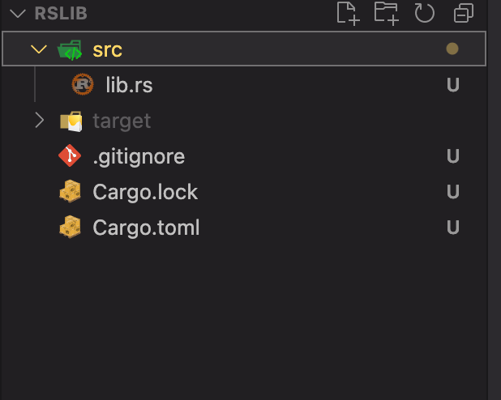
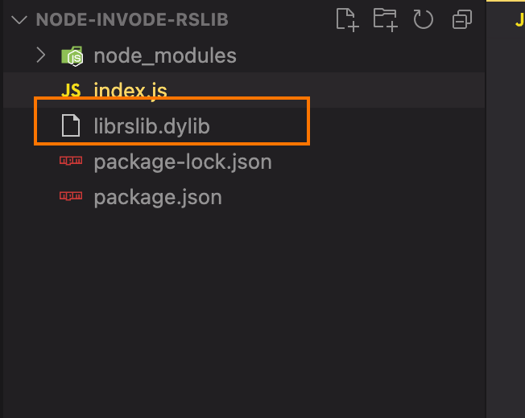

# Rust 动态连接库开发

### 一、环境要求

1. 具备 nodejs 环境
2. 具备 rust 编译环境

## 二、编写 rust 动态连接库

### 1. 创建 lib 类型 rust 工程

使用 cargo 直接生成 lib 类型的工程

```bash
cargo new rslib --lib
```

目录结构


### 2. 修改`Cargo.toml`文件内容

```diff
[package]
name = "rslib"
version = "0.1.0"
edition = "2021"

# See more keys and their definitions at https://doc.rust-lang.org/cargo/reference/manifest.html
+[lib]
+crate-type = ['cdylib']

[dependencies]

```

若还有其他需要的 dependencies 可以在`[dependencies]`层级下直接写`依赖名=“版本号”`  
也可以使用 cargo 提供的安装命令安装：

```bash
cargo install 依赖名
```

### 3. 在`lib.rs`文件中写入具体实现方法

```rust
#[no_mangle]
pub extern "C" fn add(left: i32, right: i32) -> i32 {
    left + right
}

```

1️⃣. 使用`#[no_mangle]`来组织 rust 对函数名进行编译，方便在 node 中以相同的方法名调用
2️⃣. 使用 pub extern "c" 来修饰函数，定义为使用 c 语言规范接口类型
3️⃣. 函数最后返回`left+right`的计算结果

### 4.编译为动态链接库

使用 cargo 提供的命令编译为动态连接库，可以加上--release 参数，优化打包的产物

```bash
cargo build
```

编译完成后，最终动态连接库文件路径：  
debug 模式：target/debug/lib**.`[dll/os/dylib]`  
release 模式：target/release/lib**.`[dll/os/dylib]`  
**注：windows 中后缀为 dll,linux 中后缀为 os,macos 后缀为 dylib**，\*\*为创建动态链接库是定义的名字

## 二. 编写 node 工程调用

### 1. 创建 node 工程

使用 npm 快速创建 package.json

```bash
npm init -y
```

创建完成后，修改`package.json`,使用 esmodule

```diff
{
  "name": "invode-rslib",
  "version": "1.0.0",
  "description": "",
  "main": "index.js",
+  "type": "module",
  "scripts": {
    "test": "echo \"Error: no test specified\" && exit 1"
  },
  "author": "",
  "license": "ISC",
  "dependencies": {
    "ffi-rs": "^1.0.63"
  },
  "devDependencies": {
    "@types/node": "^20.12.7"
  }
}

```

### 2.安装 ffi-rs 依赖

```bash
npm install ffi-rs
```

### 3.放入动态链接库文件

将前面生成的 ib\*\*.`[dll/os/dylib]`文件复制过来，放到根目录下


### 4.使用 ffi-rs 调用动态连接库

创建 index.js 文件，写入如下内容：

```js
import { platform } from "node:os"
import { equal } from "node:assert"
import { load, DataType, open, close } from "ffi-rs"
const a = 22
const b = 100
const dynamicLib =
  platform() === "win32" ? "./librslib.dll" : platform() === "darwin" ? "./librslib.dylib" : "./librslib.so"
// 首先你需要调用 open 来打开一个动态链接库并指定一个key来作为标志符在后续操作里调用
open({
  library: "rslib", // key
  path: dynamicLib, // path
})
const r = load({
  library: "rslib", // path to the dynamic library file
  funcName: "add", // the name of the function to call
  retType: DataType.I32, // the return value type
  paramsType: [DataType.I32, DataType.I32], // the parameter types
  paramsValue: [a, b], // the actual parameter values
})
equal(r, a + b)
console.log(r)
// 当你不需要再用到这个动态链接库时，使用close来释放它
close("rslib")
```

`r`即为调用动态链接库的计算结果，`equal`为校验结果 r 与 a+b 是否相同的方法
