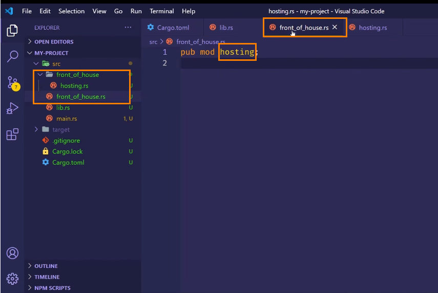

# Rust 基础语法

## 变量与可变性

### 变量声明

#### 1. 声明方式

- 使用 let 关键字声明变量（默认情况下变量是不可变的）

```rust
let count = 0;
```

- 使用 mut 关键字将不可变变量变为可变变量

```rust
let mut count = 0;
```

#### 2. shadowing(隐藏性)

在声明的变量作用于再次声明同名的变量，新的变量会隐藏之前的同名变量，可用于变量的类型转换

```rust
let x = 5;
let x = x + 1;
```

### 常量声明

常量特性：

- 不可以使用 mut，常量永远不可变
- 使用 const 声明常量，并且必须标注常量的类型
- 常量可在任何作用于内声明
- 常量在程序运行期间，在其声明的作用于内一直有效（变量可在作用域内重复声明，声明的变量之前的变量会失效）
- 常量使用全大写字母命名，单词之间使用下划线分开

```rust
const MAX_POINTS:u32 = 100_000;//数字中的_仅为增加可读性
```

## 数据类型

### 标量类型

#### 1. 整数类型

**基本类型规则**

- 整数类型没有小数
- 例如 u32 是一个无符号的整数类型，谵语 32 位的空间
- 无符号整数类型以 u 开头
- 有符号的正类型以 i 开头
- isize 和 usize 长度由计算机架构决定位数
- 除 byte 进制的数字以外，都可以使用类型座位后缀（例如：57u8）

| length           | signed | unsigned |
| ---------------- | ------ | -------- |
| 8 位(8-bit)      | i8     | u8       |
| 16 位(16-bit)    | i16    | u16      |
| 32 位(32-bit)    | i32    | u32      |
| 64 位 (64-bit)   | i64    | u64      |
| 128 位 (128-bit) | i128   | u128     |
| 平台相关 (arch)  | isize  | usize    |

**整数溢出**

- 调试模式(debug)下编译溢出的整数，程序运行时，会发生 panic
- 发布模式下(release)编译溢出的整数，程序运行时，不会发生 panic，会执行‘环绕’操作（减去对应类型的最大值后重新开始表示数值）

#### 2. 浮点类型

- f32,32 位，单精度
- f64，64 位，双精度（默认类型）

#### 3. 布尔类型

- 布尔类型有两个值：true 和 false
- 占用一个字节大小
- 符号是 bool

#### 4. 字符类型

- char 类型是最基础的单个字符
- 字符类型使用单引号
- 占用 4 个字节大小
- 使用 unicode 标量值，可以表示比 ASCII 多得多的字符内容，

### 复合类型

#### 1. 元组（Tuple）

- 多个类型多个值放在一个类型里面
- 长度固定，一旦声明无法改变
  `声明tuple`

```rust
let tup:(i32,f64,u8) = (500,6.4,1);
```

`获取tuple中元素`
使用匹配模式来解构(destructure)tuple

```rust
let (x,y,z) =(500,64,1)
```

`访问tuple中元素`
使用点标记法，后面跟上元素的索引号

```rust
println!("{},{},{},",tup.0,tup.1,tup.2);
```

#### 2. 数组

##### a. 数组特征

- 长度固定(区别于 vector 长度可变)
- 值之间使用逗号分隔

##### b. 用处

- 将数据存储在栈内存(stack)，而不是堆内存(heap)上
- 数组没有 vector 灵活

##### c. 类型

**数组类型表示形式:[类型;长度]**

```rust
let a:[i32;5]=[1,2,3,4,5];
```

**当数组中每一项的值都相同时，数组类型表示形式:[初始值；长度]**

```rust
let a=[1,5]//相当于let a:[i32,5] = [1,1,1,1,1]
```

##### d. 访问数组

- 数组是 stack 上分配的单个块的内存
- 使用索引访问数组的项
- 如果访问的索引超出了数组范围，编译会通过（简单的索引编译器能检查出来），但是运行会发生报错(runtime 时会 panic)

### 函数

- 使用 fn 关键字声明函数
- 函数的返回值为最后一个表达式的值，如果没有表达式则相当于返回空的 tuple
- 不带分号即为表达式，也可使用 return 指定返回值

```rust
fn main(){
  println!("hello word");
  another_function();

}
fn another_function(){
  println!("another function");
}
```

## 控制流

### if else

1. if 根据不同的条件执行不同的代码，这个条件必须为 bool 值,否则会报错（区别 js 默认转为 boolean 比较）

```rust
fn main(){
  let number = 5;
  if number>5 {
    println!("condition was true")
  }else{
    println!("condition was false")
  }
}
```

**当 if else 条件过多，可使用 match 优化**  
2. if 是一个表达式，可以放在 let 语句中等号的右边

```rust
fn main(){
  let condition = ture;
  let number = if condition{5}else{6};
  println!("{}",number)
}
```

### 循环

#### 1. loop

使用 loop 关键字声明循环，使 rust 反复执行这段代码，直到使用 break 中断循环或者强制终止程序执行

```rust
fn main(){
  loop {

  }
}
```

#### 2. while

使用 while 关键字声明循环，每次循环前，判断条件是否满足，不满足则中断循环

```rust
fn main(){
  let mut number = 3;
  while number !==0 {
    number = number - 1
  }
}
```

#### 3. for

使用 for 关键字声明循环

```rust
fn main(){
  let a = [10,20,30,40,50]
  for element in a.iter() {
    println!("{}",element)
  }
}
```

使用 for 循环加 Range 来代替 while 循环

```rust
fn main(){
  for element in [1..4].rev(){
    println!("{}",element)
  }
}
```

## 所有权

### 1. stack(栈内存)和 heap(堆内存)

- 存储在 stack 上的数据先入后出，并且数据必须拥有已知的固定的大小，
- 编译时未知大小或者运行时大小可能发生变化的数据必须存放在 heap 上
- heap 数据的指针也是存放在 stack 上的，因为他的大小是固定的

### 2. 所有权规则

- 每个值都有一个变量，这个变量是改值的所有者
- 每个值同时只能有一个所有者
- 当所有者超出作用域时，该值将会被删除

### 3. heap 内存释放

当变量离开作用域时，rust 自动调用 drop 函数，释放该变量的堆内存空间

```rust
fn main(){
  let s1 = String::from("hello word");
  let s2 = s1;//s1失效
  // ...s1无法使用了
}//s2内存释放
```

**这种 s1 的值赋值给 s2，然后 s1 失效的行为，成为移动(Move)**

```rust
fn main(){
  let s1 = String::from("hello word");
  let s2 = s1.clone();//s1依然有效
  // ...s1，s2均可使用
}//s1，s2内存释放
```

**这种操作成为克隆，但是比较消耗资源**

### 4. stack 上数据内存

- 标量类型都存储在 stack 上,他们都实现了 Copy trait，可以自动复制 stack 内存中的数据,所以在复制给其他变量后，原变量不会失效，依然可用，知道离开作用域，释放内存
- 当一个类型实现了 Drop trait，那就不允许在实现 Copy trait 了

### 5. 所有权与函数

- 把变量的值复制给变量跟把变量的值传递给函数时一样的（要么复制，要移动）

```rust
fn main(){
  let s = String::from("hellow");
  take_ownership(s);//s为复合类型，存储在heap上，移动到take_ownership函数内部，s变量失效，往后不再可用
  let x = 5;
  makes_copy(x);//x为标量类型，存储在stack上，实现了Copy trait，复制到makes_copy函数内存，x变量依然有效，直到离开该作用域才会失效
  println!("x:{}",x);
}
fn take_ownership(some_string:String){
  println!("{}",some_string);
}
fn makes_copy(some_number:i32){
  println!("{}",some_number);
}
```

- 函数返回值也会把所有权，移动出函数

```rust
fn main(){
  let s1 = gives_ownership();
  let s2 = String::from('hello');
  let s3 = takes_and_gives_back(s2);//s2移动到takes_and_gives_back函数，s2失效，不再可用
}//s3内存释放
fn gives_ownership(){
  let some_string = String::from("hello")
   some_string//some_string返回出去后，some_string值的移动到s1,some_string失效
}
fn takes_and_gives_back(a_string:String)->String{
  a_string//a_string返回出去后，a_string值移动到s3，a_string失效
}
```

### 引用

- 为了解决复杂类型传入函数后会失效，可以使用传入`引用`变量,使用`&`符号。

```rust
fn main(){
  let s1 = String::from("hello");
  let len = caculate_len(&s1);//这里传入s1的引用，s1不会失效，后续可以继续使用
}//s1，len内存释放
fn caculate_len(s:&String)->usize{
  s.push_str(",world");//这句会报错，借用的变量默认不可修改
  s.len()
}
```

**引用变量作为函数入参的行为称之为`借用`**
**函数内借用的变量默认不可修改**

- 如需修改借用的变量，可食用 mut 关键字，使之变为可修改的借用变量

```rust
fn main(){
  let mut s1 = String::from("hello");//为了引用可变变量，声明变量的时候就必须是声明可变变量，使用mut 关键字
  let len = caculate_len(&mut s1);//这里传入s1的引用，s1不会失效，后续可以继续使用
  // s1的职位“hello,world”
}//s1，len内存释放
fn caculate_len(s: &mut String)->usize{
  s.push_str(",world");
  s.len()
}
```

- 在特定作用域内，对某一块数据的可变引用的变量只能存在一个(可在编译时就防止数据竞争)
  **同一作用域**

```rust
fn main(){
  let mut s1 = String::from("hello");
  let s2 = &mut s1;
  let s3 = &mut s1;//报错，该作用域只能有一个可变引用，防止数据竞争
}
```

**不同作用域**
在不同作用域可以存在相同的可变引用

```rust
fn main(){
  let mut s1 = String::from("hello");
  {
    let s2 = &mut s1;//正常
  }
  let s3 = &mut s1;//正常
}
```

- 不可以同时存在可变引用和不可变引用;不可变的引用可以同时存在多个

```rust
fn main(){
  let s1 = String::from("hello");
  let r1 = &s1;
  let r2 = &s2;
  let r3 = &mut s1;//报错
}
```

- 悬空指针，rust 在编译阶段就会防止悬空指针

```rust
fn main(){
  let r = dangle();
}
fn dangle()->&String{
  let s = String::from("hello");
  &s
}//此处s销毁，内存释放，&s则是返回的悬空引用，此时编译器会报错
```

### 切片(Slice)

**使用`&`和`[]`来进行切片，左闭右开**

```rust
fn main(){
  let s = String::from("hello world");
  let hello = &s[0..5];
  let world = &s[6..11];
  // 起始下表0和最后一位下表可省略
  // let hello = &s[..5];
  // let world = &s[6..];
  // let whole = &s[..];//指向整个字符串切片
}
```

## 结构体(struct)

### 声明结构体

```rust
// 声明结构体
struct User {
  username:String,
  email:String,
  sign_in_count:u64,
  active:bool
}
```

### 实现结构体

```rust
fn main(){
  println!("hello,world");
  // 实现结构体
  let user = User {
    username:String::from("zhangsan"),
    email:String::from("xxx@163.com"),
    sign_in_count:100,
    active:true,
  }

}
```

### 读取/修改结构体的某个值

```rust
struct User {
  username:String,
  email:String,
  sign_in_count:u64,
  active:bool
}
fn main(){
  let mut user = User {
    username:String::from("zhangsan"),
    email:String::from("xxx@163.com"),
    sign_in_count:100,
    active:true,
  }
  // 修改结构体实例上的属性值
  user.username=String::from("lisi")
}
```

### struct 实例更新语法

```rust
let user2 = {
  username:user1.username,
  ..user1,//未被重新复制的属性，全部会自动更新过来，注意是两个点，并且放在结构体最后
}
```

### tuple struct

适用于想给 tuplet 起名字，并且区别去其他 tuple，又不需要给每个元素起名字

```rust
struct Color(i32,i32,i32);
struct Point(i32,i32,i32);
let black = Color(0,0,0);
let origin = Point(0,0,0);
```

上述`black`与`origin`对应两个结构体实例，虽然这两个实力的所有属性值都相同，但是是两个不同类型的结构体，所以他们不相同

### 空 struct(unit-like-struct)-没有任何字段的结构体

适用于需要在某个类型上实现某个 trait，但是又没有想要在里面存储的内容

### struct 数据的所有权

- struct 可以对其内部的全部成员拥有所有权,只要 struct 的实例是有效的，那么里面的字段数据就是有效的

```rust
struct User {
  username:String,
  email:String,
  sign_in_count:u64,
  active:bool
}
```

- struct 里也可以存放引用，但是必须使用生命周期，否则报错

```rust
struct User {
  username:&str,//会报错
  email:&str,//会报错
  sign_in_count:u64,
  active:bool
}
```

### struct 结构体实例的打印

1. 使用 derive 关键字注解，将 Rect 派生到 Debug 这个 trait 上
2. 使用 println!宏打印{:#?}格式信息，即使用 std::fmt:Debug 方法打印(默认使用 std:fmt:Display 打印,这种不能打印结构体实力),也可以不加#号，#号是为了格式化打印的结构体实例信息

```rust
#[derive(Debug)]
struct Rectangle {
    width:u32,
    length:u32,
}
fn main() {
    println!("Hello, world!");
    let dim = Rectangle{
        width:30,
        length:60,
    };
    let area = cale_area(&dim);
    println!("长方形面积为：{}",area);
    println!("长方形实例:{:#?}",dim);
}
fn cale_area(dim:&Rectangle) ->u32{
    dim.width*dim.length
}
```

### struct 方法(在实例上调用，使用.符号)

在 impl 里面定义方法,第一个参数为 self，指向实例,通过`实例.方法`调用

```rust
#[derive(Debug)]
struct Rectangle {
    width:u32,
    length:u32,
}
impl Rectangle {
    fn get_area(&self)->u32{
        self.width*self.length
    }
}
fn main() {
    println!("Hello, world!");
    let dim = Rectangle{
        width:30,
        length:60,
    };
    // let area = cale_area(&dim);
    let  area = dim.get_area();
    println!("长方形面积为：{}",area);
    println!("长方形实例:{:#?}",dim);
}
// fn cale_area(dim:&Rectangle) ->u32{
//     dim.width*dim.length
// }
```

### struct 关联函数(在 struct 上调用，使用：：符号)

在 impl 里面定义方法，第一个参数不是 self，通过`结构体::方法名`调用

```rust
#[derive(Debug)]
struct Rectangle {
    width:u32,
    length:u32,
}
impl Rectangle {
    fn get_area(&self)->u32{
        self.width*self.length
    }
    // 关联方法，通过结构体本身调用
    fn get_square(size:u32)->Rectangle{
        Rectangle { width: size, length: size }
    }
}
fn main() {
    println!("Hello, world!");
    // 通过结构体实例化
    let dim = Rectangle{
        width:30,
        length:60,
    };
    // 通过调用实例方法
    let  area = dim.get_area();
    println!("长方形面积为：{}",area);
    println!("长方形实例:{:#?}",dim);
    // 通过结构体本身调用关联方法
    let  square  = Rectangle::get_square(100);
    let square_area = square.get_area();
    println!("正方形面积为：{}",square_area)
}

```

### 每个 struct 可以拥有多个 impl 块

```rust
#[derive(Debug)]
struct Rectangle {
    width:u32,
    length:u32,
}
impl Rectangle {
    fn get_area(&self)->u32{
        self.width*self.length
    }

}
impl Rectangle{
    // 关联方法，通过结构体本身调用
    fn get_square(size:u32)->Rectangle{
        Rectangle { width: size, length: size }
    }
}

```

## 枚举

### 定义枚举

```rust
#[derive(Debug)]
enum IpAddrKind {
    V4,
    V6,
}
#[derive(Debug)]
struct IpAddr {
    kind: IpAddrKind,
    address: String,
}
#[derive(Debug)]
enum ValueIpAddrKind {
    V4(u8, u8, u8, u8),
    V6(String),
}
fn main() {
  let four = IpAddrKind::V4;
  let six = IpAddrKind::v6;
  let home = IpAddr {
        kind: IpAddrKind::V4,
        address: String::from("127.0.0.1"),
    };
     println!("home.kind:{:?}", home.kind);
    println!("home.address:{}", home.address);
    let look_back = IpAddr {
        kind: IpAddrKind::V6,
        address: String::from("::1"),
    };
    println!("home为：{:#?}", home);
    println!("look_back为：{:#?}", look_back);
    let value_address = ValueIpAddrKind::V4(127, 0, 0, 1);
    println!("value_Address:{:?}", value_address);
    let loop_back = ValueIpAddrKind::V6(String::from("::1"));
    println!("loop_back:{:?}", loop_back)
}
```

### Option 枚举

rust 中没有 Null 值。

```rust
// 标准库中定义的Option枚举
enum Option<T>{
  Some(T),
  None
}
```

`Option`,`Some`,`None`都在 Prelude(预导入模块),可以直接使用：

```rust
let some_number = Some(5);
let some_string = Some("hello world");
let absent_number = None;//None枚举值无法自动推倒类型，需要手动定义absent_number类型
```

### match

1. 匹配 Some、None 枚举

````rust
enum Coin {
    Penny,
    Nickel,
    Dime,
    Quarter
}
fn value_in_cents(coin:Coin)->u8{
    match coin {
        Coin::Penny=>1,
        Coin::Dime=>2,
        Coin::Nickel=>3,
        Coin::Quarter=>4,
    }
}
fn plus_one(x:Option<i32>)->Option<i32>{
  match x {
    None=>None,
    Some(i)=>Some(i+1)
  }
}
2. 穷举所有可能
// 使用_处理剩余的条件
```rust
fn main(){
  let v= 0u8;
  match v {
    1=>println!("one"),
    3=>println!("three"),
    _=>(),
  }
}
````

### if let

- 处理只关心一种匹配忽略其他情况
- 放弃穷举的可能

```rust
fn main(){
  let v = Some(0u8);
  if let Some(3) = v {
    println!("three")
  } else {
    println!("others")
  }
  // 等效于使用match
  // match v {
  //   3=>println!("three"),
  //   _=>(),
  // }
}
```

## 路径

- 绝对路径调用

```rust
mod front_of_house {
  mod hosting {
    fn add_to_waitlist() {

    }
  }
}
pub fn eat_at_restaurant() {
  crate::front_of_house::hosting::add_to_waitlist()
}
```

- 相对路径调用

```rust
mod front_of_house {
  pub mod hosting {
    pub fn add_to_waitlist() {

    }
  }
}
pub fn eat_at_restaurant() {
  front_of_house::hosting::add_to_waitlist();
}
```

- 调用子模块内的模块、方法需要先将模块、方法设置为 pub 才能调用
- 使用 super 访问父级目录

```rust
fn serve_order() {

}
mod back_of_house() {
  fn fix_incorrect_order(){
    super::serve_order();
    // crate::serve_order();
  }
}
```

- struct 内的属性默认是私有的需要设置 pub 才能变成公共的，enum 设置为 pub，内部的值也会变 pub
- 使用 use 关键字将路径导入到作用域内

```rust
mod front_of_house {
  pub mod hosting {
    pub fn add_to_waitlist() {

    }
  }
}
// use front_of_house::hosting;//相对路径方式
use crate::front_of_house::hosting;//绝对路径方式
pub fn eat_at_restaurant() {
  // front_of_house::hosting::add_to_waitlist();
  hosting::add_to_waitlist();
}
```

- 使用 as 关键字可以为 use 导入的路径设置别名

```rust
use std::fmt::Result as FmtResult;
use std::id::Result as IoResult;
```

- 使用 pub use 将条目引入作用域并重新导出

```rust
pub use crate::front_of_house::hosting;
```

- 在模块直接 use 其他模块，需要目录层级与路径对应
  

## Vector

### 创建 Vector

- 使用`Vec::new()`创建

```rust
fn main(){
  let mut v:Vec<i32>=Vec::new();
  v.push(1);
}
```

- 使用`vec!`宏创建

```rust
fn main(){
  let mut v = vec![1,2,3];
}
```

### 更新 Vector

使用`push`方法

```rust
fn main(){
  let mut v = vec![1,2,3,4,5];
  v.push(6)
}
```

### 删除 Vector

Vector 离开作用域后就会被删除，内部的元素也会被清理

### 访问 Vector 中的元素

- 索引

```rust
fn main(){
  let mut v = vec![1,2,3,4,5];
  let third = &v[3];
}
```

- 使用`Vector`上的`get`方法

```rust
fn main(){
  let mut v = vec![1,2,3,4,5];
  match v.get(3){
    Some(third)=>println!("the third element is {}",third),
    None()=>println!("there is no third element"),
  }
}
```

:::info
使用索引方式处理访问越界时，程序会报错，中断执行，get 方法处理越界会返回 None 枚举
:::

### 遍历 Vector

```rust
fn main(){
  let v = vec![1,2,3,4,5];
  for i in &v {
    println!("{}",i);
  }

}
```

### Vector+Enum

vec 中只能存放相同类型的数据，不同类型、可以穷尽类型的，可用枚举包裹存放

```rust
enum SpreadsheetCel{
  Int(i32)
  Float(f64)
  Text(String)
}
fn main(){
  let row = vec![
    SpreadsheetCel::Int(3),
    SpreadsheetCel::Float(10.12)
    SpreadsheetCel::Text(String::from('blue'))
  ]
}
```

## 字符串类型

其实，`String`是特殊的`Vec<u8>`类型的包装

1. 创建 String 类型

```rust
let mut s = String::new();
```

2. 使用初始值创建 String

- 使用 `to_string` 方法

```rust
let data = "initial content";
let s = data.to_string();
```

- 使用 `String::from` 关联函数

```rust
let s = String::from("initial content");
```

3. 更新 String

- `push_str`把一个字符串切片附加到 String

```rust
let mut s == String::from("foo");
s.push_str("bar");
```

**push_str 不会获得参数的所有权**

- `push`把单个字符串附加到 String

```rust
let mut s == String::from("lo");
s.push("l");
```

- 使用`+`拼接字符串
  字符串类型+字符串引用类型

```rust
let s1 == String::from("hello,");
let s2 = String::from("world")
let s3 = s1+&s2;
```

**`+`会获取 s1 的所有权，再加上引用的 s2，组成了 s3,所以 s3 过后，s1 就效了，无法访问**

- 使用`format!()`宏

```rust
let s1 = String::from("tic");
let s2= String::from("tac");
let s3 = String::from("toe");
let s4 = format!("{}-{}-{}",s1,s2,s3);
```

## HashMap

以键值对的形式存储数据

1. 创建 HashMap

```rust
use std::collections::HashMap;
fn main(){
  let mut scores:HashMap<string,i32> = HashMap::new();
  scores.insert(String::from("Blue"),0)
}
```

2. 所有权转移问题

```rust
// 对于实现了Copy trait类型，值会被复制到HashMap中
// 对于拥有所有权的值（如String），所有权会被转移到HashMap中
// 对于拥有所有权的值，传递引用到HashMap，所有权就不会转移，依然有效
fn main(){
  let field_name=String::from("color");
  let field_value=String::from("blue");
  let mut map = HashMap::new();
  map.insert(field_name,field_value);
  // 此处field_name、field_value失效了
}
```

3. 获取 HashMap 中的值

```rust
let mut scores = HashMap::new();
scores.insert(String::from("Blue"),10);
let team_name = String::from("Blue");
let team_score =  scroes.get(&team_name);
```

4. 遍历 HashMap

```rust
let mut scores = HashMap::new();
scores.insert(String::from("Blue"),10);
scores.insert(String::from("Red"),20);
for(k,v) in &scores{
  println!("{}:{}",k,v)
}
```

5. 更新 HashMap

- 直接覆盖更新简直对

```rust
let mut scores = HashMap::new();
scores.insert(String::from("Blue"),10);
scores.insert(String::from("Blue"),15);
```

- 使用`entry`判断是否有键值对，没有就使用`or_insert`更新

```rust
let mut scores = HashMap::new();
scores.insert(String::from("Blue"),10);
scores.insert(String::from("Red"),20);
let e = scores.entry(String:from("Blue"));
e.or_insert(15);
```

**or_insert 返回的是插入的简直对的值；entry 如果判断有键值对，返回的是也是该简直对的值**

- 只更新已经存在的简直对

```rust
let text = "hello world wonderful world";
let mut map = HashMap::new();
for word in text.split_whitespace{
  let count = map.entry(word).to_insert(0);
  *count+=1;
}
```

6. Hash 函数
   默认情况下 HashMap 使用功能强大的 Hash 函数，特点是安全性好，但不是最快的算法，也可以指定 hasher 切换到另一个函数

## 错误处理

### panic!

```rust
panic!("crash and burn");
```

### Result枚举

- Result枚举类型

```rust
enum Result<T,E>{
  Ok<T>,
  Err<E>,
}
```

- 使用`match`处理Result

```rust
use std::fs::File;
fn main(){
  let f = File::open("hello.txt");
  let f = match f{
    Ok(file)->file;
    Err(error)->{
      panic!("Error opening file {:?}",error)
    }
  };
}
```

- 使用`unwrap`代替`match`处理`Result`

```rust
use std::fs::File;
fn main(){
  let f = File::open("hello.txt").unwrap();
  // let f = match f{
  //   Ok(file)->file;
  //   Err(error)->{
  //     panic!("Error opening file {:?}",error)
  //   }
  // };
}
```

- 使用`expect`代替`unwrap`，指定panic!的错误信息

```rust
use std::fs::File;
fn main(){
  let f = File::open("hello.txt").expect("无法打开文件");
}
```

- 使用`?`传播Result错误
  如果Result是Ok，就是表达式的结果，程序继续执行，如果Result是Err，则Err就是整个函数的返回值，相当于return了Err

```rust
let mut f = File::open("hello.txt")?;
let mut s = String::new();
f.read_as_string(&mut s)?;
Ok(s)
```

- 使用`?`可以使用链式调用简化

```rust
let mut s = String::new();
File::open("hello.txt")?.read_as_string(&mut s)?;
Ok(s)
```

## 解构与解引用

1. 使用模式匹配自动解包引用

```rust
// 求出list中的最大数
fn largest(list:&[i32]){
  let mut largest = list[0];
  // 使用模式匹配自动解引用
  for &item in list {
    if item >largest {
      largest = item;
    }
  }
  largest
}
fn main(){
  let number_list = vec![34,50,25,100,65];
  let result = largest(&number_list);
  println!("最大值为{}",result);
}
```

2. 手动解引用获取原始值

```rust
fn largest(list:&[i32]){
  let mut largest = list[0];
  for item in list {
    // 手动解引用
    if *item >largest{
      largest = *item;
    }
  }
  largest
}
```

## 泛型

```rust
struct Point<T>{
  x:T,
  y:T
}
enum Option<T>{
  Some(T),
  None,
}
enum Result<T,E>{
  Ok(T),
  Err(E),
}
```

## trait

### 定义trait

```rust
pub trait Summary {
  fn summarize($self)-> String;
}
```

### 实现trait

```rust
pub struct NewArticle{
  title:String;
  author:String;
}
// 实现trait,类似实现结构体方法，多了Sumary for
impl Sumary for NewArticle{
  fn summarize (&self){
    format!("{},by {}",self.title,self.author)
  }
}
fn main(){
  let article = NewArticle{
    title:String::from("devel may cry"),
    author:String::from("zuishuaicc"),
  }
  // 当使用外部的trait时，必须引入对应的trait，才能使用结构体上的对应的trait
  print!("{}",article.summarize());
}
```

### trait作为参数

1. impl Trait语法

```rust
// ...定义trait和struct
pub fn notify(item: impl Summary)->String{
  format!("Breaking news! {}",item.summarize());
}
```

2. Trait bound 语法

```rust
pub fn notify<T:Summary>(item:T)->String{
  format!("Breaking news! {}",item.summarize());
}
```

**这两种语法等价** 3. 一个参数指定多个Trait

```rust
// 方法一
pub fn notify(item: impl Summary + Display)->String{
  format!("Breaking news! {}",item.summarize());
}
// 方法二
pub fn notify<T:Summary + Display>(item:T)->String{
  format!("Breaking news! {}",item.summarize());
}
```

4. 使用where语句简化类型签名

```rust
// pub fn notify<T:Summary + Display,U:Clone + Debug>(item:T){
//   println!("Breaking news! {}",item.summarize());
// }
pub fn notify<T,U>(item:T)->String
where
    T:Summary + Display,
    U:Clone + Debug,
{
  format!("Breaking news! {}",item.summarize());
}
```

### trait作为返回类型

**impl Trait作为返回类型时，函数只能返回一种类型**

```rust
pub fn notify(flag:bool)->impl Summary{
  if flag {
    NewArticle{
      title:"aaaa",
    }
  }else{
    Tweet{
      author:"dddddd",
    }
  }
}
// 不可以返回两种类型，会报错
```

### 有条件的实现某个trait

```rust
impl<T> Pair<T>{
  fn new (x:T,y:T)->Self{
    Self {x,y}
  }
}
impl<T:Display + PartialOrd> Pair<T>{
  fn cmp_display(&self){
    if self.x>=self.y{
      println!("The largest member is {}",self.x);
    }else{
      println!("The largest member is {}",self.y);
    }
  }
}
```

## 生命周期

使用`<'a>`语法声明生命周期参数

##
