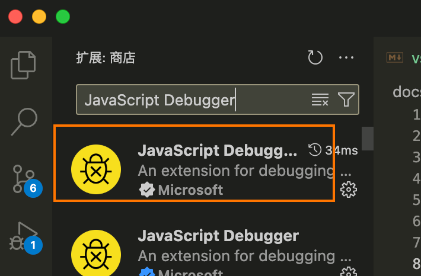
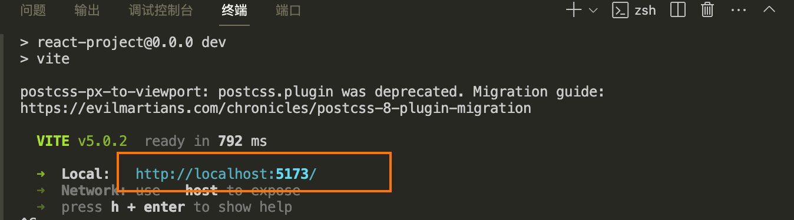
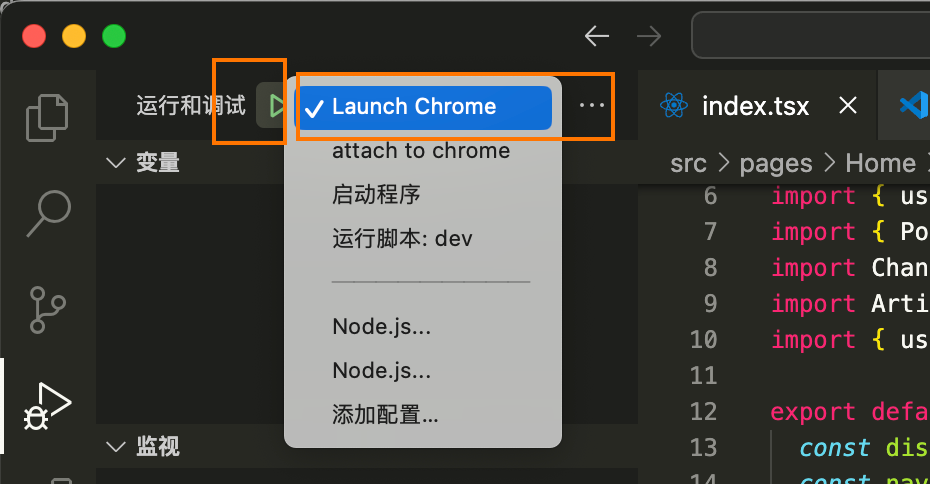
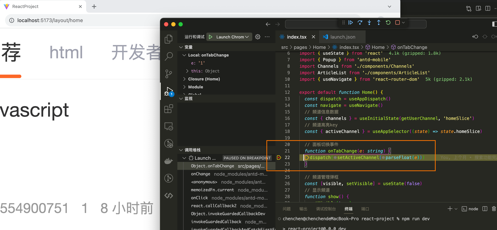
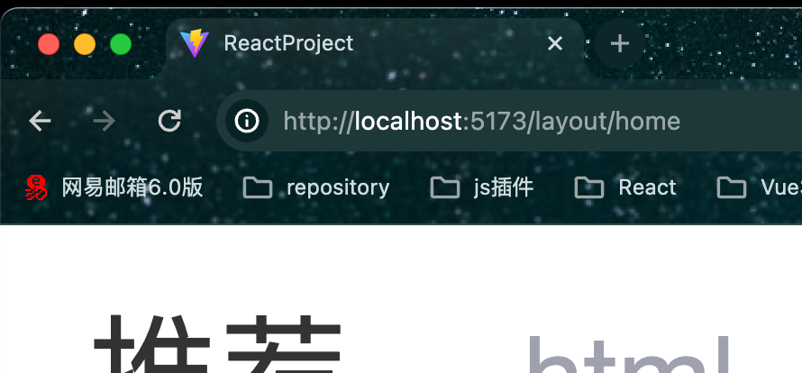
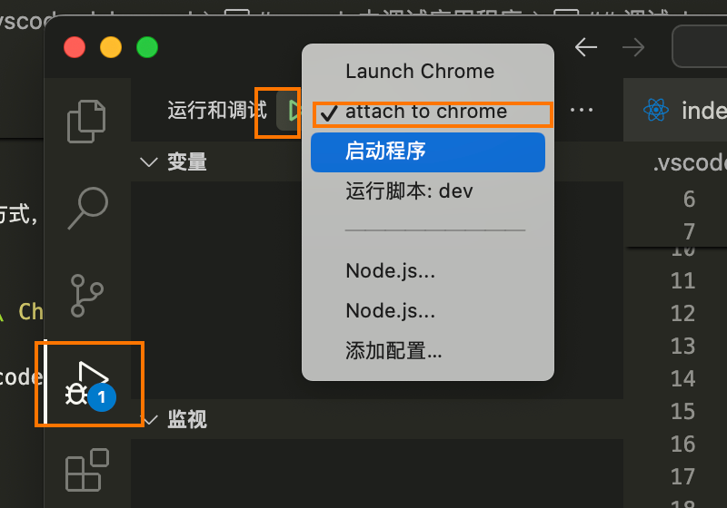
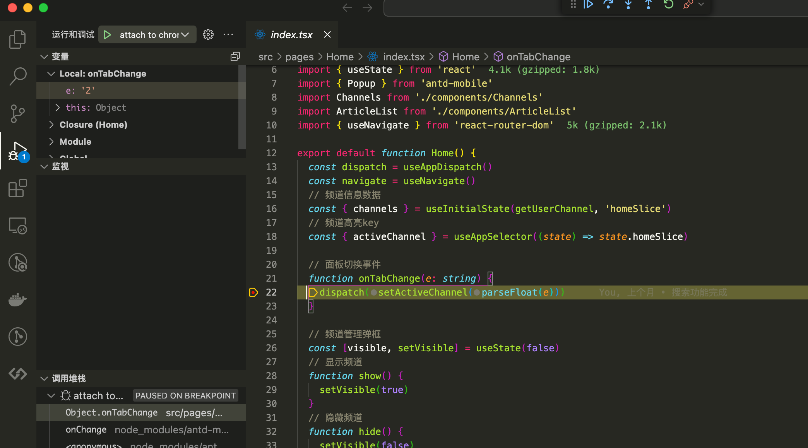
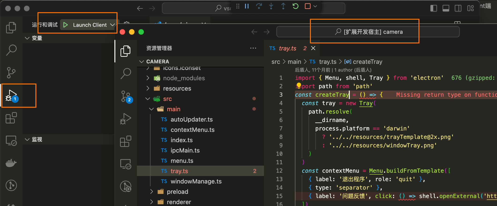
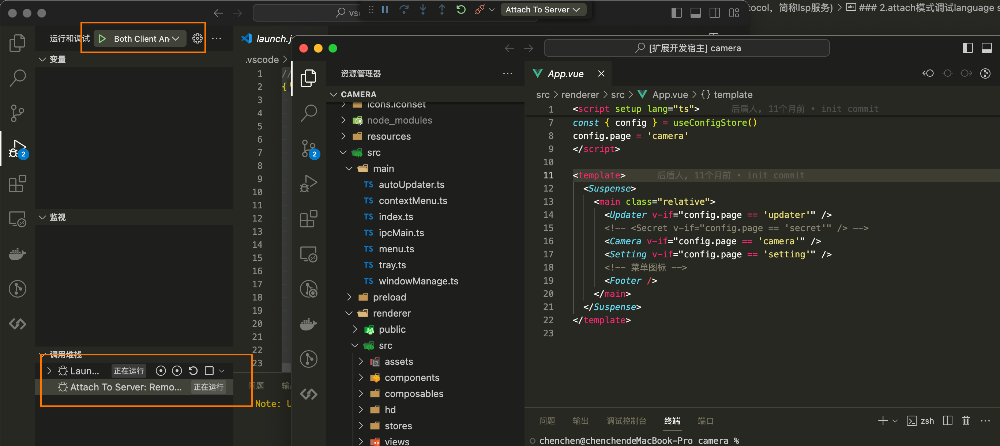

# vscode中调试应用程序
## 一、调试chrome中网页
### 1.安装vscode插件
在vscode插件市场搜索JavaScript Debugger (Nightly),并安装

### 2.配置launch模式
1️⃣. 在项目根目录新建.vscode文件夹，然后在.vscode中新建launch.json文件，使用 launch 模式进行 debugger  
```json
// launch.json配置
{
  "version": "0.2.0",
  "configurations": [
    {
      "name": "Launch Chrome",
      "request": "launch",
      "type": "chrome",
      "url": "http://localhost:5173/",//该地址为项目配置的开发服务器运行地址
      "webRoot": "${workspaceFolder}",
      "sourceMaps": true,
    },
  ]
}
```
2️⃣. 启动项目开发服务器，并确保服务运行地址为 1️⃣中url的地址

3️⃣. 找到vscode左侧“运行与调试”菜单，在绿色按钮后的下拉菜单中选择 Launch Chrome，然后点击绿色箭头，则会打开新的chrome浏览器，并在chrome中运行项目，

4️⃣. 在vscode的中打断点调试项目

### 3.配置attach模式
因launch模式打开的浏览器不能使用插件，比如vue tool 等，故我们可以使用attach模式调试。  
1️⃣.将chrome设置为远程调试模式启动，具体方法为  
window：  
首先先关闭所有的Chrome窗口（确保任务管理器中Chrome进程都被关闭掉了！），找到Chrome启动快捷键，右键打开属性，在“目标”中增加启动参数--remote-debugging-port=9222 ，记住这里的端口为 9222,大致如下：
```bash
"C:\Program Files (x86)\Google\Chrome\Application\chrome.exe" --remote-debugging-port=9222
```
mac:  
由于mac一般没有桌面快捷方式，可以编写带启动参数的chrome启动sh脚本,可以命名为start-chrome.sh，脚本内容
```bash
#!/bin/bash
/Applications/Google\ Chrome.app/Contents/MacOS/Google\ Chrome --remote-debugging-port=9222
```
2️⃣. 在项目根目录新建.vscode文件夹，然后在.vscode中新建launch.json文件，使用 attach 模式进行 debugger  
```json
// launch.json配置
{
  "version": "0.2.0",
  "configurations": [
    {
      "type": "chrome",
      "request": "attach",
      "name": "attach to chrome",
      "urlFilter": "https://localhost:5173/*",//该地址为项目配置的开发服务器运行地址
      "port": 9222,
      "webRoot": "${workspaceFolder}",
      "sourceMaps": true,
      "sourceMapPathOverrides": {
        "webpack:///src/*": "${webRoot}/*"
      }
    },
  ]
}
```
3️⃣. 启动项目开发服务器，并确保服务运行地址为 2️⃣中url的地址

4️⃣. 启动带debug参数的chrome，并输入开发服务器地址（`https://localhost:5173/`），运行项目  

5️⃣. 找到vscode左侧“运行与调试”菜单，在绿色按钮后的下拉菜单中选择 attach to chrome，然后点击绿色箭头，就可以调试已经在chrome中打开的项目了，

6️⃣. 在vscode的中打断点调试项目


## 二、调试vscode扩展插件(Language Server Protocol，简称lsp服务)
### 1. launch模式调试client端
1️⃣. 在项目根目录新建.vscode文件夹，然后在.vscode中新建launch.json文件，使用 launch 模式进行 debugger  
```json
// A launch configuration that compiles the extension and then opens it inside a new window
{
	"version": "0.2.0",
	"configurations": [
		{
			"type": "extensionHost",
			"request": "launch",
			"name": "Launch Client",
			"runtimeExecutable": "${execPath}",
			"args": ["--extensionDevelopmentPath=${workspaceRoot}"],
			"outFiles": [
				"${workspaceRoot}/client/out/**/*.js",
				"${workspaceRoot}/server/out/**/*.js"
			],
			"autoAttachChildProcesses": true,
			"preLaunchTask": {
				"type": "npm",
				"script": "watch"
			}
		}
	]
}
```
2️⃣. 找到vscode左侧“运行与调试”菜单，在绿色按钮后的下拉菜单中选择 Launch Client，然后点击绿色箭头，则会打开一个加载了插件的vscode窗口，  
也可以直接按F5，即可

### 2.attach模式调试server端
1️⃣. 在项目根目录新建.vscode文件夹，然后在.vscode中新建launch.json文件，使用 launch 模式进行 debugger  
```json
// A launch configuration that compiles the extension and then opens it inside a new window
{
	"version": "0.2.0",
	"configurations": [
		{
			"name": "Attach To Server",
			"port": 6009,
			"request": "attach",
			"type": "node"
		},
		{
			"type": "extensionHost",
			"request": "launch",
			"name": "Launch Client",
			"runtimeExecutable": "${execPath}",
			"args": ["--extensionDevelopmentPath=${workspaceRoot}"],
			"outFiles": [
				"${workspaceRoot}/client/out/**/*.js",
				"${workspaceRoot}/server/out/**/*.js"
			],
			"autoAttachChildProcesses": true,
			"preLaunchTask": {
				"type": "npm",
				"script": "watch"
			}
		},
		{
			"name": "Language Server E2E Test",
			"type": "extensionHost",
			"request": "launch",
			"runtimeExecutable": "${execPath}",
			"args": [
				"--extensionDevelopmentPath=${workspaceRoot}",
				"--extensionTestsPath=${workspaceRoot}/client/out/test/index",
				"${workspaceRoot}/client/testFixture"
			],
			"outFiles": ["${workspaceRoot}/client/out/test/**/*.js"]
		}
	],
	"compounds": [
		{
			"name": "Both Client And Server",
			"configurations": ["Launch Client","Attach To Server"]
		}
	]
}
```
2️⃣. 找到vscode左侧“运行与调试”菜单，在绿色按钮后的下拉菜单中选择 Both Client And Server，然后点击绿色箭头，则会打开一个加载了插件的vscode窗口，此时会启动client调试服务和一个attach调试服务，
