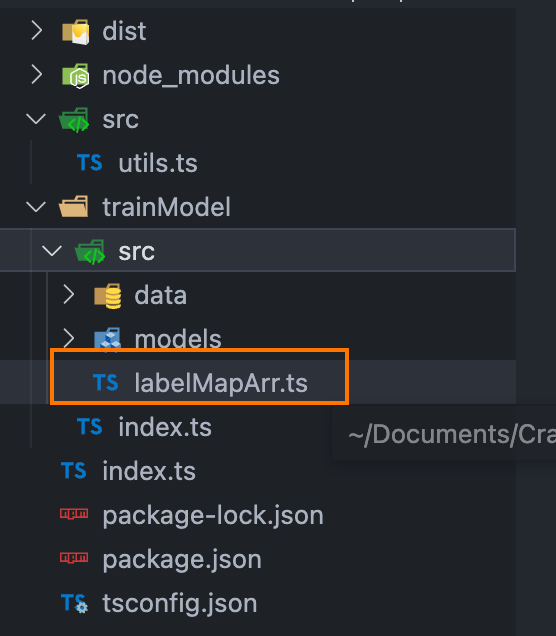
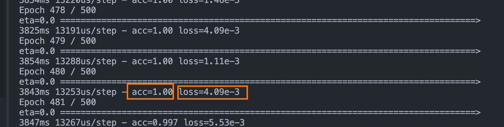

# node + tensorflowjs 训练验证码识别模型

## 一、系统环境准备

1. nodejs 版本最好大于 16,
2. tensorflow，可使用 cpu 版本或者 gpu 版本

## 二、处理数据集

1. 准备大量验证码图片，并按规则重命名验证码图片，规则为：验证码实际值+不重复的标志（时间戳或者自增下标都可以）+.png(jpg 也可以)。
2. 创建一个待训练的文件夹中，取名 test_set。

## 三、依赖安装

1. 安装 tensorflow 依赖，这里我使用的 cpu 版本，gpu 强大的可以使用 gpu 版本

```bash
npm install @tensorflow/tfjs-node
```

2. 为了更好的类型提示使用 typescript

```bash
npm install typescript -D
```

3. 为了删除文件夹方便使用了 rimraf 依赖

```bash
npm install rimraf -D
```

4. 使用 lodash 处理数据

```bash
npm install lodash
```

## 四、先将所有的图片集映射到 ts 文件，共后续使用

```ts
import fs from "node:fs"
import _ from "lodash"
import path from "node:path"
import { rimrafSync } from "rimraf"

// 生成映射文件
function generateMapFile() {
  const files = fs.readdirSync(path.join(__dirname, "./src/data/test_set"))
  const labelMapArr = files.map((fileName) => {
    return fileName.match(/(.+)\..+\.png/)![1]
  })
  const uniqueLabelMapArr = _.uniq(labelMapArr)
  const fileData = `const labelMapArr=${JSON.stringify(uniqueLabelMapArr)}
export {labelMapArr}
`
  rimrafSync(path.join(__dirname, "./src/labelMapArr.ts"))
  fs.writeFileSync(path.join(__dirname, "./src/labelMapArr.ts"), fileData)
  return { uniqueLabelMapArr, labelMapArr }
}

const { uniqueLabelMapArr, labelMapArr } = generateMapFile()
```


src 目录下的 labelMapArr.ts 即为映射文件，后续识别时需要用到

## 五、将每一张图片数据转换成张量数据（tensor）

```ts
/**
 * 将图片转换成张量
 * @param {string[]} paths 图片路径数组
 * @returns {tf.Tensor}
 */
const imageToTensor = (paths: Array<string>): tf.Tensor => {
  // concat方法是将多个张量合并成一个张量
  return tf.concat(
    paths.map((path) => {
      // 使用tidy方法，对张量进行内存控制，不然你直接读直接内存炸
      return tf.tidy(() => {
        return tf.node
          .decodeImage(fs.readFileSync(path)) // 把图片转换成张量
          .resizeNearestNeighbor([96, 96]) // 把图片的宽高转换成96x96
          .toFloat() // 转换成浮点型的张量
          .div(tf.scalar(255.0)) // 将图片张量进行归一化（这个自行去理解）
          .expandDims()
      })
    })
  )
}
```

## 六、将图片的标注转换成张量数据（tensor）

```ts
/**
 * 将图片路径里头的标注转换成张量
 * @param {string[]} paths 图片路径数组
 * @returns {tf.Tensor}
 */
const getLabels = (paths: string[]): tf.Tensor => {
  const mLabels = paths.map((path) => {
    const mTemps = path.split("/")
    const mFilename = mTemps[mTemps.length - 1]
    const name = mFilename.replace(/\..+\.png/, "")
    return uniqueLabelMapArr.indexOf(name)
  })
  // 接下来我们将这个数组转换成张量，这一行自行翻源代码理解哈
  return tf.oneHot(tf.tensor1d(mLabels, "int32"), labelMapArr.length).toFloat()
}
```

## 七、建立训练模型（model）

```ts
/**
 * 创建一个未训练的模型
 * @returns {tf.Sequential}
 */
const createModel = (): tf.Sequential => {
  // 网络每一层的一些参数
  const kernel_size = [3, 3]
  const pool_size: [number, number] = [2, 2]
  const first_filters = 32
  const dropout_conv = 0.3
  const dropout_dense = 0.3
  // 建立一个模型
  const mModel = tf.sequential()
  // 卷积层1
  mModel.add(
    tf.layers.conv2d({
      inputShape: [96, 96, 4],
      filters: first_filters,
      kernelSize: kernel_size,
      activation: "relu",
    })
  )
  // 卷积层2
  mModel.add(
    tf.layers.conv2d({
      filters: first_filters,
      kernelSize: kernel_size,
      activation: "relu",
    })
  )
  // 池化层
  mModel.add(tf.layers.maxPooling2d({ poolSize: pool_size }))
  mModel.add(tf.layers.dropout({ rate: dropout_conv }))
  mModel.add(tf.layers.flatten())
  // 全连接层1
  mModel.add(
    tf.layers.dense({
      units: 256,
      activation: "relu",
    })
  )
  mModel.add(
    tf.layers.dropout({
      rate: dropout_dense,
    })
  )
  // 全连接层2
  mModel.add(
    tf.layers.dense({
      units: labelMapArr.length,
      activation: "softmax",
    })
  )
  // 编译模型
  mModel.compile({
    optimizer: tf.train.adam(0.0001),
    loss: "categoricalCrossentropy",
    metrics: ["accuracy"],
  })
  // 查看模型
  mModel.summary()
  return mModel
}
```

## 八、开始训练模型

```ts
// 获取图片集所有路径
const mTarinPaths = fs.readdirSync(path.join(__dirname, "./src/data/test_set")).map((fileName) => {
  return path.join(__dirname, "./src/data/test_set", fileName)
})

function main() {
  // 这个方法是tensorflow.js自带的工具方法，目的把数组的顺序打乱
  tf.util.shuffle(mTarinPaths)
  const mTarinTensor = imageToTensor(mTarinPaths)
  const mTarinLabel = getLabels(mTarinPaths)
  const mModel = createModel()

  rimrafSync(path.join(__dirname, "./src/models"))
  !fs.existsSync(path.join(__dirname, "./src/models")) && fs.mkdirSync(path.join(__dirname, "./src/models"))
  // 训练模型，只需要传入我们做好的两个张量，一个是样本一个是标注
  mModel.fit(mTarinTensor, mTarinLabel, {
    epochs: 500, // 训练15次，也就是这8005张图片要被训练15次
    batchSize: 32, // 每批图片要训练多少张，这里电脑性能不好的同学最好填少一些
    callbacks: {
      onEpochEnd: async () => {
        // 每一次训练结束后执行的操作，保存模型
        mModel.save("file://trainModel/src/models/" + new Date().getTime())
      },
    },
  })
}
main()
```

## 九、训练结果


其中 acc 代表临时精度，loss 代表丢失率，loss 的值越小越好，训练好模型在 models 文件夹中，

## 十、使用模型

```ts
import * as tf from "@tensorflow/tfjs-node"
import path from "node:path"
import { labelMapArr } from "../trainModel/src/labelMapArr"

async function tensor(imageSrc: string) {
  const fileList = fs.readdirSync(path.join(__dirname, "../trainModel/src/models"))
  // 读入模型
  const mModel = await tf.loadLayersModel(`file://trainModel/src/models/${fileList[fileList.length - 1]}/model.json`)
  // 把要预测的图片转换成张量
  const mTensor = tf.node
    .decodeImage(fs.readFileSync(imageSrc))
    .resizeNearestNeighbor([96, 96])
    .toFloat()
    .div(tf.scalar(255.0))
    .expandDims()
  // 获取预测结果，主要靠predict这个方法进行预测
  // const mResult = Array.from(mModel.predict(mTensor).dataSync()).map((num) => num.toFixed(2))
  const predictions: any = mModel.predict(mTensor)
  const classIndex = predictions.dataSync()
  const mResult = Array.from(classIndex).map((num: any) => parseFloat(num.toFixed(2)))
  const { maxIndex, maxItem } = findMaxItem(mResult)
  const matchResult = labelMapArr[maxIndex]
  /* 
  matchResult:模型计算后最可能的值，
  maxItem：模型计算后为最可能的值的概率
   */
  return { tensorResult: matchResult, tensorMax: maxItem }
}
// 查找数组中最大值项
function findMaxItem(arr: Array<number>) {
  let maxItem = arr[0],
    maxIndex = 0
  for (let index = 0; index < arr.length; index++) {
    if (arr[index] > arr[index + 1]) {
      maxItem = arr[index]
      maxIndex = index
    }
  }
  return { maxItem, maxIndex }
}

// imgSrc 为需要识别的图片路径
tensor(imgSrc)
```
