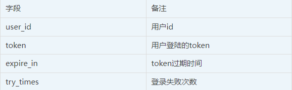
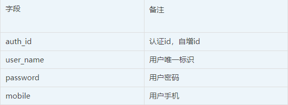
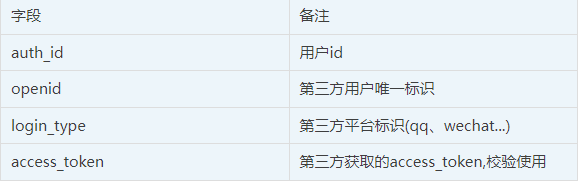

## 三方登录用户表结构设计

**数据库设计**

根据部分小伙伴的的建议，我这里做一下数据库的整理：

**用户基础表（users）**
<!-- | 字段        |      备注      |
| ------------- | :-----------: |
| user_id    | 用户id          |
| token      |   用户登录的token|
| expire_in  |   token过期时间  |
| try_times  |   登录失败次数   | -->

**用户验证关联表（user_auth_rel）**

**本地用户表（user_local_auth）**

**第三方用户表（user_third_auth）**

**说明**

- users表只是单纯针对我们业务侧的登录，主要是做自身业务的oauth2.0业务
- user_local_auth是做自己用户名、密码登录，手机号码登录信息记录，
- user_third_auth是我们第三方用户体系的数据记录，
- user_auth_rel是用来关联我们users表与user_local_auth、user_third_auth。
- 整个设计理念就是将自建用户与第三方在存储上区分，这在架构演进上也是合乎情理的，开始用户体系大多自建，而后才是对外接入。