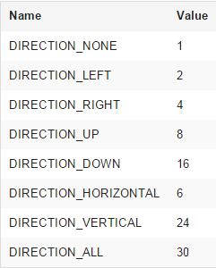
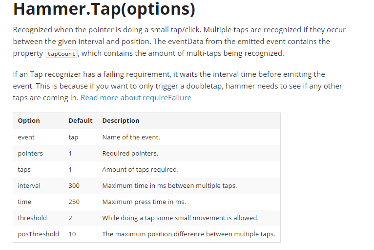
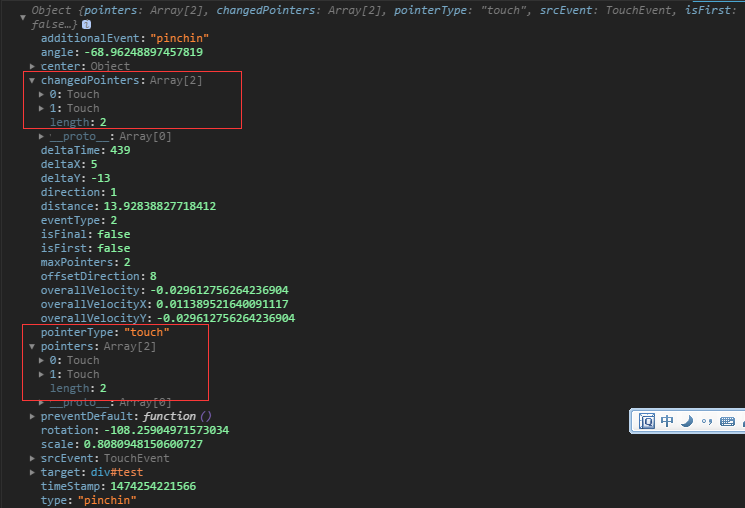
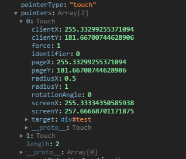
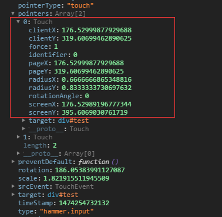

# 移动端手势库 hammerjs

## 一、引入方式

1. 使用 npm 下载库

```bash
# 下载js包
npm i hammerjs
# 下载类型包
npm i @types/hammerjs
```

2. CDN 引用

```js
<script src="http://hammerjs.github.io/dist/hammer.min.js"></script>
```

3. 将其下载到项目直接引入使用

```js
<script src="./hammer.js"></script>
```
## 二、使用
```ts
const targetElement = document.getElementById('#target')
const hammerTest = new Hammer(targetElement,options);
// 监听pan事件
hammertime.on('pan', (ev)=> {
	console.log(ev);
});
```
## 三、监听事件类型
1. pan类（平移）
- pan 
- panstart
- panmove
- panend
- pancancel
- panleft
- panright
- panup
- pandown
2. pinch类（捏拿缩放）
- pinch
- pinchstart
- pinchmove
- pinchend
- pinchcancel
- pinchin
- pinchout  
`pinch 和 rotate 默认是不可用的，因为它们可能会导致元素被卡住，要使用先`
```ts
hammerTest.get('pinch').set({
    enable: true
});
hammerTest.get('rotate').set({
    enable: true
});
```
3. press类（按住）

- press
- pressup
4. rotate类（旋转）
- rotate 
- rotatestart
- rotatemove
- rotateend
- rotatecancel
5. swipe类（滑动）
- swipe
- swipeleft
- swiperight
- swipeup
- swipedown   
垂直方向上的滑动操作一般是用来滚动页面的，所以swipe默认下未开启up与down的事件行为，要使用先设置方向
```ts
hammerTest.get('swipe').set({
    direction: Hammer.DIRECTION_ALL
});
```
其中，各方位对应值

6. tap类(触碰点击）
- tap 
- doubletap
7. 自定义

除了上述通过new Hammer(myElements, myOptions) 调用之外，Hammer.js还支持通过new Hammer.Manager(myElements, myOptions)调用

后者的myOptions参数实际上是个识别器recognizer，使用方式为
```ts
const mc = new Hammer.Manager(document.getElementById('test'), {
            recognizers: [
                [Hammer.Rotate, {
                    enable: true
                }],
                [Hammer.Swipe, {
                    direction: Hammer.DIRECTION_ALL
                }],
                [Hammer.Pan]
            ]
        });

        mc.on('press pan rotate swipe', function(ev) {
            console.log(ev.type);
        });
```
这种方式还可用于自定义事件，比如
```ts
mc.add(new Hammer.Tap({
            event: 'fourTap',
            taps: 4
        }));
        mc.on('fourTap', function(ev) {
            console.log(ev.type);
        });
```
连续点击四次则触发该事件，其实，还可以设置更多参数，比如四次点击之间的间隔也可设置

## 四、事件触发的对象属性
第三方工具对事件的封装，无非是使用到了原生的touch相关触摸事件，通过记录相应的坐标值变化，模拟出新的事件行为

看看捏拿pinchin时的对象属性


Hammer.js提供了一个hammer.input事件，它发生在每一个接收中的交互中，让你能对原生的交互来做相关处理，用法如一般的事件监听
```ts
hammerTest.on('pinch pinchin pinchout hammer.input', function(ev) {
    console.log(ev);
});
```

## 五、工具函数
Hammer.js还提供了一些实用的工具函数  

如对事件监听的简单封装

```ts
Hammer.on(window, "load resize scroll", function(ev) {
    console.log(ev.type);
});
```
简单的类继承：
```ts
function Animal(name) {
    this.name = name;
}

function Dog() {
    Animal.apply(this, arguments);
}

Hammer.inherit(Dog, Animal, {
    bark: function() {
        alert(this.name);
    }
});

var dog = new Dog('Spaikie');
dog.bark();
```