# nextjs 实战

## 项目搭建

### 1. 初始化项目

```bash
pnpm dlx create-next-app@latest
```

- What is your project named? » my-app **项目名称（必填）**
- Would you like to use the recommended Next.js defaults? **是否使用推荐配置**
- Would you like to use TypeScript? » No / Yes **是否使用 TypeScript**
- Which linter would you like to use? » ESLint / Biome / None **是否使用 ESLint**
- Would you like to use React Compiler? » No / Yes **是否使用 React Compiler**
- Would you like to use Tailwind CSS? » No / Yes **是否使用 Tailwind CSS**
- Would you like to use src/app directory? » No / Yes **是否使用 src/app 目录**
- Would you like to use App Router? (recommended) » No / Yes **是否使用 App Router**
- Would you like to use Turbopack? (recommended) » No / Yes **是否使用 Turbopack**
- Would you like to customize the import alias (@/_ by default)? » No / Yes \*\*是否自定义导入别名 `@/_`\*\*
- What import alias would you like configured? » @/_ \*\*是否自定义导入别名 `@/_`\*\*

### 2. 目录结构介绍

````
public/ -> 静态资源目录
src/ -> 源代码目录
  └─app/ -> App Router目录
     └─layout.tsx -> 跟布局(必须存在 且必须包含html body标签)
     └─page.tsx -> 首页
     └─globals.css -> 全局样式
next-env.d.ts -> TypeScript类型定义文件
next.config.ts -> Next.js配置文件
tsconfig.json -> TypeScript配置文件
postcss.config.mjs -> PostCSS配置文件(主要用于处理tailwindcss)
package.json -> 包管理文件
README.md -> 项目说明文件```
````

### 3. 命令介绍

```bash
next dev -> 启动开发服务器 -> pnpm dev
next build -> 构建项目 -> pnpm build
next start -> 启动生产服务器 -> pnpm start
```

## 路由使用

### Next.js 路由基础

Next.js 采用基于文件系统的路由机制，这意味着您只需创建文件和文件夹，框架就会自动为您生成对应的路由结构。这种约定优于配置的设计理念，让路由管理变得简单而直观.

#### 文件系统路由的工作原理

原理:在 Next.js 中，app 目录下的每个文件夹都代表一个路由段（route segment），并直接映射到 URL 路径。无需配置路由表，框架会根据您的文件结构自动处理。

#### page(页面)

默认情况下路由文件必须命名为 page，nextjs 会自动将名称为 page 的文件注册为路由

```json
app/
├── page.tsx               # /
├── about/
│   └── page.tsx           # /about
├── blog/test
│        └── page.tsx      # /blog/test
└── contact/
    └── page.tsx           # /contact
```

#### layout && template

**layout(布局)**： 布局是多个页面共享 UI，会保持状态，例如导航栏、侧边栏、底部等。
`app/layout.tsx`

```tsx
"use client"; //需要交互的地方要改为客户端组件 默认是服务端组件
import { ReactNode } from "react";
import { useState } from "react";

export default function AboutLayout({ children }: { children: ReactNode }) {
  const [count, setCount] = useState(0);
  return (
    <div>
      {/* <header>about-layout-header</header> */}
      <button onClick={() => setCount(count + 1)}>+1</button>
      <h1>数量： {count}</h1>
      {children}
      {/* <footer>about-layout-footer</footer> */}
    </div>
  );
}
```

**template(模板)**： 基本功能跟布局一样，只是不会保存状态，每次都会重新加载
`app/template.tsx`

```tsx
import { useState } from "react";
export default function BlogTemplate({
  children,
}: {
  children: React.ReactNode;
}) {
  return (
    <div>
      {/* <header>about-layout-header</header> */}
      <button onClick={() => setCount(count + 1)}>+1</button>
      <h1>数量： {count}</h1>
      {children}
      {/* <footer>about-layout-footer</footer> */}
    </div>
  );
}
```

布局和模板的特点就是：

- 布局嵌套：支持多层布局嵌套，构建复杂的页面结构
- 状态管理：布局会在页面切换时保持状态，而模板会重新渲染
- 根布局：app/layout.tsx 是必须存在的根布局文件
- 渲染顺序：当布局和模板同时存在时，渲染顺序为 `layout → template → page`

#### loading(加载)

Next.js 的 loading 是借助了 Suspense 实现的，Suspense 的具体用法请参考 [Suspense](https://react.dev/reference/react/Suspense) 组件
`app/loading.tsx`

```tsx
export default function Loading() {
  return (
    <div>
      <h1>Loading...</h1>
    </div>
  );
}
```

`app/page.tsx`
**必须是必须是异步组件，才能触发 loading**

```tsx
import Link from "next/link";
const getData = async () => {
  //触发异步会自动跳转到loading组件 异步结束正常返回页面
  return new Promise((resolve) => {
    setTimeout(() => {
      resolve("数据");
    }, 5000);
  });
};
export default async function APage() {
  const data = await getData();
  console.log(data);
  return (
    <div>
      <h1>A Page</h1>
      <Link href="/blog/b">跳转B</Link>
    </div>
  );
}
```

#### error(错误)

Next.js 的 error 是借助了`Error Boundary`实现的。  
`app/blog/error.tsx`

```tsx
"use client"; //错误组件必须是客户端组件
export default function Error() {
  return (
    <div>
      <h1>Error</h1>
    </div>
  );
}
```

`app/blog/page.tsx`

```tsx
import Link from "next/link";
export default async function APage() {
  //遇到异常会自动跳转到error组件
  throw new Error("错误");
  return (
    <div>
      <h1>A Page</h1>
      <Link href="/blog/b">跳转B</Link>
    </div>
  );
}
```

#### not-found(404)

其实 Next.js 默认会生成一个 404 页面，但我们可能自定义 404 页面，只需要在 app 目录下创建一个 not-found.tsx 文件即可

```tsx
export default function NotFound() {
  return (
    <div>
      <h1>404 Page</h1>
    </div>
  );
}
```

### 路由导航

路由导航是指我们在 Next.js 中跳转页面的方式，例如原始的`<a>`标签，等。

在 Next.js 中，共有四种方式提供跳转:

- Link 组件
- useRouter Hook (客户端组件)
- redirect 函数 (服务端组件)
- History API (浏览器 API 本文略过用的不多 了解即可)

#### Link 组件

`<Link>`是一个内置组件，在 a 标签的基础上扩展了功能，并且还能用来实现预获取(prefetch)，以及保持滚动位置(scroll)等。
基本用法

```tsx
import Link from "next/link"; //引入Link组件
export default function Home() {
  return (
    <div>
      <Link href="/about">跳转About页面</Link>
      <Link href={{ pathname: "/about", query: { name: "张三" } }}>
        跳转About并且传入参数
      </Link>
      <Link href="/page" prefetch={true}>
        预获取page页面
      </Link>
      <Link href="/xm" scroll={true}>
        保持滚动位置
      </Link>
      <Link href="/daman" replace={true}>
        替换当前页面
      </Link>
    </div>
  );
}
```

支持动态渲染

```tsx
import Link from "next/link";
export default function Page() {
  const arr = [1, 2, 3, 4, 5];
  return arr.map((item) => (
    <Link key={item} href={`/page/${item}`}>
      动态渲染的Link
    </Link>
  ));
}
```

#### useRouter Hook

```tsx
"use client";
import { useRouter } from "next/navigation";
export default function Page() {
  const router = useRouter();
  return (
    <>
      <button onClick={() => router.push("/page")}>跳转page页面</button>
      <button onClick={() => router.replace("/page")}>替换当前页面</button>
      <button onClick={() => router.back()}>返回上一页</button>
      <button onClick={() => router.forward()}>跳转下一页</button>
      <button onClick={() => router.refresh()}>刷新当前页面</button>
      <button onClick={() => router.prefetch("/about")}>预获取about页面</button>
    </>
  );
}
```

#### redirect 函数

redirect 函数可以用于服务端组件/客户端组件中跳转页面，例如根据用户权限跳转不同的页面。  
在 Next.js 中 redirect 的状态是：307 临时重定向

```tsx
import { redirect } from "next/navigation";
export default async function Page() {
  const checkLogin = await checkLogin();
  //如果用户未登录，则跳转到登录页面
  if (!checkLogin) {
    redirect("/login");
  }
  return (
    <div>
      <h1>Page</h1>
    </div>
  );
}
```

#### permanentRedirect 函数

permanentRedirect 跟上面的 redirect 的区别是：permanentRedirect 是永久重定向，而 redirect 是临时重定向。  
在 Next.js 中 permanentRedirect 的状态是：308 永久重定向

```tsx
//用法跟redirect一样，只是状态码不同
import { permanentRedirect } from "next/navigation";
export default async function Page() {
  const checkLogin = await checkLogin();
  if (!checkLogin) {
    permanentRedirect("/login");
  }
}
```

##### permanentRedirect / redirect 参数说明

这两个函数都接受以下参数：

- path：字符串类型，表示重定向的目标 URL（支持相对路径和绝对路径）
- type：可选参数，值为 replace 或 push，用于控制重定向的行为
  关于 type 参数的默认行为：

- 在 Server Actions 中：默认使用 push，会将新页面添加到浏览器历史记录
- 在 其他场景 中：默认使用 replace，会替换当前的浏览器历史记录
  你可以通过显式指定 type 参数来覆盖默认行为。  
  **⚠️ 注意：type 参数在服务端组件中无效，仅在客户端组件和 Server Actions 中生效。**

### 动态路由

动态路由是指在路由中使用方括号[]来定义路由参数，例如/blog/[id]，其中[id]就是动态路由参数，因为在某些需求下，我们需要根据不同的 id 来显示不同的页面内容，例如商品详情页，文章详情页等。

#### 基本用法[slug]

使用动态路由只需要在文件夹名加上方括号[]即可，例如[id],[params]等，名字可以自定义。  
来看 demo: 我们在 app/shop 目录下创建一个[id]目录

```tsx
//app/shop/[id]/page.tsx
export default function Page() {
  return <div>Page</div>;
}
```

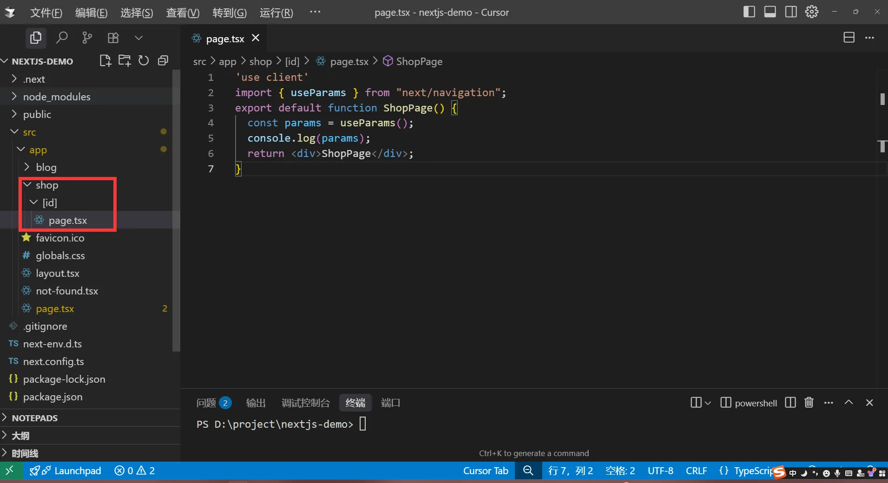
访问路径为:`http://localhost:3000/shop/123` 其中`123`就是动态路由参数，这个可以是任意值。

#### 路由片段[…slug]

我们如果需要捕获多个路由参数，例如/shop/123/456，我们可以使用路由片段来捕获多个路由参数，他的用法就是[...slug]，其中 slug 就是路由片段，这个名字可以自定义，后面的片段有多少就捕获多少。

```tsx
//app/shop/[...id]/page.tsx
export default function Page() {
  return <div>Page</div>;
}
```

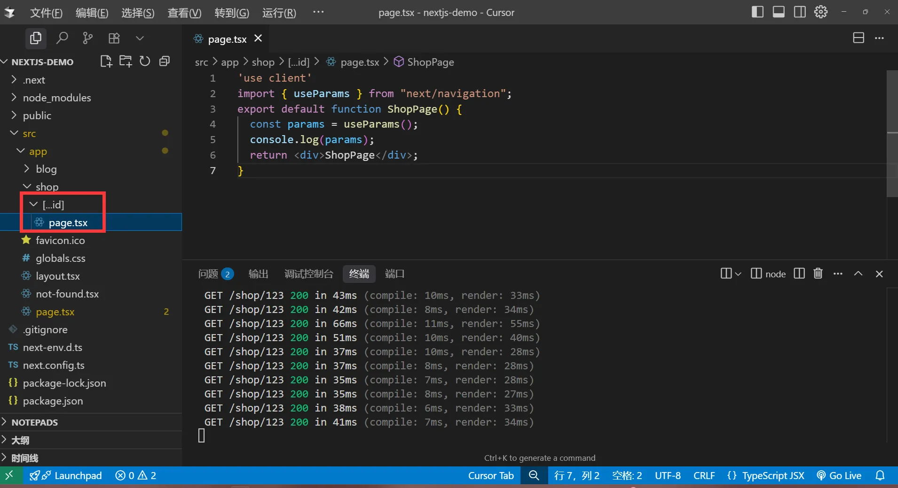
访问路径为:http://localhost:3000/shop/123/456/789 其中 123 和 456 和 789 就是动态路由参数，后面的片段有多少就捕获多少。

#### 可选路由[[…slug]]

可选路由指的是，我们可能会有这个路由参数，也可能会没有这个路由参数，例如`/shop/123`，也可能是`/shop`，我们可以使用可选路由来捕获这个路由参数，他的用法就是[[...slug]]，其中 slug 就是路由片段，这个名字可以自定义，后面的片段有多少就捕获多少。

```tsx
//app/shop/[[...id]]/page.tsx
export default function Page() {
  return <div>Page</div>;
}
```

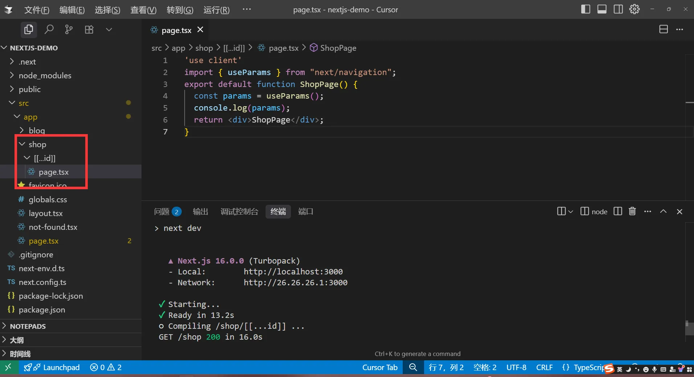

- 访问路径为:http://localhost:3000/shop，可以没有参数
- 访问路径为:http://localhost:3000/shop/123，可以有参数
- 访问路径为:http://localhost:3000/shop/123/456，可以有多个参数  
  这种方式比较灵活。

#### 接受参数

使用`useParams` hook 来接受参数，这个 hook 只能在客户端组件中使用。

```tsx
"use client";
import { useParams } from "next/navigation";
export default function ShopPage() {
  const params = useParams();
  console.log(params); //{id: '123'}  {id: ['123', '456']} 接受单个值以及多个值
  return <div>ShopPage</div>;
}
```

### 平行路由

平行路由指的是在同一布局`layout.tsx`中，可以同时渲染多个页面，例如`team`，`analytics`等，这个东西跟 vue 的 router-view 类似。

#### 基本用法

平行路由的使用方法就是通过@ + 文件夹名来定义，例如@team，@analytics 等，名字可以自定义。

```
平行路由也不会影响URL路径。
```

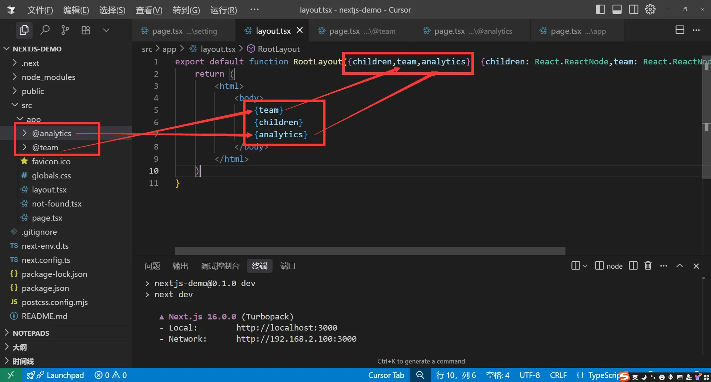
定义完成之后，我们就可以在 layout.tsx 中使用 team 和 analytics 来渲染对应的页面，他会自动注入 layout 的 props 里面
**注意：例子中我们使用了解构的语法，这里面的名称 team,analytics 需跟文件夹名称一致。**

```tsx
export default function RootLayout({
  children,
  team,
  analytics,
}: {
  children: React.ReactNode;
  team: React.ReactNode;
  analytics: React.ReactNode;
}) {
  return (
    <html>
      <body>
        {team}
        {children}
        {analytics}
      </body>
    </html>
  );
}
```

#### 独立路由

当我们使用了平行路由之后，我们为其单独定义 loading,error,等组件使其拥有独立加载和错误处理的能力。
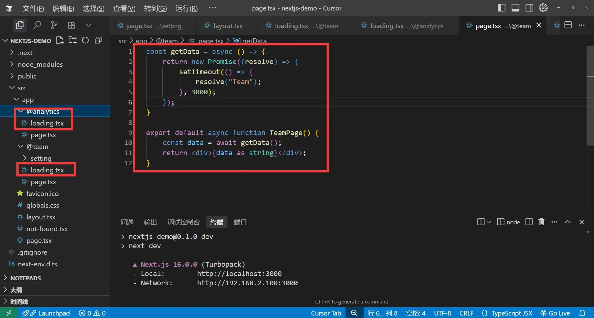

#### default.tsx

首先我们先认识一下子导航，每一个平行路由下面还可以接着创建对应的路由，例如@team 下面可以接着创建`@team/setting`，`@team/user`等。

### 路由组

#### 团队分工

路由组也是一种基于文件夹的约定范式，可以让我们开发者，按类别或者团队组织路由模块，并且不影响 URL 路径。  
用法：只需要通过`(groupName)`包裹住文件夹名即可，例如`(shop)`，`(user)`等，名字可以自定义。
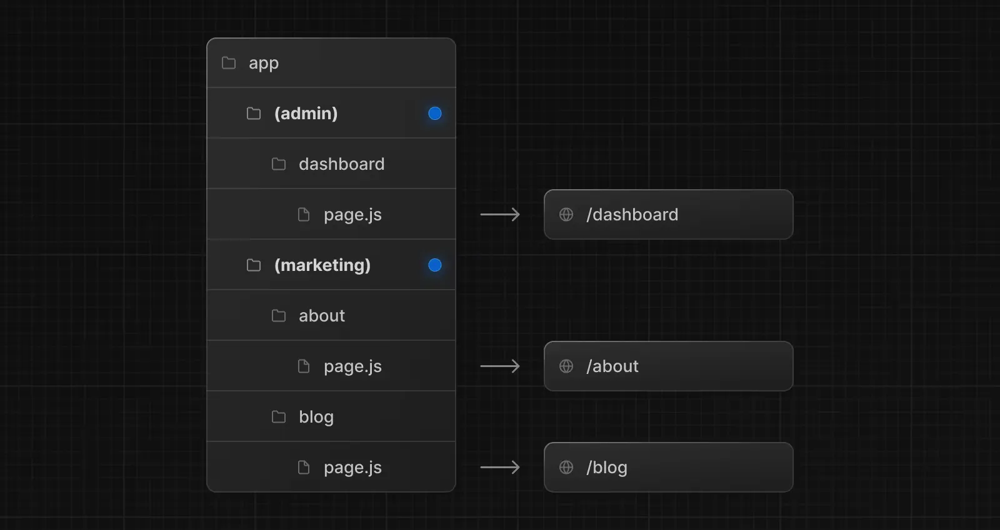

#### 定义多个根布局

这种一般是大型项目使用的，例如我们需要把，后台管理系统和前台的门户网站，放到一个项目就可以使用这种方法实现。
使用方法：

1. 先把`app`目录下的`layout.tsx` 文件删除
2. 在每组的目录下创建`layout.tsx`文件，并且定义`html`,`body`标签。
   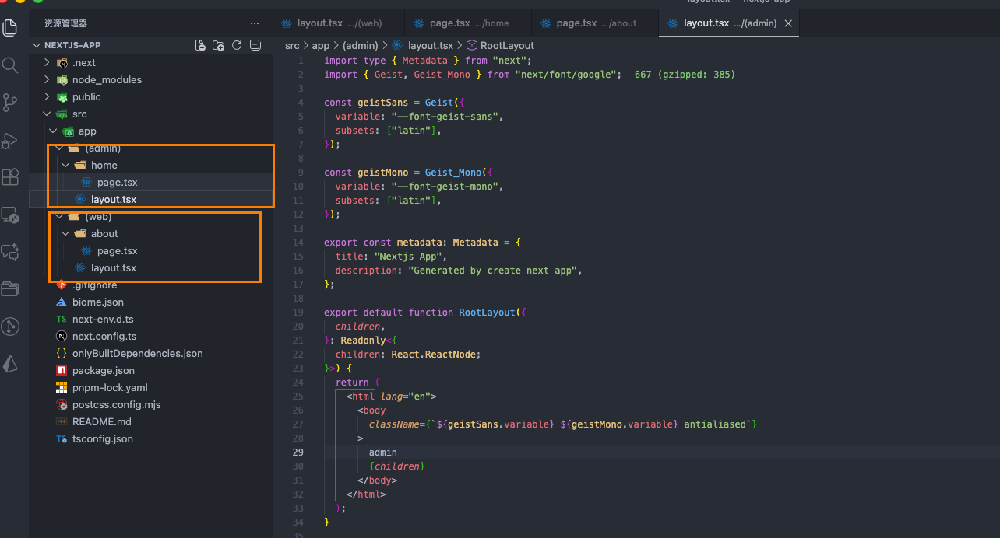

### 路由处理程序(Route Handlers)

路由处理程序，可以让我们在`Next.js`中编写 API 接口，并且支持与客户端组件的交互，真正做到了什么叫前后端分离人不分离。

#### 文件结构

定义前端路由页面我们使用的`page.tsx`文件，而定义 API 接口我们使用的`route.ts`文件，并且他两都不受文件夹的限制，可以放在任何地方，只需要文件的名称以`route.ts`结尾即可。

**注意：`page.tsx`文件和`route.ts`文件不能放在同一个文件夹下，否则会报错，因为`Next.js`就搞不清到底用哪一个了，所以我们最好把前后端代码分开。**

为此我们可以定义一个 api 文件夹，然后在这个文件夹下创建一对应的模块例如 user login register 等。

目录结构如下

```
app/
├── api
│   ├── user
│   │   └── route.ts
│   ├── login
│   │   └── route.ts
│   └── register
│       └── route.ts
```

#### 定义请求

Next.js 是遵循`RESTful API`的规范，所以我们可以使用 HTTP 方法来定义请求。

```ts
export async function GET(request) {}

export async function HEAD(request) {}

export async function POST(request) {}

export async function PUT(request) {}

export async function DELETE(request) {}

export async function PATCH(request) {}

//如果没有定义OPTIONS方法，则Next.js会自动实现OPTIONS方法
export async function OPTIONS(request) {}
```

**注意: 我们在定义这些请求方法的时候不能修改方法名称而且必须是大写，否则无效。**

#### 定义 GET 请求

`src/app/api/user/route.ts`

```ts
import { NextRequest, NextResponse } from "next/server";
export async function GET(request: NextRequest) {
  const query = request.nextUrl.searchParams; //接受url中的参数
  console.log(query.get("id"));
  return NextResponse.json({ message: "Get request successful" }); //返回json数据
}
```

#### 定义 Post 请求

`src/app/api/user/route.ts`

```ts
import { NextRequest, NextResponse } from "next/server";
export async function POST(request: NextRequest) {
  //const body = await request.formData(); //接受formData数据
  //const body = await request.text(); //接受text数据
  //const body = await request.arrayBuffer(); //接受arrayBuffer数据
  //const body = await request.blob(); //接受blob数据
  const body = await request.json(); //接受json数据
  console.log(body); //打印请求体中的数据
  return NextResponse.json(
    { message: "Post request successful", body },
    { status: 201 },
  );
  //返回json数据
}
```

#### 动态参数

我们可以在路由中使用方括号[]来定义动态参数，例如`/api/user/[id]`，其中`[id]`就是动态参数，这个参数可以在请求中传递，这个跟前端路由的动态路由类似。
`src/app/api/user/[id]/route.ts`
接受动态参参数，需要在第二个参数解构{ params },需注意这个参数是异步的，所以需要使用 await 来等待参数解析完成。

```ts
import { NextRequest, NextResponse } from "next/server";
export async function GET(
  request: NextRequest,
  { params }: { params: Promise<{ id: string }> },
) {
  const { id } = await params;
  console.log(id);
  return NextResponse.json({ message: `Hello, ${id}!` });
}
```

#### cookie

Next.js 也内置了 cookie 的操作可以方便让我们读写，接下来我们用一个登录的例子来演示如何使用 cookie。  
安装手动挡组件库[shadcn/ui](https://ui.shadcn.com/docs/installation/next)

```bash
pnpm dlx shadcn@latest init
```

为什么使用这个组件库？因为这个组件库是把组件放入你项目的目录下面，这样做的好处是可以让你随时修改组件库样式，并且还能通过 AI 分析修改组件库  
安装 button,input 组件

```bash
pnpm dlx shadcn@latest add button
pnpm dlx shadcn@latest add input
```

新建 login 接口 `src/app/api/login/route.ts`

```ts
import { cookies } from "next/headers";
import { type NextRequest, NextResponse } from "next/server";

// 登录接口
export async function POST(request: NextRequest) {
  const body = await request.json();
  if (body.name === "zuishuaicc" && body.password === "123456") {
    const cookieStore = await cookies();
    cookieStore.set("token", "auth-zuishuaicc-123456", {
      httpOnly: true, // 关键设置，浏览器 JS 无法访问
      maxAge: 60 * 60 * 24 * 30,
      sameSite: "strict",
    });
    console.log(cookieStore.get("token"), "setCookie");
    return NextResponse.json({ code: 1, message: "登录成功" }, { status: 200 });
  } else {
    return NextResponse.json(
      { code: 0, message: "账号或密码错误" },
      { status: 401 },
    );
  }
}
// 认证接口
export async function GET(request: NextRequest) {
  const cookieStore = await cookies();
  const token = cookieStore.get("token");
  console.log(token, "cookieStore.token");
  if (token && token.value === "auth-zuishuaicc-123456") {
    return NextResponse.json({ code: 1, message: "认证通过" }, { status: 200 });
  } else {
    return NextResponse.json({ code: 0, message: "认证失败" }, { status: 401 });
  }
}
```

新建登录页面`src/app/page.tsx`

```tsx
"use client";
import { useRouter } from "next/navigation";
import { type ChangeEvent, useState } from "react";
import { toast } from "sonner";
import { Button } from "@/components/ui/button";
import { Input } from "@/components/ui/input";

export default function Login() {
  const [formState, setFormState] = useState({ name: "", password: "" });
  const router = useRouter();
  function onChange(
    field: "name" | "password",
    value: ChangeEvent<HTMLInputElement>,
  ) {
    setFormState((state) => {
      const newState = { ...state };
      newState[field] = value.target.value;
      return newState;
    });
  }
  async function handleLogin() {
    try {
      const res = await fetch("/api/login", {
        method: "POST",
        body: JSON.stringify(formState),
        headers: { "Content-Type": "application/json" },
      });
      const data = await res.json();
      if (data.code === 1) {
        toast.success(data.message);
        router.push("/home");
      } else {
        toast.error(data.message);
      }
    } catch (error) {
      console.log(error);
    }
  }
  return (
    <div className="h-screen flex items-center justify-center">
      <div className="w-2xl bg-blue-300 pt-20 pb-20 pl-20 pr-20 rounded-3xl">
        <div className="text-center mb-10 text-white font-bold">Login</div>
        <Input
          className="mb-10 placeholder:text-amber-300"
          type="text"
          placeholder="name"
          onChange={(e) => onChange("name", e)}
        />
        <Input
          className="mb-10 placeholder:text-amber-300"
          type="password"
          placeholder="password"
          onChange={(e) => onChange("password", e)}
        />
        <div className="text-center">
          <Button onClick={handleLogin}>登录</Button>
        </div>
      </div>
    </div>
  );
}
```

新建 home 页面，用于验证 cookie 是否有效

```tsx
"use client";

import { useEffect } from "react";
import { toast } from "sonner";

export default function Home() {
  async function checkCookie() {
    const res = await fetch("/api/login");
    const data = await res.json();
    if (data.code === 1) {
      toast.success(data.message);
    } else {
      toast.error(data.message);
    }
  }
  // biome-ignore lint/correctness/useExhaustiveDependencies: <explanation>
  useEffect(() => {
    checkCookie();
  }, []);

  return <div>home page get detail success</div>;
}
```

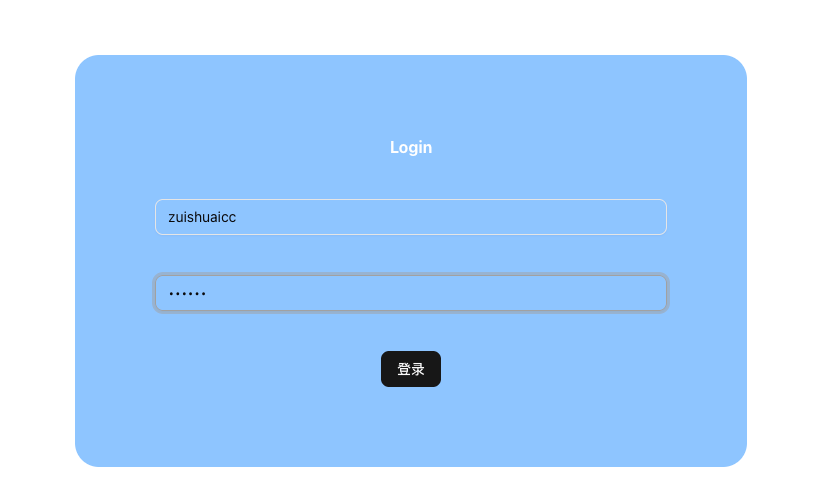
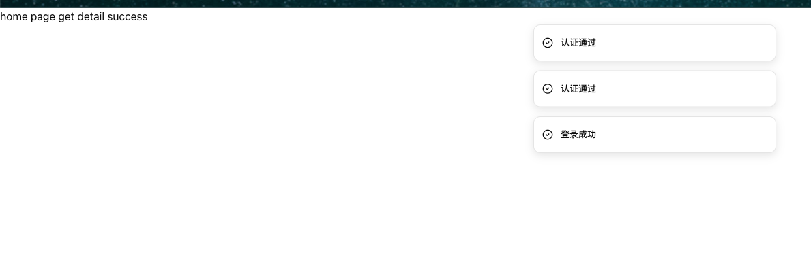

## AI 集成

Vercel 提供了 AI SDK，可以让我们在 Next.js 中轻松集成 AI 功能。[AI SDK 官网](https://ai-sdk.dev/getting-started)

### 安装 AI-SDK

```bash
pnpm add ai @ai-sdk/deepseek @ai-sdk/react
```

这儿我们使用`deepseek`作为 AI 模型，`@ai-sdk/react`封装了流式输出和上下文管理 hook，可以让我们在 Next.js 中轻松集成 AI 功能。如果你要安装其他模型，只需要将`deepseek`替换为其他模型即可。

然后把生成的 API Key 复制一下保存起来。

### 编写 API 接口

`src/app/api/chat/route.ts`

```ts
import { NextRequest } from "next/server";
import { streamText, convertToModelMessages } from "ai";
import { createDeepSeek } from "@ai-sdk/deepseek";
import { DEEPSEEK_API_KEY } from "./key";
const deepSeek = createDeepSeek({
  apiKey: DEEPSEEK_API_KEY, //设置API密钥
});
export async function POST(req: NextRequest) {
  const { messages } = await req.json(); //获取请求体
  //这里为什么接受messages 因为我们使用前端的useChat 他会自动注入这个参数，所有可以直接读取
  const result = streamText({
    model: deepSeek("deepseek-chat"), //使用deepseek-chat模型
    messages: convertToModelMessages(messages), //转换为模型消息
    //前端传过来的额messages不符合sdk格式所以需要convertToModelMessages转换一下
    //转换之后的格式：
    //[
    //{ role: 'user', content: [ [Object] ] },
    //{ role: 'assistant', content: [ [Object] ] },
    //{ role: 'user', content: [ [Object] ] },
    //{ role: 'assistant', content: [ [Object] ] },
    //{ role: 'user', content: [ [Object] ] },
    //{ role: 'assistant', content: [ [Object] ] },
    //{ role: 'user', content: [ [Object] ] }
    //]
    system: "你是一个高级程序员，请根据用户的问题给出回答", //系统提示词
  });

  return result.toUIMessageStreamResponse(); //返回流式响应
}
```

### 编写前端页面

我们在前端使用 useChat 组件来实现 AI 对话，这个组件内部封装了流式响应，默认会向/api/chat 发送请求。

- messages: 消息列表，包含用户和 AI 的对话内容
- sendMessage: 发送消息的函数，参数为消息内容
- onFinish: 消息发送完成后回调函数，可以在这里进行一些操作，例如清空输入框  
  messages：数据结构解析

```json
[
  {
    "parts": [
      {
        "type": "text", //文本类型
        "text": "你知道 api router 吗"
      }
    ],
    "id": "FPHwY1udRrkEoYgR", //消息ID
    "role": "user" //用户角色
  },
  {
    "id": "qno6vcWcwFM4Yc8J", //消息ID
    "role": "assistant", //AI角色
    "parts": [
      {
        "type": "step-start" //步骤开始
      },
      {
        "type": "text", //文本类型
        "text": "是的，我知道 **API Router**。", //文本内容
        "state": "done" //步骤完成
      }
    ]
  }
]
```

`src/app/page.tsx`

```tsx
"use client";
import { useState, useRef, useEffect } from "react";
import { Button } from "@/components/ui/button";
import { Textarea } from "@/components/ui/textarea";
import { useChat } from "@ai-sdk/react";

export default function HomePage() {
  const [input, setInput] = useState(""); //输入框的值
  const messagesEndRef = useRef<HTMLDivElement>(null); //获取消息结束的ref
  //useChat 内部封装了流式响应 默认会向/api/chat 发送请求
  const { messages, sendMessage } = useChat({
    onFinish: () => {
      setInput("");
    },
  });

  // 自动滚动到底部
  useEffect(() => {
    messagesEndRef.current?.scrollIntoView({ behavior: "smooth" });
  }, [messages]);
  //回车发送消息
  const handleKeyDown = (e: React.KeyboardEvent<HTMLTextAreaElement>) => {
    if (e.key === "Enter" && !e.shiftKey) {
      e.preventDefault();
      if (input.trim()) {
        sendMessage({ text: input });
      }
    }
  };

  return (
    <div className="flex flex-col h-screen bg-linear-to-br from-blue-50 via-white to-purple-50">
      {/* 头部标题 */}
      <div className="bg-white/80 backdrop-blur-sm shadow-sm border-b border-gray-200">
        <div className="max-w-4xl mx-auto px-6 py-4">
          <h1 className="text-2xl font-bold bg-linear-to-r from-blue-600 to-purple-600 bg-clip-text text-transparent">
            AI 智能助手
          </h1>
          <p className="text-sm text-gray-500 mt-1">随时为您解答问题</p>
        </div>
      </div>

      {/* 消息区域 */}
      <div className="flex-1 overflow-y-auto px-4 py-6">
        <div className="max-w-4xl mx-auto space-y-4">
          {messages.length === 0 ? (
            <div className="flex flex-col items-center justify-center h-full text-center py-20">
              <div className="bg-linear-to-br from-blue-100 to-purple-100 rounded-full p-6 mb-4">
                <svg
                  className="w-12 h-12 text-blue-600"
                  fill="none"
                  stroke="currentColor"
                  viewBox="0 0 24 24"
                >
                  <path
                    strokeLinecap="round"
                    strokeLinejoin="round"
                    strokeWidth={2}
                    d="M8 10h.01M12 10h.01M16 10h.01M9 16H5a2 2 0 01-2-2V6a2 2 0 012-2h14a2 2 0 012 2v8a2 2 0 01-2 2h-5l-5 5v-5z"
                  />
                </svg>
              </div>
              <h2 className="text-xl font-semibold text-gray-700 mb-2">
                开始对话
              </h2>
              <p className="text-gray-500">输入您的问题，我会尽力帮助您</p>
            </div>
          ) : (
            messages.map((message) => (
              <div
                key={message.id}
                className={`flex ${
                  message.role === "user" ? "justify-end" : "justify-start"
                } animate-in fade-in slide-in-from-bottom-4 duration-500`}
              >
                <div
                  className={`flex gap-3 max-w-[80%] ${message.role === "user" ? "flex-row-reverse" : "flex-row"}`}
                >
                  {/* 头像 */}
                  <div
                    className={`shrink-0 w-8 h-8 rounded-full flex items-center justify-center text-white font-semibold ${
                      message.role === "user"
                        ? "bg-linear-to-br from-blue-500 to-blue-600"
                        : "bg-linear-to-br from-purple-500 to-purple-600"
                    }`}
                  >
                    {message.role === "user" ? "你" : "AI"}
                  </div>

                  {/* 消息内容 */}
                  <div
                    className={`flex flex-col ${message.role === "user" ? "items-end" : "items-start"}`}
                  >
                    <div
                      className={`rounded-2xl px-4 py-3 shadow-sm ${
                        message.role === "user"
                          ? "bg-linear-to-br from-blue-500 to-blue-600 text-white"
                          : "bg-white border border-gray-200 text-gray-800"
                      }`}
                    >
                      {message.parts.map((part, index) => {
                        switch (part.type) {
                          case "text":
                            return (
                              <div
                                key={message.id + index}
                                className="whitespace-pre-wrap wrap-break-word"
                              >
                                {part.text}
                              </div>
                            );
                        }
                      })}
                    </div>
                  </div>
                </div>
              </div>
            ))
          )}
          <div ref={messagesEndRef} />
        </div>
      </div>

      {/* 输入区域 */}
      <div className="bg-white/80 backdrop-blur-sm border-t border-gray-200 shadow-lg">
        <div className="max-w-4xl mx-auto px-4 py-4">
          <div className="flex gap-3 items-end">
            <div className="flex-1 relative">
              <Textarea
                value={input}
                onChange={(e) => setInput(e.target.value)}
                onKeyDown={handleKeyDown}
                placeholder="请输入你的问题... (按 Enter 发送，Shift + Enter 换行)"
                className="min-h-[60px] max-h-[200px] resize-none rounded-xl border-gray-300 focus:border-blue-500 focus:ring-2 focus:ring-blue-200 transition-all shadow-sm"
              />
            </div>
            <Button
              onClick={() => {
                if (input.trim()) {
                  sendMessage({ text: input });
                }
              }}
              disabled={!input.trim()}
              className="h-[60px] px-6 rounded-xl bg-linear-to-r from-blue-500 to-purple-600 hover:from-blue-600 hover:to-purple-700 transition-all shadow-md hover:shadow-lg disabled:opacity-50 disabled:cursor-not-allowed"
            >
              <svg
                className="w-5 h-5"
                fill="none"
                stroke="currentColor"
                viewBox="0 0 24 24"
              >
                <path
                  strokeLinecap="round"
                  strokeLinejoin="round"
                  strokeWidth={2}
                  d="M12 19l9 2-9-18-9 18 9-2zm0 0v-8"
                />
              </svg>
            </Button>
          </div>
        </div>
      </div>
    </div>
  );
}
```

## Proxy 代理

从 Next.js 16 开始，中间件`Middleware`更名为代理（Proxy），以更好地体现其用途。其功能保持不变

### 基本使用

应用场景：

- 处理跨域请求
- 接口转发例如/api/user -> (可能是其他服务器 java/go/python 等) -> /api/user
- 限流例如配合第三方服务做限流
- 鉴权/判断是否登录  
  Prxoy 代理其实跟拦截器类似，它可以在请求完成之前进行拦截，然后进行一些处理，例如：修改请求头、修改请求体、修改响应体等。
  `src/proxy.ts`
  定义 proxy 函数导出即可，Next.js 会自动调用这个函数。

```ts
import { NextRequest, NextResponse } from "next/server";
export async function proxy(request: NextRequest) {
  console.log(request.url, "url");
}
```

但是你会发现，他会拦截项目中所有的请求，包括静态资源、API 请求、页面请求等。

```bash
http://localhost:3000/.well-known/appspecific/com.chrome.devtools.json url
http://localhost:3000/_next/static/chunks/src_app_globals_91e4631d.css url
http://localhost:3000/_next/static/chunks/%5Bturbopack%5D_browser_dev_hmr-client_hmr-client_ts_cedd0592._.js url
http://localhost:3000/_next/static/chunks/node_modules_next_dist_compiled_react-dom_1e674e59._.js url
http://localhost:3000/_next/static/chunks/node_modules_next_dist_compiled_react-server-dom-turbopack_9212ccad._.js url
http://localhost:3000/_next/static/chunks/node_modules_next_dist_compiled_next-devtools_index_1dd7fb59.js url
http://localhost:3000/_next/static/chunks/node_modules_next_dist_compiled_a0e4c7b4._.js url
http://localhost:3000/_next/static/chunks/node_modules_next_dist_client_a38d7d69._.js url
http://localhost:3000/_next/static/chunks/node_modules_next_dist_4b2403f5._.js url
http://localhost:3000/_next/static/chunks/src_app_globals_91e4631d.css.map url
http://localhost:3000/_next/static/chunks/node_modules_%40swc_helpers_cjs_d80fb378._.js url
http://localhost:3000/_next/static/chunks/_a0ff3932._.js url
http://localhost:3000/api/login url
```

### 配置(config)

例如我们只想匹配`/api`下面的路径去做一些事情，我们可以使用 config 配置来实现。

```ts
import { NextRequest, NextResponse } from "next/server";
export async function proxy(request: NextRequest) {
  console.log(request.url, "url");
}
//配置匹配路径
export const config: ProxyConfig = {
  matcher: "/api/:path*",
  //matcher: ['/api/:path*','/api/user/:path*'], 支持单个以及多个路径匹配
  //matcher: ['/((?!api|_next/static|_next/image|.*\\.png$).*)'], 同样支持正则表达式匹配
};
```

结合之前的案例,在 cookie 那一集，我们还需要单独定义 check 接口检查 cookie，现在我们可以直接在 proxy 中实现。

```ts
import { NextRequest, NextResponse } from "next/server";
export async function proxy(request: NextRequest) {
  const cookie = request.cookies.get("token");
  if (request.nextUrl.pathname.startsWith("/home") && !cookie) {
    console.log("redirect to login");
    return NextResponse.redirect(new URL("/", request.url));
  }
  if (cookie && cookie.value) {
    return NextResponse.next();
  }
  return NextResponse.redirect(new URL("/", request.url));
}

export const config = {
  matcher: ["/api/:path*", "/home/:path*"],
};
```

### 复杂匹配

- source: 表示匹配路径
- has: 表示匹配路径中必须(包含)某些条件
- missing: 表示匹配路径中(必须不包含)某些条件  
  type 只能匹配: header, query, cookie

```ts
import { NextRequest, NextResponse } from "next/server";
import { ProxyConfig } from "next/server";
export async function proxy(request: NextRequest) {
  console.log("start proxy");
  return NextResponse.next();
}

export const config: ProxyConfig = {
  matcher: [
    {
      source: "/home/:path*",
      //表示匹配路径中必须(包含)Authorization头和userId查询参数
      has: [
        { type: "header", key: "Authorization", value: "Bearer 123456" },
        { type: "query", key: "userId", value: "123" },
      ],
      //表示匹配路径中(必须不包含)cookie和userId查询参数
      missing: [
        { type: "cookie", key: "token", value: "123456" },
        { type: "query", key: "userId", value: "456" },
      ],
    },
  ],
};
```

访问 url 为：`http://localhost:3000/home?userId=123`

### 案例实战(处理跨域)

只要是/api 下面的接口都可以被任意访问

```ts
import { NextRequest, NextResponse } from "next/server";
import { ProxyConfig } from "next/server";
export async function proxy(request: NextRequest) {
  const response = NextResponse.next();
  Object.entries(corsHeaders).forEach(([key, value]) => {
    response.headers.set(key, value);
  });
  return response;
}

const corsHeaders = {
  "Access-Control-Allow-Origin": "*",
  "Access-Control-Allow-Methods": "GET, POST, PUT, DELETE, OPTIONS",
  "Access-Control-Allow-Headers": "Content-Type, Authorization",
};

export const config: ProxyConfig = {
  matcher: "/api/:path*",
};
```

## RSC(React Server Components)

RSC(服务器组件)是 React19 正式引入的一种新的组件类型，它可以在服务器端渲染，也可以在客户端渲染。  
像传统的 SSR 他是在服务器提前把页面渲染好，然后返回给浏览器，然后进行水合，CSR 则是在客户端渲染，而 RSC 则是吸取两方优势，分为服务器组件和客户端组件。

### 渲染(RSC Payload)

传统 SSR 模式是在服务器直接渲染成 HTML 页面，返回给浏览器的，而 RSC 他是一种特殊的紧凑的格式

```json
b2:["$","span",null,{"className":"line","children":["$","span",null,{"style":{"color":"var(--shiki-color-text)"},"children":"    })"}]}]
b3:["$","span",null,{"className":"line","children":[["$","span",null,{"style":{"color":"var(--shiki-color-text)"},"children":"  }"}],["$","span",null,{"style":{"color":"var(--shiki-token-punctuation)"},"children":","}],["$","span",null,{"style":{"color":"var(--shiki-color-text)"},"children":" [])"}]]}]
b4:["$","span",null,{"className":"line","children":" "}]
b5:["$","span",null,{"className":"line","children":[["$","span",null,{"style":{"color":"var(--shiki-color-text)"},"children":"  "}],["$","span",null,{"style":{"color":"var(--shiki-token-comment)"},"children":"// You can use `isPending` to give users feedback"}]]}]
b6:["$","span",null,{"className":"line","children":[["$","span",null,{"style":{"color":"var(--shiki-color-text)"},"children":"  "}],["$","span",null,{"style":{"color":"var(--shiki-token-keyword)"},"children":"return"}],["$","span",null,{"style":{"color":"var(--shiki-color-text)"},"children":" <"}],["$","span",null,{"style":{"color":"var(--shiki-token-string-expression)"},"children":"p"}],["$","span",null,{"style":{"color":"var(--shiki-color-text)"},"children":">Total Views: {views}</"}],["$","span",null,{"style":{"color":"var(--shiki-token-string-expression)"},"children":"p"}],["$","span",null,{"style":{"color":"var(--shiki-color-text)"},"children":">"}]]}]
```

那为什么这么做呢？因为我们的组件可以进行嵌套,`服务器组件`>嵌套`客户端组件`
黄色节点表示`服务器组件`，虚线节点表示`客户端组件`
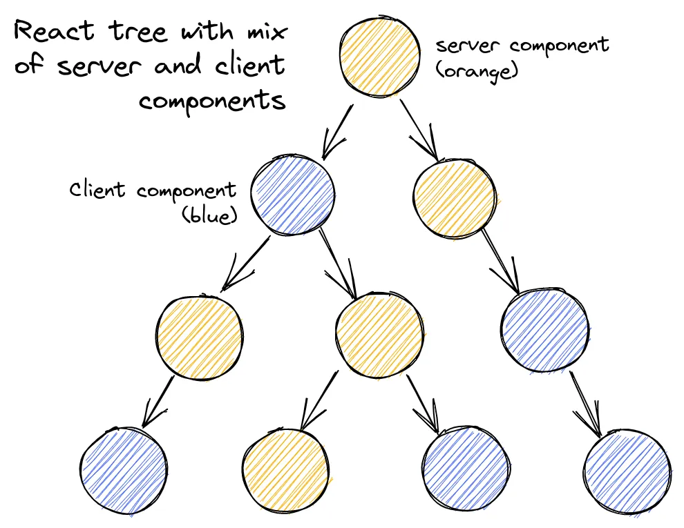
在这个结构中，Next.js 就会标记哪些是客户端组件并且预留好位置，但是不会进行水合。  
那么 Next.js 发现客户端组件也会在服务器生成这个结构，那干脆直接服务器里面把客户端组件进行预渲染(不包含交互)，这样我们就能快速看到数据，等他加载完成后再进行水合，所以客户端组件也会在服务器进行一次`预渲染`。
**优点**

- 将组件拆分成客户端组件和服务器组件，可以有效的减少 bundle 体积，因为服务器组件已经在服务器渲染好了，所以没必要打入 bundle 中,也就是说服务器组件所依赖的包都不会打进去，大大减少了 bundle 体积。
- 局部水合，像传统的 SSR 同构模式, 所有的页面都要在客户端进行水合，而 RSC 将组件拆分出来，只会把客户端组件进行水合，避免了全量水合带来的性能损耗。
- 流式加载，我们的 HTML 页面本来就支持流式加载，所以服务器组件可以边渲染边返回，提高了 FCP(首次内容绘制)性能。

### 服务端组件(Server Components)

在默认情况下, page layout 都是服务端组件，服务端组件可以访问`node.js `API，包括处理数据库 db。
`src/app/server/page.tsx`

```tsx
import fs from "node:fs"; //引入fs模块
import mysql, { RowDataPacket } from "mysql2/promise"; //操作数据库 仅供演示 非最佳实践
const pool = mysql.createPool({
  host: "localhost",
  user: "root",
  password: "123456",
  database: "catering",
});

export default async function ServerPage() {
  const [rows] = await pool.query<RowDataPacket[]>("SELECT * FROM goods");
  const data = fs.readFileSync("data.json", "utf-8");
  const json = JSON.parse(data);
  return (
    <div>
      <h1>Server Page</h1>
      {json.age}///{json.name}///{json.city}
      <h3>mysql</h3>
      {rows.map((item: any) => (
        <div key={item.id}>
          {item.name}-{item.goodsPrice}
        </div>
      ))}
    </div>
  );
}
```

`data.json`

```json
{
  "name": "John",
  "age": 30,
  "city": "New York"
}
```

### 客户端组件(Client Components)

声明客户端组件需要在文件的顶部编写 `'use client'` 声明这是客户端组件，但是注意客户端组件会在服务端进行一次`预渲染`，所以访问 `document`, `window` 等 API 需要在 `useEffect` 中访问。

```tsx
"use client";
import { useEffect, useState } from "react";
console.log("client");
export default function ServerPage() {
  const [count, setCount] = useState(0);
  console.log("client X");
  useEffect(() => {
    console.log(document, window);
  }, []);
  return (
    <div>
      <h1>Server Page</h1>
      <button onClick={() => setCount(count + 1)}>点击</button>
      <p>{count}</p>
    </div>
  );
}
```

所以我们可以看到他把 `useState` 的 `0` 预渲染了出来这样可以让用户先看到页面。

### 组件嵌套

**服务端组件可以嵌套客户端组件，客户端只能嵌套不能嵌套服务端组件**
why:因为客户端会把他所有的模块以及子组件认为是客户端组件，那此时如果服务端组件用了`node.js`的 API，或者其他服务端操作，那就会报错，因为客户端组件无法访问这些 API，故此客户端组件不能嵌套服务端组件。

### server-only

随着 `Nodejs` 的发展，很多 API 已经可以跟浏览器共用了例如 `fetch`,`webSocket`,未来 Nodejs25 支持 `localStorage` 等 API,所以就会出现这种情况  
下面这个函数可以在服务端组件使用，也可以在客户端组件使用，但有时候我们只想让他在服务端使用

```ts
export default function useTest(type: 0 | 1) {
  if (type === 0) {
    return fetch("https://api.github.com");
  } else {
    return new WebSocket("wss://api.github.com");
  }
}
```

```bash
pnpm add server-only
```

安装完成这个包之后，只需要在文件的顶部编写 `import 'server-only'` 声明即可，这样他就会在服务端执行，在客户端执行会报错。

```ts
import "server-only";
export default function useTest(type: 0 | 1) {
  if (type === 0) {
    return fetch("https://api.github.com");
  } else {
    return new WebSocket("wss://api.github.com");
  }
}
```

客户端使用报错:
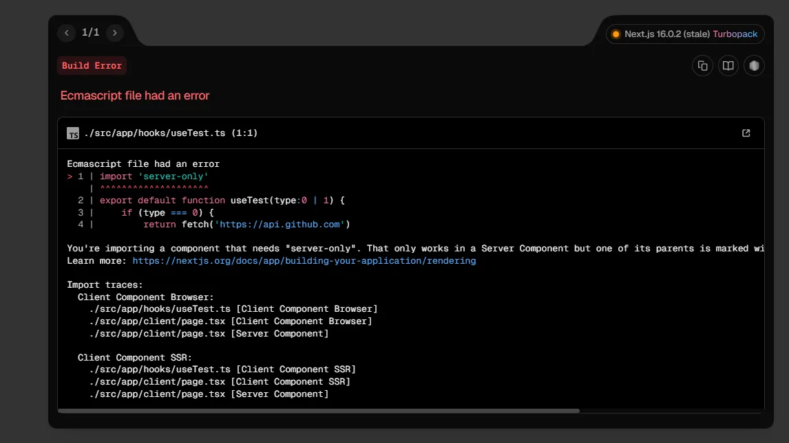

### 缓存组件

Cache Components 是 Next.js(16)版本特有的机制，实现了静态内容 动态内容 缓存内容的混合编排。

- 静态内容: 构建(`npm run build`)时进行预渲染，例如 「本地文件」「模块导入」「纯计算」（无网络请求、无用户相关数据）,会被直接编译成 HTML 瞬间加载、立即响应。
- 动态内容：用户发起请求时才开始渲染的内容，依赖 “实时数据” 或 “用户个性化信息”，每次请求都可能生成不同结果，不会被缓存。例如「实时数据源」（如实时接口、数据库实时查询）或「用户请求上下文」（如 Cookie、请求头、URL 参数）。
- 缓存内容：缓存内容的本质就是缓存动态数据，缓存之后会被纳入静态外壳(Static Shell),静态外壳就类似于毛坯房，会提前把结构搭建好，后续在通过(流式传输)填充里面的动态内容。

#### 启用 Cache Components

```ts
import type { NextConfig } from "next";

const nextConfig: NextConfig = {
  cacheComponents: true, // 启用缓存组件
};

export default nextConfig;
```

1. 静态内容展示  
   **适用场景：仅依赖同步 I/O（如 fs.readFileSync）、模块导入、纯计算的组件**

```ts
import fs from "node:fs"

export default async function Home() {
  const data = fs.readFileSync("data.json", "utf-8") //本地文件读取
  const json = JSON.parse(data)
  const impData = await import("../../../data.json") //模块导入
  const names = impData.list.map((item) => item.name).join(",") //纯计算
  console.log(json)
  console.log(impData)
  console.log(names)
  return (
    <div>
      <h1>Home</h1>
      <ul>
        {json.list.map((item: any) => (
          <li key={item.id}>
            {item.name} - {item.age}
          </li>
        ))}
      </ul>
    </div>
  )
}
```

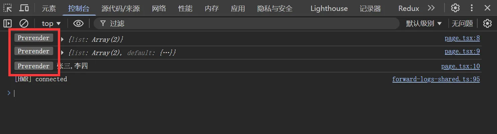 2. 动态内容展示  
**适用场景：fetch 请求、cookies、headers 等动态数据**
动态内容必须配合 Suspense 使用。

```ts
import { Suspense } from "react"
import { cookies } from "next/headers"

const DynamicContent = async () => {
  const data = await fetch("https://www.mocklib.com/mock/random/name") //随机生成一个名称
  const json = await data.json()
  console.log(json)
  const cookieStore = await cookies() //获取cookie
  console.log(cookieStore)
  return (
    <div>
      <h2>动态内容</h2>
      <main>
        <ul>
          <li>名称：{json.name}</li>
        </ul>
      </main>
    </div>
  )
}

export default async function Home() {
  return (
    <div>
      <h1>Home</h1>
      <Suspense fallback={<div>动态内容Loading...</div>}>
        <DynamicContent />
      </Suspense>
    </div>
  )
}
```

**实现原理：Next.js 会通过(Partial Prerendering/PPR)技术,实现静态外壳(Static Shell)渲染，提供占位符，当用户请求时，再通过流式传输(Streaming)填充里面的动态内容，以此提升首屏加载速度和用户体验。**  
3. 非确定操作
例如: 随机数(`random()`)、时间戳(`new Date()`)等非确定操作，每次请求都可能生成不同结果。
直接使用就会报错如下：

```
Error: Route “/home” used Math.random() before accessing either uncached data (e.g. fetch()) or Request data (e.g. cookies(), headers(), connection(), and searchParams). Accessing random values synchronously in a Server Component requires reading one of these data sources first. Alternatively, consider moving this expression into a Client Component or Cache Component. See more info here: https://nextjs.org/docs/messages/next-prerender-random at DynamicContent (page.tsx:5:25) at Home (page.tsx:27:17)
```

**解决方案：**  
使用 Suspense 包裹，然后使用 connection 表示不要预渲染这部分。
Next.js 默认会尝试尽可能多地静态预渲染页面内容。但像 Math.random() 这样的值每次调用结果都不同，如果在预渲染时执行，那这个”随机值”就被固定了，失去了意义。 通过在 Math.random() 之前调用 await connection()，你明确告诉 Next.js：

- 不要预渲染这部分
- 等真正有用户请求时再执行

```ts
import { Suspense } from "react"
import { connection } from "next/server"

const DynamicContent = async () => {
  await connection() //使用connection表示不要预渲染这部分
  const random = Math.random()
  const now = Date.now()
  console.log(random, now)
  return (
    <div>
      <h2>动态内容</h2>
      <main>
        <ul>
          <li>名称：{random}</li>
          <li>时间：{now}</li>
        </ul>
      </main>
    </div>
  )
}

export default async function Home() {
  return (
    <div>
      <h1>Home</h1>
      <Suspense fallback={<div>动态内容Loading...</div>}>
        <DynamicContent />
      </Suspense>
    </div>
  )
}
```

4. 缓存内容展示  
   缓存组件，可以使用 use cache 声明这是一个缓存组件，然后使用 cacheLife 声明缓存时间。  
   cacheLife 参数：

- stale：客户端在此时间内直接使用缓存，不向服务器发请求(单位:秒)
- revalidate：超过此时间后，服务器收到请求时会在后台重新生成内容(单位:秒)
- expire：超过此时间无访问，缓存完全失效，下次请求需要等待重新计算(单位:秒)  
  预设参数:

| Profile | 适用场景                   | stale  | revalidate | expire |
| ------- | -------------------------- | ------ | ---------- | ------ |
| seconds | 实时数据（股票、比分）     | 30 秒  | 1 秒       | 1 分钟 |
| minutes | 频繁更新（社交动态）       | 5 分钟 | 1 分钟     | 1 小时 |
| hours   | 每日多次更新（库存、天气） | 5 分钟 | 1 小时     | 1 天   |
| days    | 每日更新（博客文章）       | 5 分钟 | 1 天       | 1 周   |
| weeks   | 每周更新（播客）           | 5 分钟 | 1 周       | 30 天  |
| max     | 很少变化（法律页面）       | 5 分钟 | 30 天      | 1 年   |

```ts
import { Suspense } from "react"
import { cacheLife } from "next/cache"

const DynamicContent = async () => {
  "use cache"
  cacheLife("hours") //使用预设参数
  //cacheLife({stale: 30, revalidate: 1, expire: 1}) //使用自定义参数
  const data = await fetch("https://www.mocklib.com/mock/random/name")
  const json = await data.json()
  console.log(json)
  return (
    <div>
      <h2>动态内容</h2>
      <main>
        <ul>
          <li>名称：{json.name}</li>
        </ul>
      </main>
    </div>
  )
}

export default async function Home() {
  return (
    <div>
      <h1>Home</h1>
      <Suspense fallback={<div>动态内容Loading...</div>}>
        <DynamicContent />
      </Suspense>
    </div>
  )
}
```

## 缓存策略

### 未使用缓存组件

确保`cacheComponents`配置为`false`或者不配置。

```ts
import type { NextConfig } from "next";

const nextConfig: NextConfig = {
  /* config options here */
  cacheComponents: false, // 缓存组件(关闭或者不配置)
};

export default nextConfig;
```

`src/app/home/page.tsx`(新建一个页面)

```ts
export default async function Home() {
  const randomImage = await fetch("https://www.loliapi.com/acg/pc?type=json") //这个接口随机返回一个二刺猿图片
  const data = await randomImage.json()
  console.log(data)
  return (
    <div>
      <h1>Home</h1>
      
    </div>
  )
}
```

- 我们可以看到上图在开发模式是没有任何问题的，每次刷新图片都会重新获取。
- 但是当我们进行构建之后`npm run build && npm run start`我们发现每次刷新图片都不会变化，始终是同一个图片。  
  **原因是：Next.js 会尽可能多的进行缓存，以提高性能降低成本，这意味着路由会被静态渲染，以及数据请求也会被缓存，除非禁用缓存。**
  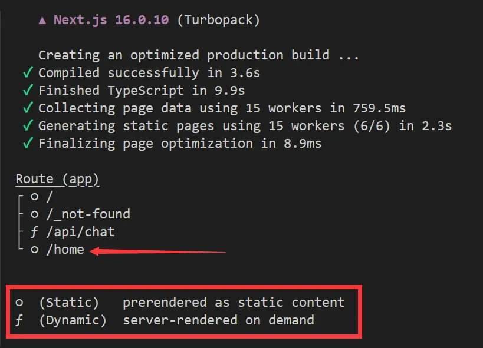

我们观察上图可以发现有两个符号：

- ○(空心圆): 表示这是预渲染的静态内容。
- ƒ(f 函数符): 表示这是动态内容。

**那么如何退出缓存呢?**

1. 第一种方案重新验证
   使用 revalidate 属性，可以设置缓存时间，单位为秒。

```tsx
export const revalidate = 5; // 5秒后重新更新
//export const revalidate = 0 // 设置为0表示不缓存
export default async function Home() {
  const randomImage = await fetch("https://www.loliapi.com/acg/pc?type=json");
  const data = await randomImage.json();
  return (
    <div>
      <h1>Home</h1>
      
    </div>
  );
}
```

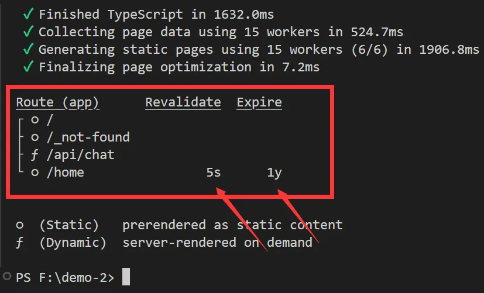

当我们重新运行之后，每过 5 秒，图片会重新获取，并且会显示新的图片。 2. 第二种方案使用 dynamic 属性
使用 dynamic 属性，并且设置为 force-dynamic，表示将禁用缓存，每次请求都会重新获取数据。

```ts
export const dynamic = "force-dynamic" // 动态更新 缓存组件不需要使用这个 默认都是动态内容
export default async function Home() {
  const randomImage = await fetch("https://www.loliapi.com/acg/pc?type=json")
  const data = await randomImage.json()
  return (
    <div>
      <h1>Home</h1>
      
    </div>
  )
}
```

3. 第三种方案使用禁用缓存

```ts
export default async function Home() {
  const randomImage = await fetch("https://www.loliapi.com/acg/pc?type=json", { cache: "no-store" })
  const data = await randomImage.json()
  return (
    <div>
      <h1>Home</h1>
      
    </div>
  )
}
```

4. 第四种方案使用任意动态内容 API
   当你使用以下任意 API 时，该路由会被视为动态内容，不会被缓存。

- cookies
- headers
- connection
- searchParams
- fetch 和{ cache: ‘no-store’ }

```ts
import { connection } from "next/server"

export default async function Home() {
  await connection()
  const randomImage = await fetch("https://www.loliapi.com/acg/pc?type=json")
  const data = await randomImage.json()
  return (
    <div>
      <h1>Home</h1>
      
    </div>
  )
}
```

### 启用缓存组件

确保`cacheComponents`配置为`true`。

```ts
import type { NextConfig } from "next";

const nextConfig: NextConfig = {
  /* config options here */
  cacheComponents: true, //开启缓存组件
};

export default nextConfig;
```

**启用缓存组件之后，所有组件默认为`动态内容`，因此`export const dynamic = 'force-dynamic'`不需要配置。**  
因此，启用缓存组件后，默认都是动态内容，不进行缓存，除非使用`'use cache'`，使组件变为缓存组件

```tsx
import { Suspense } from "react";
const DynamicImage = async () => {
  const randomImage = await fetch("https://www.loliapi.com/acg/pc?type=json");
  const data = await randomImage.json();
  return ;
};

export default async function Home() {
  return (
    <div>
      <h1>Home</h1>
      <Suspense fallback={<div>Loading...</div>}>
        <DynamicImage />
      </Suspense>
    </div>
  );
}
```

## 内置组件

### Image 组件

该组件是 Next.js 内置的图片组件，是基于原生`img`标签进行扩展，并不代表原生`img`标签不能使用。

- 尺寸优化：支持使用现代化图片格式，如`webp`，`avif`，`apng`等,并自动根据设备提供正确的尺寸。
- 视觉稳定性：防止图片加载时发生布局偏移，具体参考[CLS](https://web.dev/articles/cls?hl=zh-cn)
- 懒加载：在图片进入视口才会加载，使用浏览器原生懒加载，并可选择添加模糊显示占位符。
- 灵活性：可按需调整图像大小，即使是存储在远程服务器上的图像也可以调整。

#### src 本地图片引入

- Next.js 建议我们把图片放在根目录下的 public 文件夹中，然后使用/开头访问。

```tsx
<Image src="/HA-1.png" width={100} height={100} alt="logo"></Image>
```

- Image 组件默认懒加载，使用`loading="eager"`,更改为立即加载
- width、height 必须写，避免 CLS 问题

#### import 静态导入

使用`import`引入图片，是不需要填写宽度和高度，Next.js 会自动确定图片的尺寸,无需指定 width 和 height。
**配置路径别名**

```ts
{
    "compilerOptions": {
        "paths": {
            "@/*": ["./src/*"],
            "@/public/*": ["./public/*"] // 新增这一行代码，配置图片路径。
        }
    }
}
```

导入图片

```ts
import HA from "@public/HA-1.png"
;<Image src={HA} alt="logo" loading="eager"></Image>
```

#### 远程引入

next.config.ts 中配置允许远程加载图片的域名信息

```ts
import type { NextConfig } from "next";

const nextConfig: NextConfig = {
  /* config options here */
  reactCompiler: true, //使用react编译器
  cacheComponents: true, //开启缓存组件
  // 核心：禁用私有IP检测（16.0.7 实验性配置）
  experimental: {
    // 关闭 SSRF 防护中的私有IP检测
    // disableImageIpCheck: true,
  },
  images: {
    formats: ["image/avif"],
    remotePatterns: [
      {
        protocol: "https",
        hostname: "profile-avatar.csdnimg.cn",
        port: "",
        pathname: "/**",
      },
    ],
  },
};

export default nextConfig;
```

组件中使用

```tsx
<Image
  src="https://profile-avatar.csdnimg.cn/default.jpg!1"
  width={100}
  height={100}
  alt="logo"
></Image>
```

#### 图片格式优化

Next.js 会通过请求 Accept 头自动检测浏览器支持的图像格式，以确定最佳输出格式

```json
Accept:image/avif,image/webp,image/apng,image/svg+xml,image/*,*/*;q=0.8
```

我们可以同时启用 AVIF 和 WebP 格式。对于支持 AVIF 的浏览器，系统将优先使用 AVIF 格式，WebP 格式作为备选方案。目前 AVIF 格式最优。

```ts
const nextConfig: NextConfig = {
  /* config options here */
  images: {
    formats: ["image/avif", "image/webp"], //默认是 ['image/webp']
  },
};
```

#### 设备适配

如果需要兼容哪些设备，你可以使用 deviceSizes 和 imageSizes 属性来配置。

```ts
const nextConfig: NextConfig = {
  /* config options here */
  images: {
    deviceSizes: [640, 750, 828, 1080, 1200, 1920, 2048, 3840], // 设备尺寸
    imageSizes: [16, 32, 48, 64, 96, 128, 256, 384], // 图片尺寸
  },
};
```

#### Image 组件可用的属性：

**必需属性**
| 属性 | 类型 | 示例 | 说明 |
| ---- | ------ | --------------------------- | ---------------------------------- |
| src | String | src="/profile.png" | 图片源路径，支持本地路径或远程 URL |
| alt | String | alt="Picture of the author" | 图片替代文本，用于无障碍访问和 SEO |

**尺寸相关**

| 属性   | 类型         | 示例                             | 说明                             |
| ------ | ------------ | -------------------------------- | -------------------------------- |
| width  | Integer (px) | width={500}                      | 图片宽度，静态导入时可选         |
| height | Integer (px) | height={500}                     | 图片高度，静态导入时可选         |
| fill   | Boolean      | fill={true}                      | 填充父容器，替代 width 和 height |
| sizes  | String       | sizes="(max-width: 768px) 100vw" | 响应式图片尺寸                   |

**优化相关**

| 属性        | 类型     | 示例                 | 说明                    |
| ----------- | -------- | -------------------- | ----------------------- |
| quality     | Integer  | quality={80}         | 图片压缩质量，默认为 75 |
| loader      | Function | loader={imageLoader} | 自定义图片加载器函数    |
| unoptimized | Boolean  | unoptimized={true}   | 禁用图片优化，使用原图  |

**加载相关**

| 属性        | 类型    | 示例                             | 说明                          |
| ----------- | ------- | -------------------------------- | ----------------------------- |
| loading     | String  | loading="lazy"                   | 加载策略，“lazy” 或 “eager”   |
| preload     | Boolean | preload={true}                   | 是否预加载，用于 LCP 元素     |
| placeholder | String  | placeholder="blur"               | 占位符类型，“blur” 或 “empty” |
| blurDataURL | String  | blurDataURL="data:image/jpeg..." | 模糊占位符的 Data URL         |

**事件回调**

| 属性    | 类型     | 示例                  | 说明                 |
| ------- | -------- | --------------------- | -------------------- |
| onLoad  | Function | onLoad={e => done()}  | 图片加载完成时的回调 |
| onError | Function | onError={e => fail()} | 图片加载失败时的回调 |

**其他属性**

| 属性        | 类型   | 示例                   | 说明                            |
| ----------- | ------ | ---------------------- | ------------------------------- |
| style       | Object | style={{  }}           | 内联样式对象                    |
| overrideSrc | String | overrideSrc="/seo.png" | 覆盖 src，用于 SEO 优化         |
| decoding    | String | decoding="async"       | 解码方式，“async”/“sync”/“auto” |

### font 字体

`next/font`模块，内置了字体优化功能，其目的是防止`CLS`布局偏移。font 模块主要分为两部分，一部分是内置的`Google Fonts`字体，另一部分是本地字体。

#### 基本用法

Goggle 字体  
在使用 google 字体的时候，Google 字体和 css 文件会在构建的时候下载到本地，可以与静态资源一起托管到服务器，所以不会向 Google 发送请求。

1. 基本使用

```tsx
import { BBH_Sans_Hegarty } from "next/font/google"; //引入字体库
const bbhSansHegarty = BBH_Sans_Hegarty({
  weight: "400", //字体粗细
  display: "swap", //字体显示方式
});
export default function RootLayout({
  children,
}: Readonly<{ children: React.ReactNode }>) {
  return (
    <html lang="en">
      <body className={bbhSansHegarty.className}>
        {" "}
        {/** bbhSansHegarty会返回一个类名，用于加载字体 */}
        {children}
        sdsadasdjsalkdjasl 你好
      </body>
    </html>
  );
}
```

2. 可变字体
   可变字体是一种可以适应不同字重和样式的字体，它可以在不同的设备上自动调整字体大小和样式，以适应不同的屏幕大小和分辨率。

```tsx
import { Roboto } from "next/font/google";
const roboto = Roboto({
  weight: ["400", "700"], //字体粗细 (不是所有字体都支持可变字体)
  style: ["normal", "italic"], //字体样式
  subsets: ["latin"],
  display: "swap",
});
```

如何选择其他字体？可以参考[Google Fonts](https://fonts.google.com/)

```tsx
import {
  Inter,
  BBH_Sans_Bartle,
  Roboto_Slab,
  Rubik,
  Montserrat,
} from "next/font/google"; //引入其他字体库
```

#### API 参考

配置选项
| 属性 | Google | 本地 | 类型 | 必填 | 说明 |
| ------------------ | ------ | ---- | -------------- | ---- | --------------------- |
| src | ✗ | ✓ | String/Array | 是 | 字体文件路径 |
| weight | ✓ | ✓ | String/Array | 否 | 字体粗细，如 '400' |
| style | ✓ | ✓ | String/Array | 否 | 字体样式，如 'normal' |
| subsets | ✓ | ✗ | Array | 否 | 字符子集 |
| axes | ✓ | ✗ | Array | 否 | 可变字体轴 |
| display | ✓ | ✓ | String | 否 | 显示策略 |
| preload | ✓ | ✓ | Boolean | 否 | 是否预加载 |
| fallback | ✓ | ✓ | Array | 否 | 备用字体 |
| adjustFontFallback | ✓ | ✓ | Boolean/String | 否 | 调整备用字体 |
| variable | ✓ | ✓ | String | 否 | CSS 变量 |
| declarations | ✗ | ✓ | Array | 否 | 自定义声明 |

#### 本地字体

字体下载地址：[免费可商用字体](https://nextjs-docs-henna-six.vercel.app/ZhiyongDatongFont.ttf)
本地字体需要通过`src`属性指定字体文件路径，字体文件路径可以是单个文件，也可以是多个文件。

```tsx
import localFont from "next/font/local";
const local = localFont({
  src: "./font/zydtt.ttf", //本地字体文件路径
  display: "swap", //字体显示方式
});
export default function RootLayout({
  children,
}: Readonly<{ children: React.ReactNode }>) {
  return (
    <html lang="en">
      <body className={local.className}>
        {children}
        sdsadasdjsalkdjasl 你好
      </body>
    </html>
  );
}
```

### Script 组件

Next.js 允许我们使用 Script 组件去加载 js 脚本(外部/本地脚本)，并且他还对 Script 组件进行优化。

#### 局部引入

`src/app/home/page.tsx`
在 home 路由引入一个远程的 js 脚本，他只会在切换到 home 路由时才会加载，并且只会加载一次，然后纳入缓存。

```tsx
import Script from "next/script"; //引入Script组件
export default function HomePage() {
  return (
    <div>
      <Script src="https://unpkg.com/vue@3/dist/vue.global.js" />
    </div>
  );
}
```

他的底层原理会把这个 Script 组件转换成`<script>`标签，然后插入到`<head>`标签中。

#### 全局引入

`src/app/layout.tsx`
全局引入直接在 app/layout.tsx 中引入，他会自动在所有页面中引入，并且只会加载一次，然后纳入缓存。

```tsx{1,6}
import Script from 'next/script'
export default function RootLayout({ children }: { children: React.ReactNode }) {
    return (
        <html>
            <head>
                <Script src="https://unpkg.com/vue@3/dist/vue.global.js" />
            </head>
            <body>
                {children}
            </body>
        </html>
    )
}
```

#### 加载策略

Next.js 允许我们通过 strategy 属性来控制 Script 组件的加载策略。

- beforeInteractive: 在代码和页面之前加载会阻塞页面渲染。
- afterInteractive(默认值): 在页面渲染到客户端之后加载。
- lazyOnload: 在浏览器空闲时稍后加载脚本。
- worker(实验性特性): 暂时不建议使用。

```tsx
<Script id="VGUBHJMK1" strategy="beforeInteractive" src="https://unpkg.com/vue@3/dist/vue.global.js" />
<Script id="VGUBHJMK2" strategy="afterInteractive" src="https://unpkg.com/vue@3/dist/vue.global.js" />
<Script id="VGUBHJMK3" strategy="lazyOnload" src="https://unpkg.com/vue@3/dist/vue.global.js" />
<Script id="VGUBHJMK4" strategy="worker" src="https://unpkg.com/vue@3/dist/vue.global.js" />
```

::: warning
webWorker 模式 尚不稳定，谨慎使用,小提示可以给 Script 组件添加 id，Next.js 会追踪优化。
:::

#### 内联脚本

即使不从外部文件载入脚本，Next.js 也支持我们通过`{}`直接在`Script`组件编写代码。

1. 第一种写法

```tsx{1,9,15-29}
import Script from "next/script";
export default function RootLayout({
  children
}: Readonly<{
  children: React.ReactNode;
}>) {
  return (
    <html lang="en">
      <head>
        <Script id="VGUBHJMK5" strategy="beforeInteractive" src="https://unpkg.com/vue@3/dist/vue.global.js"></Script>
      </head>
      <body>
        {children}
        <div id="app"></div>
        <Script id="VGUBHJMK6"
         strategy="afterInteractive">
        {
           `
            const {createApp} = Vue
            createApp({
              template: '<h1>{{ message }}</h1>',
              setup() {
                return {
                  message: 'Next.js + Vue.js'
                }
              }
            }).mount('#app')
          `
        }
        </Script>
      </body>
    </html>
  );
}
```

2. 第二种写法

```tsx
<Script
  dangerouslySetInnerHTML={{
    __html: `
    const {createApp} = Vue
    createApp({
        template: '<h1>{{ message }}</h1>',
        setup() {
        return {
            message: 'Next.js + Vue.js'
        }
        }
    }).mount('#app')
    `,
  }}
  strategy="afterInteractive"
></Script>
```

#### 事件监听

- onload: 脚本加载完成时触发。
- onReady: 脚本加载完成后，且组件每次挂载的时候都会触发。
- onError: 脚本加载失败时触发。
  :::warning
  Script 组件的生命周期只有在导入客户端的时候才会生效，所以需要使用'use client'声明这是一个客户端组件。
  :::

```tsx{1,10-12}
'use client'

import Script from 'next/script'

export default function Page() {
  return (
    <>
      <Script
        src="https://example.com/script.js"
        onLoad={() => {
          console.log('Script has loaded')
        }}
      />
    </>
  )
}
```

## 静态导出 SSG

Next.js 支持静态站点生成（SSG，Static Site Generation），可以在构建时预先生成所有页面的静态 HTML 文件。这种方式特别适合内容相对固定的站点，如官网、博客、文档等，能够提供最佳的性能和 SEO 表现。

### 配置静态导出

需要在 n`ext.config.js`文件中配置`output`为`export`，表示导出静态站点。`distDir`表示导出目录，默认为`out`。

```ts
import type { NextConfig } from "next";
const nextConfig: NextConfig = {
  /* config options here */
  output: "export", // 导出静态站点
  distDir: "dist", // 导出目录,默认为out
};

export default nextConfig;
```

接着我们执行`npm run build`命令，构建静态站点。  
启动完成之后发现点击 a 标签无法进行跳转，是因为打完包之后的页面叫 about.html,而我们的跳转链接是/about，所以需要修改配置项。

### 修改配置项

需要在`next.config.ts`文件中配置`trailingSlash`为`true`，表示添加尾部斜杠，生成`/about/index.html`而不是`/about.html`。否则需要通过 nginx 之类的代理配置

```ts
import type { NextConfig } from "next";

const nextConfig: NextConfig = {
  /* config options here */
  output: "export", // 导出静态站点
  distDir: "dist", // 导出目录
  trailingSlash: true, // 添加尾部斜杠，生成 /about/index.html 而不是 /about.html
};

export default nextConfig;
```

再次打包，点击 a 连接就可以跳转了

### 动态路由处理

新建目录: `src/app/posts/[id]/page.tsx`  
如果要使用动态路由，则需要使用`generateStaticParams`函数来生成有多少个动态路由，这个函数需要返回一个数组，数组中包含所有动态路由的参数，例如`{ id: '1' }`表示对应 id 为 1 的详情页。

```ts
export async function generateStaticParams() {
  //支持调用接口请求详情id列表 const res = await fetch('https://api.example.com/posts'),该接口一次性的，只在构建的时候会调用一次
  return [
    { id: "1" }, //返回对应的详情id
    { id: "2" },
  ]
}

export default async function Post({ params }: { params: Promise<{ id: string }> }) {
  const { id } = await params
  return (
    <div>
      <h1>Post {id}</h1>
    </div>
  )
}
```

### 图片优化

如果使用`Image`组件优化图片，在开发模式会进行报错
:::warning
⚠️ 警告
get-img-props.ts 442 Uncaught Error: Image Optimization using the default loader is not compatible with { output: 'export' }.

可能的解决方案：

- 移除 { output: 'export' } 并运行 "next start" 以启用包含图片优化 API 的服务器模式。
- 在 next.config.js 中配置 { images: { unoptimized: true } } 来禁用图片优化 API。
- 使用自定义 loader 实现
- 使用原生``标签
  了解更多：https://nextjs.org/docs/messages/export-image-api
  :::
  我们使用自定义 loader 来实现图片优化,要求我们通过一个图床托管图片。[路过图床](https://imgchr.com/) 是一个免费的图床，我们可以使用它来托管图片。

```ts
import type { NextConfig } from "next";

const nextConfig: NextConfig = {
  /* config options here */
  output: "export", // 导出静态站点
  distDir: "dist", // 导出目录
  trailingSlash: true, // 添加尾部斜杠，生成 /about/index.html 而不是 /about.html
  images: {
    loader: "custom", // 自定义loader
    loaderFile: "./image-loader.ts", // 自定义loader文件
  },
};

export default nextConfig;
```

根目录：`/image-loader.ts`

```ts
export default function imageLoader({
  src,
  width,
  quality,
}: {
  src: string;
  width: number;
  quality: number;
}) {
  return `https://s41.ax1x.com${src}`;
}
```

`src/app/about/page.tsx`

```tsx
import Image from "next/image";

export default function About() {
  return (
    <div>
      <h1>About</h1>
      <Image
        loading="eager"
        src="/2025/12/29/pZYbW7t.jpg"
        alt="logo"
        width={250 * 3}
        height={131 * 3}
      />
    </div>
  );
}
```

:::info
注意事项,以下功能在 SSG 中不支持，请勿使用：

- Dynamic Routes with dynamicParams: true
- 动态路由没有使用 generateStaticParams()
- 路由处理器依赖于 Request
- Cookies
- Rewrites 重写
- Redirects 重定向
- Headers 头
- Proxy 代理
- Incremental Static Regeneration 增量静态再生
- Image Optimization with the default loader 默认加载器的图像优化
- Draft Mode 草稿模式
- Server Actions 服务器操作
- Intercepting Routes 拦截路由
  :::

### MDX

MDX 是一种将`Markdown`和`React`组件混合在一起的语法，它可以在`Markdown`中使用`React`组件，从而实现更复杂的页面。另外就是我们在编写技术文档或者博客的时候，配合`SSG`模式，更喜欢用`Markdown`来编写，`MDX`他正好将`Markdown`和`React`组件混合在一起，实在是方便至极。

#### 安装依赖

```bash
pnpm add @next/mdx @mdx-js/loader @mdx-js/react @types/mdx
```

#### 启用 MDX 功能

1. next.config.js 配置以下内容

```ts
//next.config.ts
import type { NextConfig } from "next";
import createMDX from "@next/mdx";
const withMDX = createMDX({
  //extension: /\.(md|mdx)$/ 默认只支持mdx文件,如果想额外支持md文件编写次行代码。
});
const nextConfig: NextConfig = {
  reactCompiler: true,
  pageExtensions: ["js", "jsx", "md", "mdx", "ts", "tsx"],
};
export default withMDX(nextConfig);
```

2. 根目录下面创建`mdx-components.tsx`文件

```tsx
import type { MDXComponents } from "mdx/types";

const components: MDXComponents = {};

export function useMDXComponents(): MDXComponents {
  return components;
}
```

#### 创建文件

```
 my-project
  ├── app
  │   └── mdx-page
  │       └── page.(mdx/md)
  |── mdx-components.(tsx/js)
  └── package.json
```

#### 代码高亮

打开编辑器-插件市场-搜索`MDX`-安装`MDX`插件

#### 基础使用

可以支持(`Markdown`语法 + `React`组件 + `HTML`标签)

```mdx
# welcome to MDX

这是一段文字，**他加粗了**，并且有重点内容`important`。

- one
- two
- three

<div className="bg-red-500">
  <p>自定义标签</p>
</div>
```

#### 引入自定义组件

引入自定义组件一定要跟 md 语法之间空一行，否则会报错  
`src/app/home/page.mdx`

```mdx {10,14}
import MyComponent from "./my-component"; //引入自定义组件一定要跟md语法之间空一行，否则会报错。

# welcome to MDX

这是一段文字，**他加粗了**，并且有重点内容`important`。

- one
- two
- three

<div className="bg-red-500">
  <p>自定义标签</p>
</div>

<MyComponent />
```

mdx 文件无法实现一些复杂的交付逻辑，如果有复杂的交付逻辑，我们可以使用 React 组件来实现，然后在 mdx 文件中引入即可。

`src/app/home/my-component.tsx`

```tsx
"use client";
import { useState } from "react";
export default function MyComponent() {
  const [count, setCount] = useState(0);
  return (
    <div>
      <p>Count: {count}</p>
      <button onClick={() => setCount(count + 1)}>Increment</button>
    </div>
  );
}
```

#### 全局样式

如果你希望在这个项目中修改所有的 MDX 文件的样式，你可以使用`mdx-components.tsx`文件来修改。

```tsx
//mdx-components.tsx
import type { MDXComponents } from "mdx/types";

const components: MDXComponents = {
  h1: ({ children }) => (
    <h1 className="text-2xl text-red-400 font-bold">{children}</h1>
  ), //# 代表h1 你可以自定义修改样式
  li: ({ children }) => (
    <li className="list-disc text-blue-500 list-inside">{children}</li>
  ), //- 代表li 你可以自定义修改样式
  //...你可以自定义修改更多的样式
};

export function useMDXComponents(): MDXComponents {
  return components;
}
```

#### 远程加载 mdx/md 文件

如果你的 MDX 文件存储在远程服务器上，你可以使用远程`mdx`来加载文件。

```bash
pnpm install next-mdx-remote-client
```

`src/app/home/page.tsx`

```tsx
import { MDXRemote } from "next-mdx-remote-client/rsc";
export default async function Home() {
  const res = await fetch("https://nextjs-docs-henna-six.vercel.app/xm.mdx"); //链接是彩蛋
  const source = await res.text();
  return <MDXRemote source={source} />;
}
```

## 服务器函数(Server Action)

服务器函数指的是可以是服务器组件处理表单的提交，无需手动编写 API 接口，并且还支持数据的验证，以及状态管理等。

### 核心原理

因为`React`扩展了原生 HTML`form`表单，允许通过`action`属性直接绑定`server action`函数，当表单提交后，函数会自动接受原生的`FormData`数据。

### 基本用法

传统的表单提交方式:
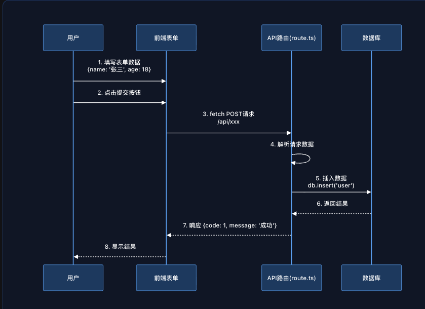
服务器函数的用法:
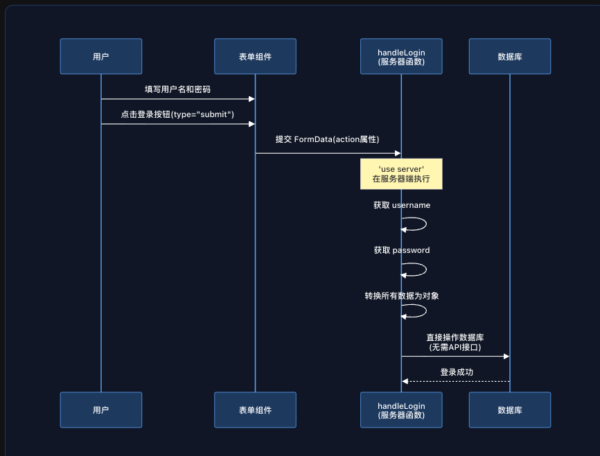
`src/app/login/page.tsx`

```tsx
export default function Login() {
  async function handleLogin(formData: FormData) {
    "use server";
    const username = formData.get("username"); //接受单个参数
    const password = formData.get("password"); //接受单个数据
    const form = Object.fromEntries(formData); //接受所有数据 {username: '张三', password: '123456'}
    //可以直接操作数据库，这样就无需编写API接口了 哇哦太方便了
  }
  return (
    <div>
      <h1>登录页面</h1>
      <div className="flex flex-col gap-2 w-[300px] mx-auto mt-30">
        <form action={handleLogin} className="flex flex-col gap-2">
          <input
            className="border border-gray-300 rounded-md p-2"
            type="text"
            name="username"
            placeholder="用户名"
          />
          <input
            className="border border-gray-300 rounded-md p-2"
            type="password"
            name="password"
            placeholder="密码"
          />
          <button
            type="submit"
            className="bg-blue-500 text-white p-2 rounded-md"
          >
            登录
          </button>
        </form>
      </div>
    </div>
  );
}
```

- `button` 的`type`必须为`submit`
- `input` 必须有`name`属性，作为数据对象的 key
- `form` 增加 action 属性，绑定内联函数，内联函数内必须增加`use server`标记，标记该函数为，可以从客户端代码调用的服务器函数。

### 额外参数

那么我想携带 ID 或者其他自定义参数怎么做？
我们需要使用 `bind` 方法来进行参数扩展，这样在函数内部就可以接收到 ID 参数。

```tsx
export default function Login() {
  //接受id参数
  async function handleLogin(id: number, formData: FormData) {
    "use server";
    const username = formData.get("username");
    const password = formData.get("password");
    const form = Object.fromEntries(formData);
    console.log(username, password, form, id);
  }
  const userFunction = handleLogin.bind(null, 1); //绑定id参数
  return (
    <div>
      <h1>登录页面</h1>
      <div className="flex flex-col gap-2 w-[300px] mx-auto mt-30">
        {/*使用新的函数绑定id参数 userFunction*/}
        <form action={userFunction} className="flex flex-col gap-2">
          <input
            className="border border-gray-300 rounded-md p-2"
            type="text"
            name="username"
            placeholder="用户名"
          />
          <input
            className="border border-gray-300 rounded-md p-2"
            type="password"
            name="password"
            placeholder="密码"
          />
          <button
            type="submit"
            className="bg-blue-500 text-white p-2 rounded-md"
          >
            登录
          </button>
        </form>
      </div>
    </div>
  );
}
```

### 参数校验(zod) + 读取状态

zod 是一个目前非常流行的数据验证库，可以让我们在服务器端进行数据验证，避免用户输入非法数据。

```bash
pnpm add zod
```

`src/app/lib/login/actions.ts`
官方推荐 server action 文件放在`src/app/lib/**`这个位置

```ts
"use server";
import { z } from "zod";
const loginSchema = z.object({
  username: z.string().min(6, "用户名不能少于6位"), //zod基本用法表示这是一个字符串，并且不能少于6位
  password: z.string().min(6, "密码不能少于6位"), //zod基本用法表示这是一个字符串，并且不能少于6位
});

export async function handleLogin(_prevState: any, formData: FormData) {
  const result = loginSchema.safeParse(Object.fromEntries(formData)); //调用zod的safeParse方法进行校验

  if (!result.success) {
    const errorMessage = z.treeifyError(result.error).properties; //调用zod的treeifyError方法将错误信息转换为对象
    let str = "";
    Object.entries(errorMessage!).forEach(([_key, value]) => {
      value.errors.forEach((error: any) => {
        str += error + "\n"; //将错误信息拼接成字符串
      });
    });
    return { message: str }; //返回错误信息
  }
  //校验成功，进行数据库操作逻辑
  return { message: "登录成功" }; //返回成功信息
}
```

如果要读取状态需要使用 React19 的 useActionState hook，这个 hook 必须在客户端组件中使用。所以需要增加'use client'声明这是一个客户端组件。
**参数**
`useActionState` hook 接受三个参数:

- fn: 表单提交时触发的函数，接收上一次的 state（首次为 initialState）作为第一个参数，其余参数为表单参数
- initialState: state 的初始值，可以是任何可序列化的值
- permalink(可选): 表单提交后跳转的 URL，用于 JavaScript 加载前的渐进式增强
  **返回值:**
- state: 当前状态，初始值为 initialState，之后为 action 的返回值
- formAction: 新的 action 函数，用于传递给 form 或 button 组件
- isPending: 布尔值，表示是否有正在进行的 Transition
  `src/app/login/page.tsx`

```tsx
"use client";
import { useActionState } from "react";
import { handleLogin } from "../lib/login/actions";
const initialState = { message: "" };
export default function Login() {
  const [state, formAction, isPending] = useActionState(
    handleLogin,
    initialState,
  );

  return (
    <div>
      <h1>登录页面</h1>
      {isPending && <div>Loading...</div>}
      {state.message}
      <div className="flex flex-col gap-2 w-[300px] mx-auto mt-30">
        <form action={formAction} className="flex flex-col gap-2">
          <input
            className="border border-gray-300 rounded-md p-2"
            type="text"
            name="username"
            placeholder="用户名"
          />
          <input
            className="border border-gray-300 rounded-md p-2"
            type="password"
            name="password"
            placeholder="密码"
          />
          <button
            type="submit"
            className="bg-blue-500 text-white p-2 rounded-md"
          >
            登录
          </button>
        </form>
      </div>
    </div>
  );
}
```

## 环境变量

环境变量一般是指程序在运行时，所需要的一些配置信息，例如数据库连接字符串，API 密钥，端口号等。其次就是环境变量跟我们的操作系统有关，例如 Linux，Windows，Mac 等。

### 基本用法

#### 查询环境变量

1. Linux / MacOS / wsl (通用命令):

```bash
echo $PATH #查询PATH环境变量
```

2. Windows /cmd:

```cmd
echo %PATH% #查询PATH环境变量
echo %USERNAME% #查询用户名环境变量
```

3. Windows /powershell:

```powershell
dir Env:* #查询所有环境变量
```

或

```powershell
echo $env:* #查询所有环境变量
```

#### 设置临时环境变量

1. Linux / MacOS / wsl (通用命令) 提示：这个必学，部署的时候也很常用。:

```bash
export CC=123 #设置CC环境变量为123
echo $CC #查询CC环境变量
```

2. Windows /cmd:

```cmd
set CC=123 #设置XM环境变量为123
echo %CC% #查询XM环境变量
```

3. Windows /powershell:

```powershell
$env:CC='123' #设置XM环境变量为123
echo $env:CC #查询XM环境变量
```

### script-shell

```json
{
  "scripts": {
    "dev": "set DB_HOST=localhost && next dev",
    "build": "set DB_HOST=8.8.8.8 && next build",
    "start": "next start"
  }
}
```

为什么人在 powershell 命令行中运行 script 脚本中可以运行 cmd 的命令？  
原理：npm 运行 script 脚本的时候会单独开一个线程，当 npm 的`scropt-shell`为设置，默认值为 null 时，这个线程在 Linux/MacOs 下是/bin/sh，在 Windows 下是 cmd,所以我们在 script 脚本中要编写`cmd`的命令。

### cross-env

为了解决跨平台问题，可以使用 cross-env 来设置环境变量

```bash
npm install cross-env -D #安装cross-env
```

然后我们就可以在`package.json`文件中使用`cross-env`来设置环境变量：

```json
{
  "scripts": {
    "dev": "cross-env DB_HOST=localhost next dev",
    "build": "cross-env DB_HOST=8.8.8.8 next build",
    "start": "next start"
  }
}
```

这样我们就可以在不同的操作系统下，使用相同的命令来设置环境变量了。

### 最佳实践

因为上述方式依旧麻烦，如果有很多的环境变量，我们的命令就会变得非常长，所以我们可以使用`.env`文件来存储环境变量。  
Next.js 环境变量查找规则(官方规定)，如果在其中一个链路中找到了环境变量，那么就不会继续往下找了。

1. process.env
2. .env.$(NODE_ENV).local
3. .env.local（未检查的情况 NODE_ENV.test）
4. .env.$(NODE_ENV)
5. .env

:::warning
提示：NODE_ENV 是 Next.js 自动注入的环境变量，开发模式他会注入 development，生产模式他会注入 production。
:::
创建 .env.development.local 文件(表示开发环境)，并添加环境变量：

```bash
DB_HOST=localhost
DB_USER=root
DB_PASSWORD=123456
```

创建 .env.production.local 文件(表示生产环境)，并添加环境变量：

```bash
DB_HOST=8.8.8.8
DB_USER=xiaoman
DB_PASSWORD=123456
```

创建/src/app/home/page.tsx 文件，并添加环境变量：

```tsx
//服务器组件 不要增加`use client`
export default function Home() {
  return (
    <div>
      <h1>Home</h1>
      <p>DB_HOST: {process.env.DB_HOST}</p>
      <p>DB_USER: {process.env.DB_USER}</p>
      <p>DB_PASSWORD: {process.env.DB_PASSWORD}</p>
    </div>
  );
}
```

## 国际化(i18n)

国际化(Internationalization)是Next.js提供的一种机制，用于支持多语言的网站，例如可以实现中英文切换，包括接口同步翻译，以及不同语言所展示的页面不一样等。

小知识：i18n(internationalization)的由来是取自开头i和结尾n的中间有18个字母，所以称为i18n，其他的也是类似的例如k8s(kubernetes)就是取自开头k和结尾s的中间有8个字母，所以称为k8s。

### 术语解释

language: 语言(排名不分先后)

1. 英语(English) 用en表示
2. 中文(Chinese) 用zh表示(zh取自Zhongwen的拼音)
3. 日本语(Japanese) 用ja表示
4. 韩国语(Korean) 用ko表示  
   **语言速查表: https://zh.wikipedia.org/wiki/ISO_639-1**

territory：地区(排名不分先后)

1. 美国(United States) 用US表示
2. 中国(China) 用CN表示
3. 日本(Japan) 用JP表示
4. 韩国(Korea) 用KR表示  
   **地区速查表: https://zh.wikipedia.org/wiki/ISO_3166-1**
   :::info
   一般我们把语言和地区组合起来，称为`locale`，例如en-US表示英语(美国)，zh-CN表示中文(中国)。
   :::

### 实现原理

Next.js建议我们使用http报文头来判断用户使用的语言`Accept-Language`，例如`Accept-Language: zh-CN,zh;q=0.9,en;q=0.8`表示用户使用中文(中国)，如果用户没有设置，则使用默认语言。

### Accept-Language规则

`zh-CN,zh;q=0.9,en;q=0.8` 表示用户使用中文(中国)，权重为1(最大值1会被省略)，中文(中国)权重为0.9，英语(美国)权重为0.8。

### 安装第三方库

```bash
npm i negotiator # 用于解析Accept-Language
npm i @formatjs/intl-localematcher # **用于匹配语言**
```

`src/proxy.ts` 创建一个代理函数,关于`proxy`代理函数在之前的篇章已经讲过了。

```tsx
import { NextRequest, NextResponse } from "next/server";
import Negotiator from "negotiator";
import { match } from "@formatjs/intl-localematcher";
export default function proxy(req: NextRequest, res: NextResponse) {
  // 获取请求头
  const headers = {
    "accept-language": req.headers.get("accept-language") || "",
  };
  // 解析请求头
  const negotiator = new Negotiator({ headers });
  // 获取语言
  const language = negotiator.languages();
  //['zh-CN', 'zh', 'en-US', 'en', 'ja']  // 按优先级从高到低排序
}

export const config = {
  matcher: [
    "/((?!api|_next/static|_next/image|favicon.ico).*)", //跳过内部匹配路径
  ],
};
```

例如 `Accept-Language: zh-CN,zh;q=0.9,en-US;q=0.8,en;q=0.7,ja;q=0.6`

解析规则：
| 语言 | 权重 (q值) | 说明 |
| ----- | ---------- | -------- |
| zh-CN | 1.0 (默认) | 最优先 |
| zh | 0.9 | 第二优先 |
| en-US | 0.8 | 第三优先 |
| en | 0.7 | 第四优先 |
| ja | 0.6 | 最低优先 |

```
['zh-CN', 'zh', 'en-US', 'en', 'ja']  // 按优先级从高到低排序
```

简单复刻了一下`Negotiator`的实现

```ts
const languages = "zh-CN,zh;q=0.9,en;q=0.8".split(",");
const languagesWithQ = languages
  .map((language) => {
    const [lang, q] = language.split(";");
    return {
      lang,
      q: parseFloat(q?.split("=")[1] || "1"),
    };
  })
  .sort((a, b) => b.q - a.q)
  .map((item) => item.lang);
```

### 匹配语言

`src/dictionaries/index.ts`定义项目支持的语言和默认语言。

```ts
export const locales = ["en", "zh", "ja", "ko"]; // 配置项目支持的语言
export const defaultLocale = "zh"; // 项目默认使用的语言
```

tsconfig.json 配置别名

```json
{
  "paths": {
    //新增别名@dict
    "@dict/*": ["./src/dictionaries/*"]
  }
}
```

src/proxy.ts继续完善代理函数(完整代码)

```ts
import { NextRequest, NextResponse } from "next/server";
import Negotiator from "negotiator";
import { match } from "@formatjs/intl-localematcher";
import { locales, defaultLocale } from "@dict/index"; // 导入项目支持的语言和默认语言
export default function proxy(req: NextRequest, res: NextResponse) {
  // 如果请求路径为根路径，则直接返回 首页不做任何处理
  if (req.nextUrl.pathname === "/") {
    return NextResponse.next();
  }
  //如果路径已经包含所支持的语言，则直接返回 例如 /zh/about /zs/home 等
  if (locales.some((locale) => req.nextUrl.pathname.startsWith(`/${locale}`))) {
    return NextResponse.next();
  }
  // 获取请求头
  const headers = {
    "accept-language": req.headers.get("accept-language") || "",
  };
  // 解析请求头
  const negotiator = new Negotiator({ headers });
  // 获取语言
  const language = negotiator.languages();
  //['zh-CN', 'zh', 'en-US', 'en', 'ja']  // 按优先级从高到低排序
  const lang = match(language, locales, defaultLocale);
  //language-浏览器支持的语言 locales-项目支持的语言 defaultLocale-项目默认语言
  // 匹配语言例如 zh-CN 则 lang 返回 zh en-US 则 lang 返回 en 如果没有匹配到则返回默认语言defaultLocale
  const pathname = req.nextUrl.pathname;
  // 拼接语言
  req.nextUrl.pathname = `/${lang}${pathname}`;
  // 重定向 例如用户访问的是/home 我们则读取语言后重定向到/zh/home 给它增加语言前缀
  return NextResponse.redirect(req.nextUrl);
}

export const config = {
  matcher: [
    "/((?!api|_next/static|_next/image|favicon.ico).*)", //跳过内部匹配路径
  ],
};
```

### 新建测试用例

`src/dictionaries/zh.json`

```json
{
  "title": "标题",
  "description": "描述",
  "keywords": "关键词"
}
```

`src/dictionaries/en.json`

```json
{
  "title": "title",
  "description": "description",
  "keywords": "keywords"
}
```

`src/dictionaries/ja.json`

```json
{
  "title": "タイトル",
  "description": "説明",
  "keywords": " キーワード"
}
```

`src/dictionaries/ko.json`

```json
{
  "title": "제목",
  "description": "설명",
  "keywords": "키워드"
}
```

上面这四个文件会根据`locale`参数动态导入，例如`locale`为`zh`则导入`src/dictionaries/zh.json`，`locale`为`en`则导入`src/dictionaries/en.json`等等

`src/dictionaries/index.ts` 定义测试用例

```ts
export type Dictionary = {
  title: string;
  description: string;
  keywords: string;
};
export const locales = ["en", "zh", "ja", "ko"]; // 支持的语言
export const defaultLocale = "zh";
export function getDictionary(locale: string): Promise<Dictionary> {
  //例如locale为zh 则返回 src/dictionaries/zh.json
  //locale为en 则返回 src/dictionaries/en.json
  //locale为ja 则返回 src/dictionaries/ja.json
  //locale为ko 则返回 src/dictionaries/ko.json
  return import(`./${locale}.json`).then((module) => module.default);
}
```

src/[lang]/home/page.tsx 测试页面  
**这个页面的`params`参数是动态路由参数，例如访问`/zh/home` 则params参数为`{ lang: ‘zh’ }`，访问`/en/home` 则`params`参数为`{ lang: ‘en’ }`等**

```tsx
import { getDictionary } from "@dict/index";
export default async function Home({
  params,
}: {
  params: Promise<{ lang: string }>;
}) {
  //获取语言
  const { lang } = await params;
  //获取字典 lang = zh/en/ja/ko等
  const dictionary = await getDictionary(lang);
  //返回页面
  return (
    <div>
      <h1>{dictionary.title}</h1>
      <p>{dictionary.description}</p>
      <p>{dictionary.keywords}</p>
    </div>
  );
}
```

### 封装语言切换组件

`src/app/[lang]/home/switchI18n.tsx`
这个组件是语言切换组件，他会根据当前语言切换到对应语言的页面，例如当前语言为zh，则切换到/zh/home页面，当前语言为en，则切换到/en/home页面等

```tsx
"use client";
import { locales } from "@dict/index";
import { usePathname, useRouter } from "next/navigation";
export default function SwitchI18n({ lang }: { lang: string }) {
  const pathname = usePathname(); // 获取当前路径
  const router = useRouter(); // 获取路由实例
  const handleChange = (e: React.ChangeEvent<HTMLSelectElement>) => {
    const newLang = e.target.value; // 获取新语言
    const newPath = pathname.replace(`/${lang}`, `/${newLang}`); // 替换语言
    router.replace(newPath); // 跳转新路径
  };
  return (
    <div>
      <select value={lang} onChange={handleChange}>
        {locales.map((locale) => (
          <option key={locale} value={locale}>
            {locale}
          </option>
        ))}
      </select>
    </div>
  );
}
```

`src/app/[lang]/home/page.tsx 使用语言切换组件`
这个页面是首页，他会根据当前语言显示对应语言的标题，描述，关键词，就是刚才那四个json文件中的内容

```tsx
import { getDictionary } from "@dict/index";
import SwitchI18n from "./switchI18n";
export default async function Home({
  params,
}: {
  params: Promise<{ lang: string }>;
}) {
  const { lang } = await params;
  const dictionary = await getDictionary(lang);
  return (
    <div>
      <SwitchI18n lang={lang} /> {/* 语言切换组件并且传入当前语言 */}
      <h1>{dictionary.title}</h1>
      <p>{dictionary.description}</p>
      <p>{dictionary.keywords}</p>
    </div>
  );
}
```

## next.config.ts配置

查看完整版配置项观看: [next.config.js](https://nextjs.org/docs/app/api-reference/config/next-config-js/adapterPath)配置

### 根据不同环境进行配置

例如我想在开发环境配置 XXX，或者生产环境配置YYY，那么我们可以使用`next/constants`来判断当前环境。

```ts
//Next.js next/constants内置的常量
export declare const PHASE_EXPORT = "phase-export"; // 导出静态站点
export declare const PHASE_PRODUCTION_BUILD = "phase-production-build"; // 生产环境构建
export declare const PHASE_PRODUCTION_SERVER = "phase-production-server"; // 生产环境服务器
export declare const PHASE_DEVELOPMENT_SERVER = "phase-development-server"; // 开发环境服务器
export declare const PHASE_TEST = "phase-test"; // 测试环境
export declare const PHASE_INFO = "phase-info"; // 信息
```

我们要根据不同环境配置，需要返回一个函数，而不是直接返回一个对象，在函数中会接受一个参数`phase`，这个参数是Next.js的环境，我们可以根据这个参数来判断当前环境。

```ts
//next.config.ts
import {
  PHASE_DEVELOPMENT_SERVER,
  PHASE_TYPE,
  PHASE_PRODUCTION_BUILD,
} from "next/constants";
import type { NextConfig } from "next";

export default (phase: PHASE_TYPE): NextConfig => {
  const nextConfig: NextConfig = {
    reactCompiler: false,
  };

  if (phase === PHASE_DEVELOPMENT_SERVER) {
    nextConfig.reactCompiler = true; // 开发环境使用reactCompiler
  }
  if (phase === PHASE_PRODUCTION_BUILD) {
    nextConfig.reactCompiler = false; // 生产环境不使用reactCompiler
  }
  //if() 其他环境.....

  return nextConfig;
};
```

### Next.js配置端口号

这是Next.js很迷的一个操作，通过一般脚手架或者其他项目都会在配置文件进行配置端口号，但是Next.js却没有，而是在启动命令中进行配置。(默认是3000端口)

```json
{
  "scripts": {
    "dev": "next dev -p 8888", // 开发环境端口号
    "build": "next build",
    "start": "next start -p 9999 " // 生产环境端口号
  }
}
```

### Next.js导出静态站点

需要在`next.config.ts`文件中配置`output`为`export`，表示导出静态站点。`distDir`表示导出目录，默认为`out`。
**具体用法请查看: [静态导出SSG](/views/frontend/nextjs/nextjs-base.html#静态导出-ssg)**

```ts
import type { NextConfig } from "next";
const nextConfig: NextConfig = {
  /* config options here */
  output: "export", // 导出静态站点
  distDir: "dist", // 导出目录
  trailingSlash: true, // 添加尾部斜杠，生成 /about/index.html 而不是 /about.html
};

export default nextConfig;
```

### Next.js配置图片优化

Next.js的`Image`组件默认只允许加载本地图片，如果需要加载远程图片，需要配置`next.config.ts`文件。
**详细用法请查看: [图片优化](/views/frontend/nextjs/nextjs-base.html#图片优化)**

```ts
import type { NextConfig } from "next";

const nextConfig: NextConfig = {
  /* config options here */
  images: {
    remotePatterns: [
      {
        protocol: "https", // 协议
        hostname: "eo-img.521799.xyz", // 主机名
        pathname: "/i/pc/**", // 路径
        port: "", // 端口
      },
    ],
    formats: ["image/avif", "image/webp"], //默认是 ['image/webp']
    deviceSizes: [640, 750, 828, 1080, 1200, 1920, 2048, 3840], // 设备尺寸
    imageSizes: [16, 32, 48, 64, 96, 128, 256, 384], // 图片尺寸
  },
};
```

### 自定义响应标头

例如配置`CORS`跨域，或者是自定义响应标头等，只要是http支持的响应头都可以配置。
**HTTP响应头参考: [HTTP响应头](https://developer.mozilla.org/zh-CN/docs/Web/HTTP/Reference/Headers)**

```ts
const nextConfig: NextConfig = {
  headers: () => {
    return [
      {
        source: "/:path*", // 匹配路径 所有路径 也支持精准匹配 例如/api/user 包括支持动态路由等 /api/user/:id
        headers: [
          {
            key: "Access-Control-Allow-Origin", //允许跨域
            value: "*", // 允许所有域名访问
          },
          {
            key: "Access-Control-Allow-Methods", //允许的请求方法
            value: "GET, POST, PUT, DELETE, OPTIONS", // 允许的请求方法
          },
          {
            key: "Access-Control-Allow-Headers", //允许的请求头
            value: "Content-Type, Authorization", // 允许的请求头
          },
        ],
      },
      {
        source: "/home", // 精准匹配 /home 路径
        headers: [
          {
            key: "X-Custom-Header", //自定义响应头
            value: "123456", // 值
          },
        ],
      },
    ];
  },
};
```

### assetPrefix配置

assetPrefix配置用于配置静态资源前缀，例如：部署到CDN后，静态资源路径会发生变化，需要配置这个配置项。

```ts
import type { NextConfig } from "next";
const nextConfig: NextConfig = {
  /* config options here */
  assetPrefix: "https://cdn.example.com", // 静态资源前缀
};

export default nextConfig;
```

未配置assetPrefix时：

```
/_next/static/chunks/4b9b41aaa062cbbfeff4add70f256968c51ece5d.4d708494b3aed70c04f0.js
```

配置assetPrefix后：

```
https://cdn.example.com/_next/static/chunks/4b9b41aaa062cbbfeff4add70f256968c51ece5d.4d708494b3aed70c04f0.js
```

### basePath配置

应用前缀：也就是跳转路径中增加前缀，例如前缀是`/docs`，那么跳转`/home`就需要跳转到`/docs/home`。访问根目录也需要增加前缀，例如访问`/`就需要跳转到`/docs`。这儿可以使用重定向来实现。访问`/`自动跳转到`/docs`。

```ts
import type { NextConfig } from "next";
const nextConfig: NextConfig = {
  /* config options here */
  basePath: "/docs", // 基础路径
  redirects() {
    return [
      {
        source: "/", // 源路径
        destination: "/docs", // 目标路径
        basePath: false, // 是否使用basePath 默认情况下 source 和 destination 都会自动加上 basePath 前缀 就变成了/docs/docs 所以这儿不需要增加
        permanent: false, // 是否永久重定向
      },
    ];
  },
};

export default nextConfig;
```

### compress

compress配置用于配置压缩，例如：压缩js/css/html等。默认情况是开启的，如果需要关闭，可以配置为false。

```ts
import type { NextConfig } from "next";
const nextConfig: NextConfig = {
  compress: true, // 压缩
};

export default nextConfig;
```

### 日志配置

日志配置用于配置日志，例如：显示完整的URL等。

```ts
import type { NextConfig } from "next";
const nextConfig: NextConfig = {
  logging: {
    fetches: {
      fullUrl: true, // 显示完整的URL
    },
  },
};

export default nextConfig;
```

### 页面扩展

默认情况下，Next.js 接受以下扩展名的文件：`.tsx.js`、 `.js` `.ts`、`.jsx.md`、`.js.js`。可以修改此设置以允许其他扩展名，例如 markdown（.md.md、.md .mdx）。

```ts
import type { NextConfig } from "next";
const nextConfig: NextConfig = {
  pageExtensions: ["js", "jsx", "md", "mdx", "ts", "tsx"],
};

export default nextConfig;
```

### devIndicators

关闭调试指示器，默认情况下是开启的，如果需要关闭，可以配置为false。

```ts
import type { NextConfig } from "next";
const nextConfig: NextConfig = {
  devIndicators: false, // 关闭开发指示器
  // devIndicators:{
  //   position:'bottom-right', //也支持放入其他位置 bottom-right bottom-left top-right top-left
  // },
};

export default nextConfig;
```

### generateEtags

Next.js会为静态文件生成ETag，用于缓存控制。默认情况下是开启的，如果需要关闭，可以配置为false。  
浏览器会根据ETag来判断文件是否发生变化，如果发生变化，则重新下载文件。

### turbopack

Next.js已内置turbopack进行打包编译等操作，所以允许透传配置项给turbopack。  
一般情况下是不需要做太多优化的，因为它都内置了例如`tree-shaking`、`压缩``按需编译`、`语法降级` 等优化。
具体用法请查看: [turbopack](https://nextjs.org/docs/app/api-reference/config/next-config-js/turbopack)
例如我们需要编译其他文件less配置如下:

```bash
npm i less-loader -D
```

```ts
import type { NextConfig } from "next";
const nextConfig: NextConfig = {
  turbopack: {
    rules: {
      "*.less": {
        loaders: ["less-loader"],
        as: "*.css",
      },
    },
  },
};
export default nextConfig;
```

## Next.js CSS方案

在Next.js可以使用多种Css方案，包括：

- Tailwind CSS(个人推荐)
- CSS Modules(创建css模块化，类似于Vue的单文件组件)
- Next.js内置Sass(css预处理器)
- 全局Css(全局的css，可以全局使用)
- Style(内联样式)
- css-in-js(类似于React的styled-components，不推荐)

### Tailwind CSS

Tailwind CSS(原子化CSS)，他是一个css框架，可以让你快速构建网页，他提供了大量的css类，你只需要使用这些类，就可以快速构建网页。

[Tailwind CSS](https://tailwindcss.com/)
安装教程

```bash
npx create-next-app@latest my-project
```

当我们去创建Next.js项目的时候，选择`customize settings`(自定义选项) 那么就会出现`Tailwind CSS`的选项，我们选择`Yes`即可。  
**那么如果我在当时忘记选择`Tailwind CSS`，我该怎么安装呢？**  
[Next.js Tailwind CSS 安装教程](https://tailwindcss.com/docs/installation/framework-guides/nextjs)

1. 创建你的 Next.js 项目
   如果还没有项目，可以使用 `Create Next App` 快速初始化：

```bash
npx create-next-app@latest my-project --typescript --eslint --app
cd my-project
```

2. 安装 Tailwind CSS 及相关依赖
   通过 `npm` 安装 `tailwindcss`、`@tailwindcss/postcss` 以及 `postcss` 依赖：

```bash
npm install tailwindcss @tailwindcss/postcss postcss
```

3. 配置 PostCSS 插件
   在项目根目录下创建 `postcss.config.mjs` 文件，并添加如下内容：

```js
const config = {
  plugins: {
    "@tailwindcss/postcss": {},
  },
};
export default config;
```

4. 导入 Tailwind CSS
   在 `./app/globals.css` 文件中添加 Tailwind CSS 的导入：

```css
@import "tailwindcss";
```

5. 启动开发服务

```bash
npm run dev
```

6. 在项目中开始使用 Tailwind

```tsx
export default function Home() {
  return <h1 className="text-3xl font-bold underline">Hello world!</h1>;
}
```

### CSS Modules

CSS Modules 是一种 CSS 模块化方案，可以让你在组件中使用CSS模块化，类似于Vue的单文件组件(scoped)。
Next.js已经内置了对CSS Modules的支持，你只需要在创建文件的时候新增`.module.css`后缀即可。例如i`ndex.module.css`。

```css
/** index.module.css */
.container {
  background-color: red;
}
```

```tsx
/** index.tsx */
import styles from "./index.module.css";
export default function Home() {
  return (
    <div className={styles.container}>
      <h1>Home</h1>
    </div>
  );
}
```

### Next.js内置Sass

Next.js已经内置了对Sass的支持，但是依赖还需要手动安装，不过配置项它都内置了，只需要安装一下即可。

```bash
npm install --save-dev sass
```

另外Next.js还支持配置全局sass变量，只需要在`next.config.js`中配置即可。

```ts
import type { NextConfig } from "next";
const config: NextConfig = {
  reactCompiler: true,
  reactStrictMode: false,
  cacheComponents: false,
  sassOptions: {
    additionalData: `$color: blue;`, // 全局变量
    // additionalData: `@import "@/styles/variables.scss";`, // 全局变量文件路径
  },
};

export default config;
```

### 全局Css

全局CSS，就是把所有样式应用到全局路由/组件，那应该怎么搞呢?  
在根目录下创建`globals.css`文件，然后添加全局样式。

```css
/** app/globals.css */
body {
  background-color: red;
}
.flex {
  display: flex;
  justify-content: center;
  align-items: center;
}
```

在`layout.tsx`文件中引入`globals.css`文件。

```tsx
//app/layout.tsx
import "./globals.css";
export default function RootLayout({
  children,
}: {
  children: React.ReactNode;
}) {
  return (
    <html lang="en">
      <body>{children}</body>
    </html>
  );
}
```

### Style

Style，就是内联样式，就是直接在组件中使用style属性来定义样式。

```tsx
export default function Home() {
  return (
    <div style={{ backgroundColor: "red" }}>
      <h1>Home</h1>
    </div>
  );
}
```

### css-in-js

css-in-js，就是把css + js + html混合在一起，拨入styled-components，不推荐很多人接受不了这种写法。

1. 安装启用styled-components

```bash
npm install styled-components
```

```ts
import type { NextConfig } from "next";
const config: NextConfig = {
  compiler: {
    styledComponents: true, // 启用styled-components
  },
};
export default config;
```

2. 创建style-component注册表
   使用styled-componentsAPI 创建一个全局注册表组件，用于收集渲染过程中生成的所有 CSS 样式规则，以及一个返回这些规则的函数。最后，使用该useServerInsertedHTML钩子将注册表中收集的样式注入到`<head>`根布局的 HTML 标签中。

```tsx
//lib/registry.ts
"use client";

import React, { useState } from "react";
import { useServerInsertedHTML } from "next/navigation";
import { ServerStyleSheet, StyleSheetManager } from "styled-components";

export default function StyledComponentsRegistry({
  children,
}: {
  children: React.ReactNode;
}) {
  // Only create stylesheet once with lazy initial state
  // x-ref: https://reactjs.org/docs/hooks-reference.html#lazy-initial-state
  const [styledComponentsStyleSheet] = useState(() => new ServerStyleSheet());

  useServerInsertedHTML(() => {
    const styles = styledComponentsStyleSheet.getStyleElement();
    styledComponentsStyleSheet.instance.clearTag();
    return <>{styles}</>;
  });

  if (typeof window !== "undefined") return <>{children}</>;

  return (
    <StyleSheetManager sheet={styledComponentsStyleSheet.instance}>
      {children}
    </StyleSheetManager>
  );
}
```

3. 注册style-component注册表

```tsx
//app/layout.tsx
import StyledComponentsRegistry from "./lib/registry";

export default function RootLayout({
  children,
}: {
  children: React.ReactNode;
}) {
  return (
    <html>
      <body>
        <StyledComponentsRegistry>{children}</StyledComponentsRegistry>
      </body>
    </html>
  );
}
```

4. 使用styled-components

```tsx
"use client";
import styled from "styled-components";
const StyledButton = styled.button`
  background-color: red;
  color: white;
  padding: 10px 20px;
  border-radius: 5px;
`;
export default function Home() {
  return <StyledButton>Click me</StyledButton>;
}
```
