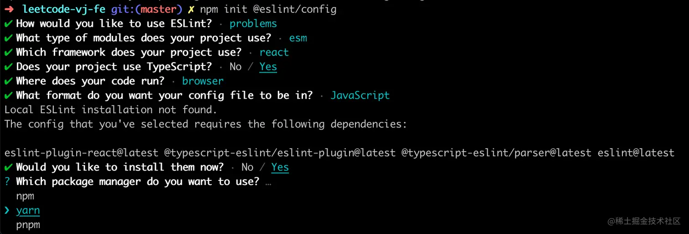
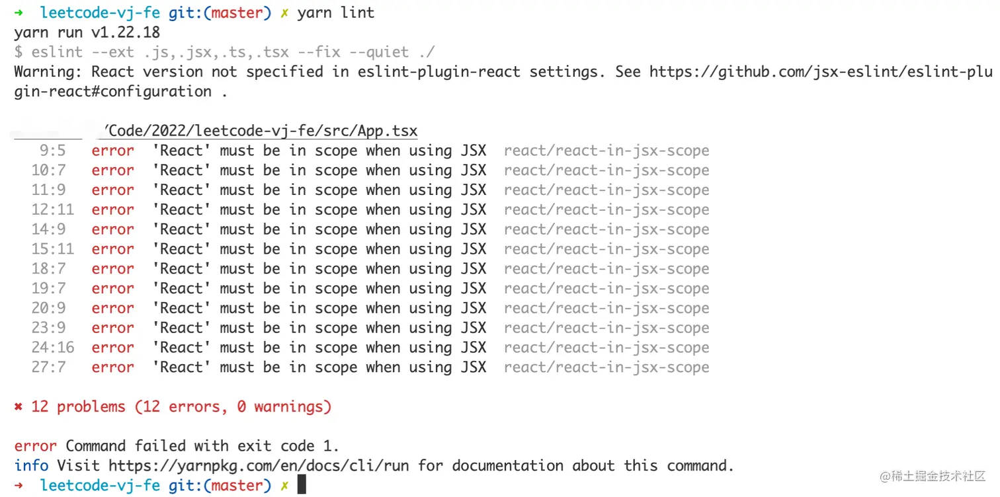

# 通过vite搭建react+ts项目
## 创建项目
```bash
# 脚手架命令安装
npm create vite@latest
# 进入项目目录
cd my-project
# 安装依赖
npm install
# 启动服务
npm run dev
```
## 使用Eslint增加代码规范
```bash
npm init @eslint/config
```
选择eslint配置

按需选择完配置后，选择立即安装，就可一键安装相关依赖。安装成功后 ESLint 帮我们创建了 .eslintrc.cjs 配置文件（cjs 是指 CommonJS 格式）。
## 安装Prettier
```bash
npm install prettier -D
```
然后再根目录创建 .prettierrc.js 配置文件
```js
module.exports = {
  printWidth: 80,
  tabWidth: 2,
  useTabs: false,
  singleQuote: true,
  semi: false,
  trailingComma: "none",
  bracketSpacing: true
}
```
## ESLint + Prettier
```bash
yarn add eslint-config-prettier eslint-plugin-prettier -D
```
现在更改 Eslint 的配置文件 .eslintrc.cjs 在里面加入 Prettier 相关配置。具体含义可见 https://github.com/prettier/eslint-plugin-prettier#recommended-configuration
```diff
module.exports = {
    "env": {
        "browser": true,
        "es2021": true
    },
    "extends": [
        "eslint:recommended",
        "plugin:react/recommended",
        "plugin:@typescript-eslint/recommended",
+       "plugin:prettier/recommended"
    ],
    "parser": "@typescript-eslint/parser",
    "parserOptions": {
        "ecmaFeatures": {
            "jsx": true
        },
        "ecmaVersion": "latest",
        "sourceType": "module"
    },
    "plugins": [
        "react",
        "@typescript-eslint",
+       "prettier"
    ],
    "rules": {
+       "prettier/prettier": "error",
+       "arrow-body-style": "off",
+       "prefer-arrow-callback": "off"
    }
}
```
接下来在 package.json 的 script 中添加命令。
```json
{
    "script": {
        "lint": "eslint --ext .js,.jsx,.ts,.tsx --fix --quiet ./"
    }
}
```
尝试运行一下 yarn lint 但是发现报错了。
```bash
Error [ERR_REQUIRE_ESM]: require() of ES Module /Users/Code/2022/leetcode-vj-fe/.prettierrc.js from /Users/Code/2022/leetcode-vj-fe/node_modules/prettier/third-party.js not supported.
```
这个是 .prettierrc.js 中使用 CommonJS 语法报错，把 .prettierrc.js 也改名为 .prettierrc.cjs 就好了。  
再试下发现还是有错误，如下

错误看起来也比较明显，就是我们没有引入 React，在 React17 中，我们已经不需要为 JSX 显示引入 React 了，按照提示更改下 .eslintrc.cjs。
```js
module.exports = {
  extends: [
    // ...
    'plugin:react/jsx-runtime'
  ],
  //...
  settings: {
    react: {
      version: 'detect'
    }
  }
}
```
再运行已经没有报错了，我们看到 ESLint 已经生效，对 App.tsx 进行了修复。
## Husky + lint-staged
Husky 是一个 Git Hooks 工具，可以让我们在 Git 事件发生时自动运行脚本。
### Husky
首先安装依赖
```bash
npm install husky -D
```
然后在 package.json 中添加脚本 prepare 并运行
``` bash
npm pkg set scripts.prepare="husky install"

npm run prepare
```
运行命令后会在项目根目录创建 .husky 文件夹。  

现在给 Husky 添加一个 Hook
```bash
npx husky add .husky/pre-commit "npm run lint"
```
### lint-staged
首先安装依赖
```bash
yarn add lint-staged -D
```
然后在 package.json 添加相关配置。
```json
{
  "lint-staged": {
    "*.{js,jsx,tsx,ts}": [
      "npm run lint"
    ]
  }
}
```
并在 .husky/pre-commit 中替换 npm run lint 为 npx lint-staged。现在我们每次提交代码前都会对改动的文件进行 Lint 检查。
### commitlint
使用 commitlint 对提交信息进行校验。先安装依赖：
```bash
yarn add @commitlint/cli @commitlint/config-conventional -D
```
然后在根目录创建配置文件 .commitlintrc.cjs
```js
module.exports = {
  extends: ["@commitlint/config-conventional"]
}
```
然后把 commitlint 命令也添加 Husky Hook。运行命令：

```bash
npx husky add .husky/commit-msg "npx --no-install commitlint -e $HUSKY_GIT_PARAMS"
```
