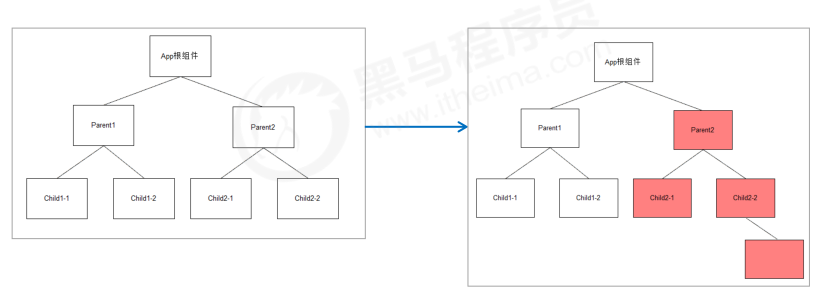
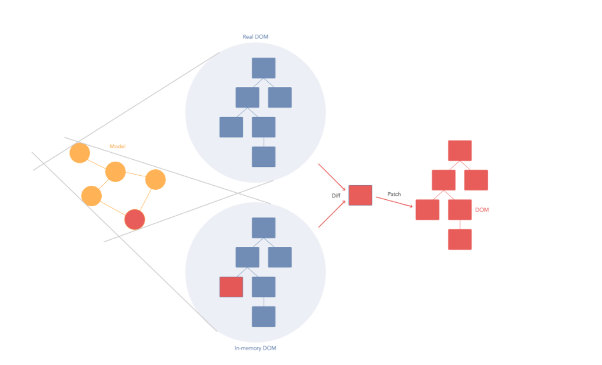
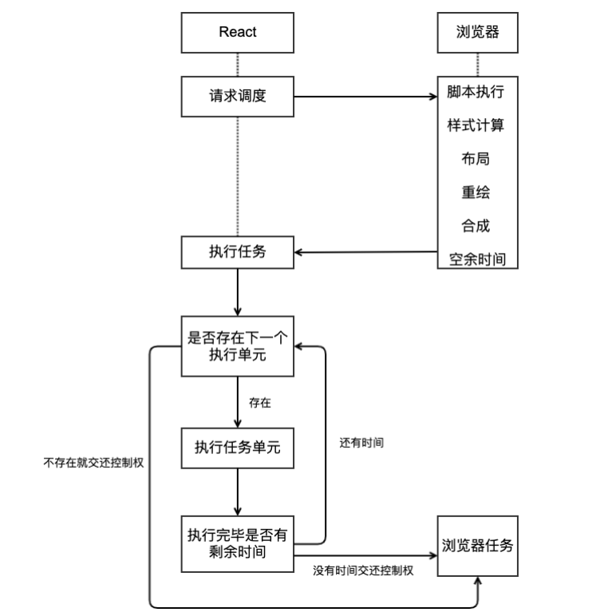
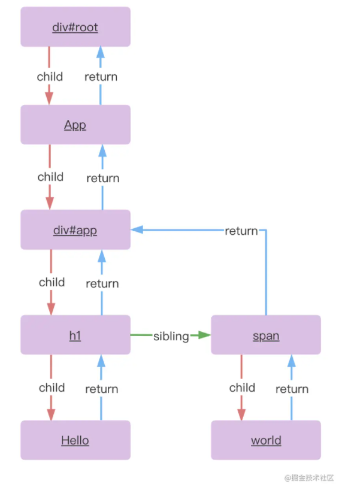
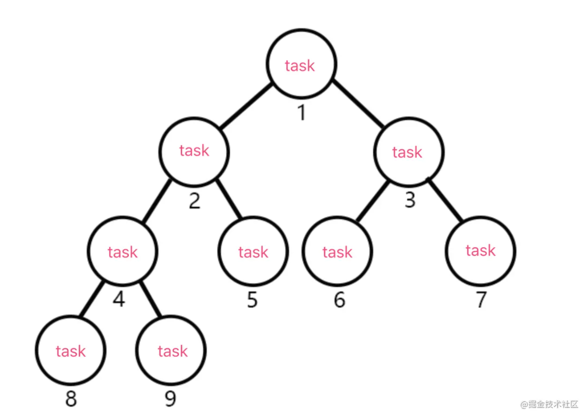

# 组件复用

## mixins（已废弃）

> https://react.docschina.org/blog/2016/07/13/mixins-considered-harmful.html

+ mixin引入了隐式依赖关系
  + 对于组件中的方法和数据的来源不明确，不容易维护
+ Mixins 导致名称冲突
+ Mixins 导致滚雪球般的复杂性

## render-props技术

### 组件复用的说明

+ 思考：如果两个组件中的部分功能相似或相同，该如何处理？
+ 处理方式：复用相似的功能（联想函数封装）
+ 复用什么？1. state 2. 操作state的方法   **复用组件的状态和组件的逻辑，组件的UI不一样**
+ 两种解决方案(类组件)
  + render-props
  + HOC（高阶组件）
  
+ 注意：这两种方式不是新的API，而是利用React自身特点的编码技巧，演化而成的固定模式（写法）

### render-props基本使用

+ 思路：将要复用的state和操作state的方法封装到一个组件中

+ 问题：渲染的UI内容不一样，该怎么办
+ **在使用组件时，添加一个值为函数的prop，通常把这个prop命名为render，在组件内部调用这个函数。传进来的函数负责渲染UI**
+ 问题2：如果获取组件内部的状态
+ **在组件内部调用方法的时候，把状态当成参数进行传递**

```js
class Mouse extends React.Component {
	// … 省略state和操作state的方法
    render() {
    	return this.props.render(this.state)
    }
}
```

```js
<Mouse render={(mouse) => (
	<p>鼠标当前位置 {mouse.x}，{mouse.y}</p>
)}/>
```

### children代替render属性

+ 注意：并不是该模式叫 render props 就必须使用名为render的prop，实际上可以使用任意名称的prop
+ 把prop是一个函数并且告诉组件要渲染什么内容的技术叫做：render props模式
+ 推荐：使用 children 代替 render 属性

```js
<Mouse>
	{({x, y}) => <p>鼠标的位置是 {x}，{y}</p> }
</Mouse>
// 组件内部：
this.props.children(this.state)
```


```js
// Context 中的用法：
<Consumer>
	{data => <span>data参数表示接收到的数据 -- {data}</span>}
</Consumer>
```

## 高阶组件  HOC 

### 概述

+ 目的：实现状态逻辑复用   增强一个组件的能力

+ 采用 包装（装饰）模式 ，比如说：手机壳
+ 手机：获取保护功能
+ 手机壳 ：提供保护功能
+ 高阶组件就相当于手机壳，通过包装组件，增强组件功能


### 思路分析 

+ 高阶组件（HOC，Higher-Order Component）是一个函数，接收要包装的组件，返回增强后的组件
+ 高阶组件的命名： `withMouse`  `withRouter` `withXXX`
+ 高阶组件内部创建一个类组件，在这个类组件中提供复用的状态逻辑代码，通过prop将复用的状态传递给
  被包装组件 

```js
const CatWithMouse = withMouse(Cat)
const PositionWithMOuse = withMouse(Position)
```


```js
// 高阶组件内部创建的类组件：
const WithMouse = (Base) => {
  class Mouse extends React.Component {
        // 处理鼠标的位置等操作
        render() {
            return <Base {...this.state} />
        }
	}	
  return Mouse
}
```

### 使用步骤

+ 创建一个函数，名称约定以 with 开头
+ 指定函数参数（作为要增强的组件）  传入的组件只能渲染基本的UI
+ 在函数内部创建一个类组件，**提供复用的状态逻辑代码**，并返回
+ 在内部创建的组件的render中，需要渲染传入的基本组件，增强功能，通过props的方式给基本组件传值
+ 调用该高阶组件，传入要增强的组件，通过返回值拿到增强后的组件，并将其渲染到页面中

```js
// 创建组件
const MousePosition = withMouse(Position)

// 渲染组件
<MousePosition />
```

### 传递props

+ 问题：props丢失
+ 原因：高阶组件没有往下传递props
+ 解决方式：渲染 WrappedComponent 时，将 state 和 this.props 一起传递给组件
+ 传递方式：

```js
<WrappedComponent {...this.state} {...this.props} />
```

## 自定义hooks

```jsx
import { useEffect, useState } from 'react'
// ahooks
export function useMouse() {
  const [mouse, setMouse] = useState({ x: 0, y: 0 })
  const onMove = (e: MouseEvent) => {
    setMouse({
      x: e.pageX,
      y: e.pageY
    })
  }
  useEffect(() => {
    document.addEventListener('mousemove', onMove)
    return () => {
      document.removeEventListener('mousemove', onMove)
    }
  }, [])
  return mouse
}

export function useScroll() {
  const [scroll, setScroll] = useState({ left: 0, top: 0 })
  const onScroll = () => {
    setScroll({
      left: window.pageXOffset,
      top: window.pageYOffset
    })
  }
  useEffect(() => {
    window.addEventListener('scroll', onScroll)
    return () => {
      window.removeEventListener('scroll', onScroll)
    }
  }, [])
  return scroll
}

```


# 性能优化

## 组件更新机制

+  setState() 的两个作用： 1. 修改 state 2. 更新组件（UI）
+  过程：父组件重新渲染时，也会重新渲染子组件。但只会渲染当前组件子树（当前组件及其所有子组件）

 

## 组件性能优化-class组件

1. 功能第一
2. 性能优化

###  减轻state

+ 减轻 state：只存储跟组件渲染相关的数据（比如：count / 列表数据 / loading 等）
+ 注意：不用做渲染的数据不要放在 state 中，比如定时器 id等 
+ 对于这种需要在多个方法中用到的数据，应该直接放在 this 中 
  + this.xxx = 'bbb'
  + this.xxx   

```js
class Hello extends Component {
    componentDidMount() {
        // timerId存储到this中，而不是state中
        this.timerId = setInterval(() => {}, 2000)
    }
    componentWillUnmount() {
    	clearInterval(this.timerId)
    }
    render() { … }
}
```

vue中不要把和渲染无关的数据放到state中

### 避免不必要的重新渲染

+  组件更新机制：父组件更新会引起子组件也被更新，这种思路很清晰
+  问题：子组件没有任何变化时也会重新渲染 （接收到的props没有发生任何的改变）
+  如何避免不必要的重新渲染呢？
+  解决方式：使用钩子函数 `shouldComponentUpdate(nextProps, nextState)`

+  作用：通过返回值决定该组件是否重新渲染，返回 true 表示重新渲染，false 表示不重新渲染
+  触发时机：更新阶段的钩子函数，组件重新渲染前执行 （shouldComponentUpdate => render）

```js
class Hello extends Component {
    shouldComponentUpdate() {
        // 根据条件，决定是否重新渲染组件
        return false
    }
    render() {…}
}
```

### 纯组件  

+ 纯组件：`React.PureComponent` 与 `React.Component `功能相似  
+ 区别：PureComponent 内部自动实现了 shouldComponentUpdate 钩子，不需要手动比较
+ 原理：纯组件内部通过分别 对比 前后两次 props 和 state 的值，来决定是否重新渲染组件

```js
class Hello extends React.PureComponent {
    render() {
        return (
        	<div>纯组件</div>
        )
    }
}
```

**只有在性能优化的时候可能会用到纯组件，不要所有的组件都使用纯组件，因为纯组件需要消耗性能进行对比**

### 纯组件比较-值类型

+ 说明：纯组件内部的对比是 shallow compare（浅层对比）

+ 对于值类型来说：比较两个值是否相同（直接赋值即可，没有坑）

```js
let number = 0
let newNumber = number
newNumber = 2
console.log(number === newNumber) // false
```

```js
state = { number: 0 }
setState({
  number: Math.floor(Math.random() * 3)
})
// PureComponent内部对比：
最新的state.number === 上一次的state.number // false，重新渲染组件
```

### 纯组件比较-引用类型 

+ 说明：纯组件内部的对比是 shallow compare（浅层对比）
+ 对于引用类型来说：只比较对象的引用（地址）是否相同

```js
const obj = { number: 0 }
const newObj = obj
newObj.number = 2
console.log(newObj === obj) // true
```


```js
state = { obj: { number: 0 } }
// 错误做法
state.obj.number = 2
setState({ obj: state.obj })
// PureComponent内部比较：
最新的state.obj === 上一次的state.obj // true，不重新渲染组件
```

纯组件的最佳实践：

 注意：state 或 props 中属性值为引用类型时，应该创建新数据，不要直接修改原数据！

```js
// 正确！创建新数据
const newObj = {...state.obj, number: 2}
setState({ obj: newObj })
// 正确！创建新数据
// 不要用数组的push / unshift 等直接修改当前数组的的方法
// 而应该用 concat 或 slice 等这些返回新数组的方法
this.setState({
	list: [...this.state.list, {新数据}]
})

```

## 组件性能优化-hooks

### React.memo高阶组件  

#### 介绍

React.memo 高阶组件的使用场景说明：

React 组件更新机制：只要父组件状态更新，子组件就会无条件的一起更新。

+ 子组件 props 变化时更新过程：组件代码执行 -> JSX Diff（配合虚拟 DOM）-> 渲染（变化后的内容）【 DOM 操作】。
+ 子组件 props 无变化更新过程：组件代码执行 -> JSX Diff（配合虚拟 DOM）【无 DOM 操作】。

注意：此处更新指的是组件代码执行、JSX 进行 Diff 操作（纯 JS 的操作，速度非常快，不会对性能产生太多影响）。

+ 如果组件 props 改变了，那么，该组件就必须要更新，才能接收到最新的 props。
+ 但是，如果组件 props 没有改变时，组件也要进行一次更新。实际上，这一次更新是没有必要的。

如果要避免组件 props 没有变化而进行的不必要更新（Diff），这种情况下，就要使用 React.memo 高阶组件。

注：`对于 class 组件来说，可以使用 PureComponent 或 shouldComponentUpdate 钩子函数来实现`。

```jsx
import { useState } from 'react'
import ReactDOM from 'react-dom'

const Child2 = ({ count }) => {
  console.log('Child2 子组件代码执行了')
  return <div style={{ backgroundColor: '#abc' }}>子组件2：{count}</div>
}

const Child1 = () => {
  console.log('Child1 子组件代码执行了')
  return <div style={{ backgroundColor: '#def' }}>子组件1</div>
}

const App = () => {
  const [count, setCount] = useState(0)

  return (
    <div style={{ backgroundColor: 'pink', padding: 10 }}>
      <h1>计数器：{count}</h1>
      <button onClick={() => setCount(count + 1)}>+1</button>
      <hr />

      {/* 子组件 */}
      <Child1 />
      <br />
      <Child2 count={count} />
    </div>
  )
}

ReactDOM.render(<App />, document.getElementById('root'))

```

#### 语法

使用场景：当你想要避免函数组件 props 没有变化而产生的不必要更新时，就要用到 React.memo 了。

作用：**记忆组件上一次的渲染结果，在 props 没有变化时复用该结果，避免函数组件不必要的更新**。


解释：

+ React.memo 是一个高阶组件，用来记忆（memorize）组件。
+ 参数（Child）：需要被记忆的组件，或者说是需要避免不必要更新的组件。
+ 返回值（MemoChild）：React 记住的 Child 组件。

原理：通过对比检查更新前后 props 是否相同，来决定是否复用上一次的渲染结果，

+ 如果相同，复用上一次的渲染结果；
+ 如果不同，重新渲染组件。


**并不是所有的组件都适合使用memo，比如child2组件，每次都需要重新渲染，使用memo反而会使性能变得更低，逻辑也变得更复杂**

#### 浅层对比

默认情况下，React.memo 只会对更新前后的 props 进行浅对比（shallow compare）与 PureComponent 相同。

也就是说，对于对象类型的 prop 来说，只会比较引用

+ 如果更新前后的引用相同，复用上一次的渲染结果（不会重新渲染该组件）。
+ 如果更新前后的引用不同，重新渲染该组件。

如果你要手动控制比较过程，可以使用 React.memo 的第二个参数：


解释：

+ 第二个参数：用来比较更新前后 props 的函数。
+ 返回值：如果返回 true，表示记住（不重新渲染）该组件；如果返回 false，表示重新渲染该组件。

### useCallback hook

#### 使用场景

在使用 React.memo 时，对于对象类型的 props，只会比较引用（浅对比）。

但是，因为**组件每次更新都会创建新的 props 值**，比如，新的对象、事件处理程序等（函数组件的特性）。

这就导致：React.memo 在处理对象类型的 props 时，会失效（每次的 props 都是新对象）。

但是，我们还是想让 React.memo 在处理对象类型的 props 时，也有效。


为了让 React.memo 处理对象类型的 props 有效，只要在*组件更新期间保持对象类型引用相*等，就可以了。

这时候，就要用到以下两个 Hooks：

+ `useCallback` Hook：记住函数的引用，在组件每次更新时返回相同引用的函数。
+ `useMemo` Hook：记住任意数据（数值、对象、函数等），在组件每次更新时返回相同引用的数据【功能之一】


#### 基本使用

使用场景：在使用 React.memo 时，为了组件每次更新时都能获取到相同引用的函数，就要用到 useCallback Hook

注意：**需要配合 React.memo 高阶函数一起使用**。

作用：记忆传入的回调函数，这个被记住的回调函数会一直生效，直到依赖项发生改变


解释：

+ 第一个参数：必选，需要被记忆的回调函数。
+ 第二个参数：必选，依赖项数组，用于指定回调函数中依赖（用到）的数据（类似于 useEffect 的第二个参数）。
+ 即使没有依赖，也得传入空数组（[]），此时，useCallback 记住的回调函数就会一直生效。
+ 返回值：useCallback 记住的回调函数。
+ useCallback 记住的回调函数会一直生效（或者说会一直返回同一个回调函数），直到依赖项发生改变。

```jsx
import { useState, memo, useCallback } from 'react'
import ReactDOM from 'react-dom'

const App = () => {
  const [count, setCount] = useState(0)
  const [money, setMoney] = useState(1000)

  const help = useCallback(() => {
    setCount(count - 1)
  }, [count])
  return (
    <div>
      <h1>计数器</h1>
      <div>豆豆被打了{count}次</div>
      <div>金钱：{money}</div>
      <button onClick={() => setCount(count + 1)}>打豆豆</button>
      <button onClick={() => setMoney(money + 100)}>加钱</button>
      <hr />
      {count < 5 ? <DouDou count={count} help={help}></DouDou> : '豆豆被打死了'}
    </div>
  )
}

const DouDou = memo(({ count, help }) => {
  console.log('豆豆组件渲染')
  return (
    <div>
      <h3>我是豆豆组件{count}</h3>
      <button onClick={help}>续命</button>
    </div>
  )
})

ReactDOM.render(<App />, document.getElementById('root'))

```

**useCallback需要配置React.memo使用才有意义，不然反而性能更低，因为useCallback来包裹函数也是需要开销的**

### useMemo hook

使用场景：类似于 useCallback，可以在组件更新期间保持任意数据引用相等，一般用来处理对象类型的数据

对比：useCallback 只能记忆函数，而 useMemo 可以记忆任意数据。

作用：**记忆任意数据，这个被记住的数据会一直生效，直到依赖项发生改变1**。


语法

+ 第一个参数：必选，回调函数。注意：**该回调函数会被调用，并通过返回值指定需要被记住的数据**。
+ 第二个参数：必选，依赖项数组，用于指定回调函数中依赖（用到）的数据。同样，没有依赖项时，传入空数组（[]）。
+ 返回值：useMemo 记住的数据
+ useMemo 记住的数据会一直生效（或者说会一直返回同一个数据），直到依赖项发生改变。

如何选择使用哪一个？

+ 如果处理的是函数，推荐使用 useCallback Hook。
+ 如果处理的是其他数据（比如，对象），推荐使用 useMemo Hook。

### 模拟useCallback的用法

> `useCallback(fn, deps)` 相当于 `useMemo(() => fn, deps)`。

```jsx
const help = useCallback(() => {
  setCount(count - 1)
}, [count])


const help = useMemo(() => {
    return () => {
        setCount(count - 1)
    }
}, [count])
```


```js
const memoizedValue = useMemo(() => computeExpensiveValue(a, b), [a, b]);
```

# 虚拟DOM与diff算法 （stack 架构）


### 虚拟 DOM 和 Diff 算法

#### 虚拟 DOM 对象

- 为什么使用虚拟DOM？
  1. 真正的 DOM 对象属性很多，处理起来不方便
  2. 性能角度
  3. 虚拟 DOM 的真正价值：跨平台

- Virtual DOM
- 虚拟 DOM 对象：就是一个普通的 JS 对象，用来描述我们希望在页面中看到的 HTML 结构内容

```js
const element = {
  type: 'h1',
  props: {
    className: 'greeting',
    children: 'Hello JSX!'
  }
}

<div></div>
// { type: 'div' }

<div>123</div>
// { type: 'div', props: { chilren: '123' } }

<div class="tab">123</div>
// { type: 'div', props: { className: 'tab', chilren: '123' } }
```

- 原生 DOM 对象： 也是一个 JS 对象，是浏览器默认提供的
- DOM 对象 和 HTML 元素之间是一一对应的关系

#### React JSX 语法转化的过程

- 转化过程：JSX -> React.createEelement()/_jsx -> 虚拟DOM

```js
// JSX
const el = <div className="abc" onClick={() => {}}>123</div>

// 旧的转化方式：
// React 元素
const el = /*#__PURE__*/React.createElement("div", {
  className: "abc",
  onClick: () => {}
}, "123");

// 新的转化方式：
var _jsxRuntime = require("react/jsx-runtime");
const el = /*#__PURE__*/(0, _jsxRuntime.jsx)("div", {
  className: "abc",
  onClick: () => {},
  children: "123"
});

// 虚拟 DOM
{
  type: 'div',
  props: {
    className: "abc",
    onClick: () => {},
    children: "123"
  }
}
```

### Virtual DOM 如何提升效率

精准找出发生变化的 DOM 对象，只更新发生变化的部分。

在 React 第一次创建 DOM 对象后，会为每个 DOM 对象创建其对应的 Virtual DOM 对象，在 DOM 对象发生更新之前，React 会先更新所有的 Virtual DOM 对象，然后 React 会将更新后的 Virtual DOM 和 更新前的 Virtual DOM 进行比较，从而找出发生变化的部分，React 会将发生变化的部分更新到真实的 DOM 对象中，React 仅更新必要更新的部分。

Virtual DOM 对象的更新和比较仅发生在内存中，不会在视图中渲染任何内容，所以这一部分的性能损耗成本是微不足道的。



#### Diff 算法的说明

https://www.jianshu.com/p/3ba0822018cf

- 第一次页面渲染的过程：1 JSX + state => 2 虚拟DOM树（JS对象） => 3 浏览器中看到的HTML结构内容
- 当更新了状态，就会重新渲染组件，也就会重新生成一棵新的 虚拟DOM树
- Diff 算法就会：对比 初始虚拟DOM树 和 更新后的虚拟DOM树，找到不同之处，最终，只将不同的地方更新到页面中

#### 一个组件内部更新机制 

- 只要想让状态发生变化，就调用 setState()，只要调用 setState()，就会执行组件的 render 方法。来重新渲染组件
- 注意：render 重新执行，不代表把整个组件重新渲染到页面中。而实际上，React内部会使用 *虚拟DOM* 和 *Diff 算法*来做到 **部分更新**。
  - 部分更新（打补丁）：只将变化的地方重新渲染到页面中，这样，尽量减少了 DOM 操作

#### Diff 算法的说明 - 1

- 如果两棵树的**根元素类型**不同，React 会销毁旧树，创建新树

```js
// 旧树
<div>
  <Counter />
</div>

// 新树
<span>
  <Counter />
</span>

执行过程：destory Counter -> insert Counter
```

#### Diff 算法的说明 - 2

- 对于类型相同的 React DOM 元素，React 会对比两者的属性是否相同，只更新不同的属性
- 当处理完这个 DOM 节点，React 就会递归处理子节点。

```html
// 旧
<div className="before" title="stuff"></div>
// 新
<div className="after" title="stuff"></div>
只更新：className 属性

// 旧
<div style={{color: 'red', fontWeight: 'bold'}}></div>
// 新
<div style={{color: 'green', fontWeight: 'bold'}}></div>
只更新：color属性
```

#### Diff 算法的说明 - 3

- 1 当在子节点的后面添加一个节点，这时候两棵树的转化工作执行的很好

```js
// 旧
<ul>
  <li>first</li>
  <li>second</li>
</ul>

// 新
<ul>
  <li>first</li>
  <li>second</li>
  <li>third</li>
</ul>

执行过程：
React会匹配新旧两个<li>first</li>，匹配两个<li>second</li>，然后添加 <li>third</li> tree
```

- 2 但是如果你在开始位置插入一个元素，那么问题就来了：

```js
// 旧
<ul>
  <li>1</li>
  <li>2</li>
</ul>

// 新
<ul>
  <li>3</li>
  <li>1</li>
  <li>2</li>
</ul>

执行过程：
React将改变每一个子节点，而非保持 <li>Duke</li> 和 <li>Villanova</li> 不变
```

#### key 属性  index

> 为了解决以上问题，React 提供了一个 key 属性。当子节点带有 key 属性，React 会通过 key 来匹配原始树和后来的树。

```js
// 旧
<ul>
  <li key="1">1</li>
  <li key="2">2</li>
</ul>

// 新
<ul>
  <li key="3">3</li>   
  <li key="1">1</li>
  <li key="2">2</li>
</ul>

执行过程：
现在 React 知道带有key '2014' 的元素是新的，对于 '2015' 和 '2016' 仅仅移动位置即可
```

- 说明：key 属性在 React 内部使用，但不会传递给你的组件
- 推荐：在遍历数据时，推荐在组件中使用 key 属性：`<li key={item.id}>{item.name}</li>`
- 注意：**key 只需要保持与他的兄弟节点唯一即可，不需要全局唯一**
- 注意：**尽可能的减少数组 index 作为 key，数组中插入元素的等操作时，会使得效率底下**

```js
// 旧
<ul>
  <li key="0">1 <input /></li>
  <li key="1">2 <input /></li>
</ul>

// 新
<ul>
  <li key="0">3 <input /></li>
  <li key="1">1 <input /></li>
  <li key="2">2 <input /></li>
</ul>
```

### **key 的技巧**

```tsx
如果不想组件复用，可以给组件提供一个变化的key属性
```

### React 15

- 包含了：虚拟DOM 和 Diff

- 架构

  1. Reconciler：（协调器）负责调用 render 生成虚拟 Dom，进行 Diff，找出变化后的虚拟 Dom
  2. Renderer：（渲染器）负责接收 Reconciler 通知，将变化的组件渲染在当前`宿主环境`

    - 比如浏览器（react-dom），不同的宿主环境会有不同的 Renderer

- 缺陷：

  - 递归同步更新 DOM 树，如果节点非常多，即使只有一次 state 变更，React 也需要进行复杂的递归更新，更新一旦开始，**中途就无法中断**，直到遍历完整颗树，才能释放 `JS 主线程`   
  - setState() ===> 做一次diff算法，找到不同的虚拟DOM ===》 更新成DOM

- 状态更新

  - setState是同步还是异步
  - 批处理：多次调用 setState() 会合并为一次更新
  - 原理：调用 setState() 并没有立即更新状态，而是存储到 `_pendingStateQueue` 队列中，将需要更新的组件存入 `dirtyComponent` 中。在非 异步代码 中，React 会将 `isBatchingUpdates` 标记设置为 true，表示批量更新；而当 异步代码 执行时，由于 React 已经将内部的 `isBatchingUpdates` 标记设置为 false，所以，异步代码中操作 setState 表现为非批量更新，而是调用一次 setState 就更新一次状态、组件
  - 其实，这是一个 bug，因为在不同情况下 setState 表现不一致
  - React 为了解决这个问题，提供了一个 API 来实现批处理：`ReactDOM.unstable_batchedUpdates()`


# React 16

- [参考：React 各个版本特性的变化](https://juejin.cn/post/7010539227284766751)
- [React 16 实现的动画效果](https://claudiopro.github.io/react-fiber-vs-stack-demo/fiber.html)
- [React 15 实现的动画效果](https://claudiopro.github.io/react-fiber-vs-stack-demo/stack.html)

## 1. 为什么会卡顿

浏览器刷新频率：`60HZ` 也就是每秒刷新 60 次，大概 16.67ms 浏览器刷新一次   
由于 `GUI 渲染线程`和 `JS 线程`是互斥的，所以 JS 脚本执行和浏览器布局、绘制不能同时执行  
**在这 16.6ms 的时间里，浏览器既需要完成 JS 的执行，也需要完成样式的重排和重绘**，如果 JS 执行的时间过长，超出了 16.6ms，这次刷新就没有时间执行样式布局和样式绘制了，于是在页面上就会表现为卡顿。


React 16 之前的版本比对更新 VirtualDOM 的过程是采用循环加递归实现的，这种比对方式有一个问题，就是一旦任务开始进行就无法中断，如果应用中组件数量庞大，主线程被长期占用，直到整棵 VirtualDOM 树比对更新完成之后主线程才能被释放，主线程才能执行其他任务。这就会导致一些用户交互，动画等任务无法立即得到执行，页面就会产生卡顿, 非常的影响用户体验。 

核心问题：递归无法中断，执行重任务耗时长。 JavaScript 又是单线程，无法同时执行其他任务，导致任务延迟页面卡顿，用户体验差。

## 2. requestIdleCallback

### 2.1 核心 API 功能介绍

利用浏览器的空余时间执行任务，如果有更高优先级的任务要执行时，当前执行的任务可以被终止，优先执行高级别任务。

```javascript
requestIdleCallback(function(deadline) {
  // deadline.timeRemaining() 获取浏览器的空余时间
})
```

#### 2.2 浏览器空余时间

页面是一帧一帧绘制出来的，当每秒绘制的帧数达到 60 时，页面是流畅的，小于这个值时， 用户会感觉到卡顿

1s 60帧，每一帧分到的时间是 1000/60 ≈ 16 ms，如果每一帧执行的时间小于16ms，就说明浏览器有空余时间

如果任务在剩余的时间内没有完成则会停止任务执行，继续优先执行主任务，也就是说 requestIdleCallback 总是利用浏览器的空余时间执行任务

#### 2.3 API 功能体验

页面中有两个按钮和一个DIV，点击第一个按钮执行一项昂贵的计算，使其长期占用主线程，当计算任务执行的时候去点击第二个按钮更改页面中 DIV 的背景颜色。

使用 requestIdleCallback 就可以完美解决这个卡顿问题。

```html
<div class="playground" id="play">playground</div>
<button id="work">start work</button>
<button id="interaction">handle some user interaction</button>
```

```css
<style>
  .playground {
    background: palevioletred;
    padding: 20px;
    margin-bottom: 10px;
  }
</style>
```

```javascript
var play = document.getElementById("play")
var workBtn = document.getElementById("work")
var interactionBtn = document.getElementById("interaction")
var iterationCount = 100000000
var value = 0

var expensiveCalculation = function (IdleDeadline) {
  while (iterationCount > 0 && IdleDeadline.timeRemaining() > 1) {
    value =
      Math.random() < 0.5 ? value + Math.random() : value + Math.random()
    iterationCount = iterationCount - 1
  }
  requestIdleCallback(expensiveCalculation)
}

workBtn.addEventListener("click", function () {
  requestIdleCallback(expensiveCalculation)
})

interactionBtn.addEventListener("click", function () {
  play.style.background = "palegreen"
})
```

## 3 Fiber

#### 3.1 问题

React 16 之前的版本比对更新 VirtualDOM 的过程是采用循环加递归实现的，这种比对方式有一个问题，就是一旦任务开始进行就无法中断，如果应用中组件数量庞大，主线程被长期占用，直到整棵 VirtualDOM 树比对更新完成之后主线程才能被释放，主线程才能执行其他任务。这就会导致一些用户交互，动画等任务无法立即得到执行，页面就会产生卡顿, 非常的影响用户体验。 

核心问题：递归无法中断，执行重任务耗时长。 JavaScript 又是单线程，无法同时执行其他任务，导致任务延迟页面卡顿，用户体验差。

#### 3.2 解决方案

1. 利用浏览器空闲时间执行任务，拒绝长时间占用主线程
2. 放弃递归只采用循环，因为循环可以被中断
3. 任务拆分，将任务拆分成一个个的小任务

1. 在 React 15 中，将 VirtualDOM 整体看成一个任务进行递归处理，任务整体庞大执行耗时不能中断。

   在 React 16 中，将整个任务拆分成了一个一个小的任务进行处理。每一个小的任务就表示一个执行单元。每一个小的任务指的就是一个 Fiber 节点的构建。一个 Fiber 节点的构建就是一个执行单元。执行单元在浏览器的空闲时间被执行，且可以随时被终止。React 会在每个执行单元执行完成后，检查是否还有空余时间，如果没有就交还主线程的控制权。

   


#### 3.3 实现思路

在 Fiber 方案中，为了实现任务的终止再继续，DOM比对算法被分成了两部分：

1. 构建 Fiber        (可中断)
2. 提交 Commit   (不可中断)

DOM 初始渲染: virtualDOM -> Fiber -> Fiber[] -> DOM

DOM 更新操作: newFiber vs oldFiber -> Fiber[] -> DOM

#### 3.4 Fiber 对象

```jsx
type Fiber = {
  // 组件类型 div、span、组件构造函数
  type: any,
  // DOM 对象
  stateNode: any,  
  // 指向自己的父级 Fiber 对象
  return: Fiber | null,
  // 指向自己的第一个子级 Fiber 对象
  child: Fiber | null,
  // 指向自己的下一个兄弟 iber 对象
  sibling: Fiber | null,
};
```






