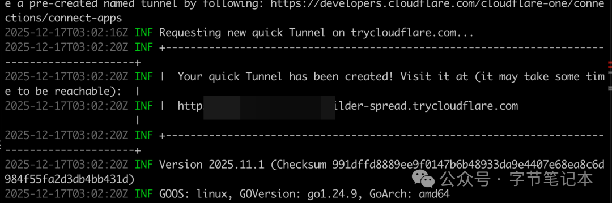

## outline: deep

# 内网穿透

## cloudflared 实现内网穿透

### 安装依赖

- **MacOs**

```bash
brew install cloudflare
```

- **Windows**

1. 去 GitHub 的 Cloudflare 仓库下载 cloudflared-windows-amd64.exe.
2. 将下载的文件重命名为 cloudflared.exe。

### 启动服务

```bash
cloudflared tunnel --url http://localhost:3000
```
在输出的日志中，找到以下面这个地址 trycloudflare.com 结尾的链接，即为公网域名地址
