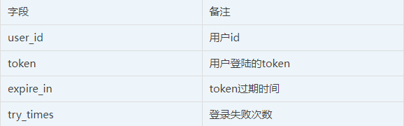
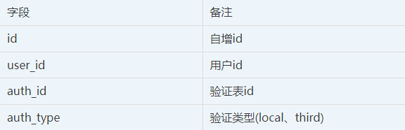
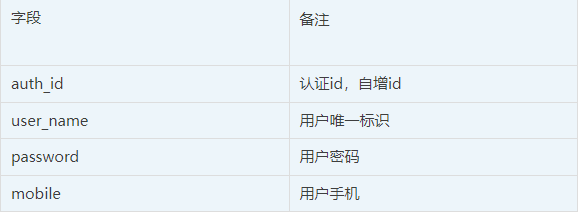
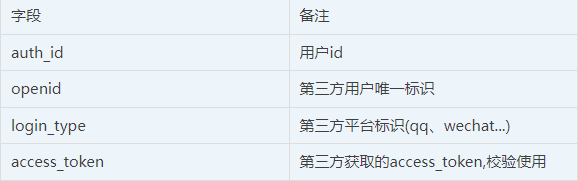
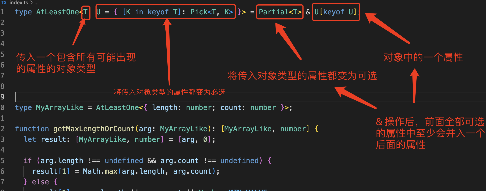

## vscode下载CDN

**/stable地址之前的地址换为如下内容**：

[vscode.cdn.azure.cn](https://link.zhihu.com/?target=http%3A//vscode.cdn.azure.cn/) <--------就是左边这个

## 处理npm包依赖冲突

```
npm install xxxx --legacy-peer-deps
```

## 三方登录用户表结构设计

**数据库设计**

根据部分小伙伴的的建议，我这里做一下数据库的整理：

**用户基础表（users）**




**用户验证关联表（user_auth_rel）**




**本地用户表（user_local_auth）**




**第三方用户表（user_third_auth）**




**说明**

- users表只是单纯针对我们业务侧的登录，主要是做自身业务的oauth2.0业务
- user_local_auth是做自己用户名、密码登录，手机号码登录信息记录，
- user_third_auth是我们第三方用户体系的数据记录，
- user_auth_rel是用来关联我们users表与user_local_auth、user_third_auth。
- 整个设计理念就是将自建用户与第三方在存储上区分，这在架构演进上也是合乎情理的，开始用户体系大多自建，而后才是对外接入。
## vitepress中文官网
https://vitejs.cn/vitepress/

## ts定义种少包含一种类型(工具类型)
```ts
type AtleastOne<T,U> = {[k in keyof T]: Pick<T, K>}=Partial<T>&U[keyof U]
```
