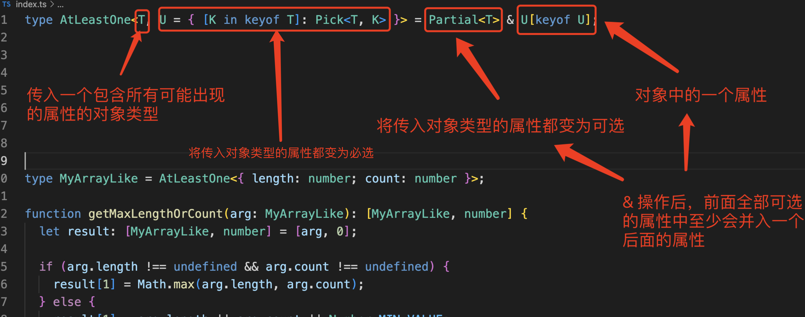

## vscode 下载 CDN

**/stable 地址之前的地址换为如下内容**：

[vscode.cdn.azure.cn](https://link.zhihu.com/?target=http%3A//vscode.cdn.azure.cn/) <--------就是左边这个

## 处理 npm 包依赖冲突

```bash
npm install xxxx --legacy-peer-deps
```

## vitepress 中文官网

https://vitejs.cn/vitepress/  
https://vitepress.qzxdp.cn/guide/what-is-vitepress.html

## ts 定义种少包含一种类型(工具类型)

```ts
type AtleastOne<T,U> = {[k in keyof T]: Pick<T, K>}=Partial<T>&U[keyof U]
```



## 仿 b 站开源项目

https://github.com/galaxy-s10/billd-live?tab=readme-ov-file

## 终端彩色打印日志

chalk、gradient-string

## clip-path工具

https://techbrood.com/

## vitepress插件

https://github.com/T-miracle/vitepress-plugins

## 使用valine自定义实现vitepress评论系统

http://f.zuo11.com/3-optimize/fast-create-website/#%E6%B3%A8%E5%86%8C-valine

## 对象存储RustFS

https://rustfs.com/

## 使用canvas构建页面 uikit

https://github.com/xiaxiangfeng/beyond-dom-ui
